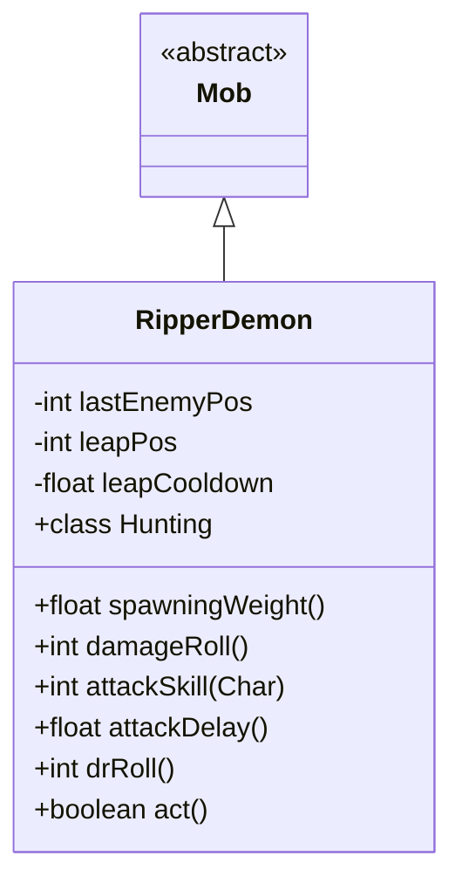

# RipperDemon 类文档

## 1. 基本信息
| 属性 | 值 |
|------|-----|
| 文件路径 | core/src/main/java/com/shatteredpixel/shatteredpixeldungeon/actors/mobs/RipperDemon.java |
| 包名 | com.shatteredpixel.shatteredpixeldungeon.actors.mobs |
| 类类型 | class |
| 继承关系 | extends Mob |
| 代码行数 | 291 行 |

## 2. 类职责说明
RipperDemon（撕裂恶魔）是一种具有跳跃攻击能力的恶魔敌人。它会预测目标的移动方向，然后跳跃攻击造成流血效果。撕裂恶魔攻击速度快（50%攻击延迟），跳跃攻击必定命中。它不会自然生成，只通过特殊方式出现。

## 4. 继承与协作关系


## 静态常量表
| 常量名 | 类型 | 值 | 说明 |
|--------|------|-----|------|
| LAST_ENEMY_POS | String | "last_enemy_pos" | Bundle 存储键 |
| LEAP_POS | String | "leap_pos" | Bundle 存储键 |
| LEAP_CD | String | "leap_cd" | Bundle 存储键 |

## 实例字段表
| 字段名 | 类型 | 修饰符 | 说明 |
|--------|------|--------|------|
| lastEnemyPos | int | private | 敌人上次位置 |
| leapPos | int | private | 跳跃目标位置 |
| leapCooldown | float | private | 跳跃冷却时间 |

## 7. 方法详解

### spawningWeight()
**签名**: `public float spawningWeight()`
**功能**: 获取自然生成权重
**返回值**: float - 0（不自然生成）

### damageRoll()
**签名**: `public int damageRoll()`
**功能**: 计算伤害掷骰
**返回值**: int - 伤害范围 15-25

### attackSkill(Char target)
**签名**: `public int attackSkill(Char target)`
**功能**: 获取攻击技能值
**返回值**: int - 攻击技能值 30

### attackDelay()
**签名**: `public float attackDelay()`
**功能**: 获取攻击延迟
**返回值**: float - 正常延迟的50%

### drRoll()
**签名**: `public int drRoll()`
**功能**: 计算伤害减免
**返回值**: int - 伤害减免 0-4

### act()
**签名**: `protected boolean act()`
**功能**: 每回合行动逻辑
**返回值**: boolean - 行动结果
**实现逻辑**:
```
第114-116行: 游荡状态下重置跳跃位置
第120行: 减少跳跃冷却
第123-129行: 更新敌人位置追踪（用于预测跳跃）
```

## 内部类详解

### Hunting（追猎状态）
**功能**: 管理跳跃攻击行为
**方法**:
- `act()`: 复杂的跳跃攻击逻辑
  - 第142-216行: 如果已准备跳跃，执行跳跃攻击
  - 第235-268行: 如果冷却结束且距离>=3，准备跳跃
  - 第239-247行: 预测敌人移动方向
  - 第261-266行: 显示警告并准备跳跃
  - 第272-285行: 否则正常接近目标

## 11. 使用示例
```java
// 撕裂恶魔不会自然生成
RipperDemon ripper = new RipperDemon();
ripper.pos = spawnPos;
GameScene.add(ripper);

// 会预测玩家移动方向进行跳跃攻击
// 跳跃攻击造成流血效果

// 攻击速度快，跳跃有2-4回合冷却
```

## 注意事项
1. **恶魔属性**: 属于 DEMONIC 和 UNDEAD 类型
2. **跳跃攻击**: 预测移动，必定命中，造成流血
3. **快速攻击**: 攻击延迟减半
4. **不自然生成**: spawningWeight 为 0
5. **冷却时间**: 跳跃后 2-4 回合冷却

## 最佳实践
1. 观察红色目标格避开跳跃攻击
2. 保持移动让预测失效
3. 不要站在预测路径上
4. 注意流血效果的累积伤害