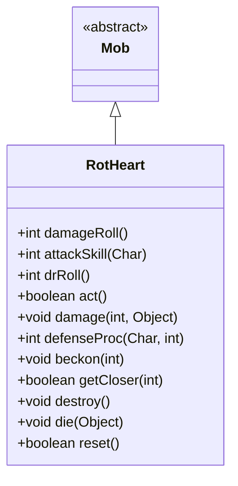

# RotHeart 类文档

## 1. 基本信息
| 属性 | 值 |
|------|-----|
| 文件路径 | core/src/main/java/com/shatteredpixel/shatteredpixeldungeon/actors/mobs/RotHeart.java |
| 包名 | com.shatteredpixel.shatteredpixeldungeon.actors.mobs |
| 类类型 | class |
| 继承关系 | extends Mob |
| 代码行数 | 140 行 |

## 2. 类职责说明
RotHeart（腐烂之心）是一种特殊的不可移动敌人，通常被腐烂藤蔓包围。它不会攻击，但受到伤害时会释放毒气。火焰可以直接杀死腐烂之心。死亡时掉落腐烂浆果种子并杀死所有藤蔓。

## 4. 继承与协作关系


## 静态常量表
（无静态常量）

## 实例字段表
（无额外实例字段，继承自 Mob）

## 7. 方法详解

### act()
**签名**: `protected boolean act()`
**功能**: 每回合清除警戒状态
**返回值**: boolean - 行动结果
**实现逻辑**:
```
第56行: 始终清除警戒状态（保持被动）
第57行: 调用父类 act
```

### damage(int dmg, Object src)
**签名**: `public void damage(int dmg, Object src)`
**功能**: 受到伤害时的处理
**参数**:
- dmg: int - 伤害值
- src: Object - 伤害来源
**实现逻辑**:
```
第63-65行: 如果来源是火焰，直接死亡
第66-68行: 否则正常处理伤害
```

### defenseProc(Char enemy, int damage)
**签名**: `public int defenseProc(Char enemy, int damage)`
**功能**: 防御时释放毒气
**参数**:
- enemy: Char - 攻击者
- damage: int - 伤害值
**返回值**: int - 实际伤害
**实现逻辑**:
```
第74-79行: 计算周围开放格子数量
第81行: 释放毒气，量随开放空间增加
```

### beckon(int cell)
**签名**: `public void beckon(int cell)`
**功能**: 响应召唤（忽略）
**参数**:
- cell: int - 召唤位置
**实现逻辑**:
```
第88行: 什么都不做，保持被动
```

### getCloser(int target)
**签名**: `protected boolean getCloser(int target)`
**功能**: 接近目标（不可移动）
**返回值**: boolean - 始终返回 false

### destroy()
**签名**: `public void destroy()`
**功能**: 销毁时杀死所有藤蔓
**实现逻辑**:
```
第99行: 跳过遭遇计数
第100-104行: 杀死所有腐烂藤蔓
第105行: 恢复遭遇计数
```

### die(Object cause)
**签名**: `public void die(Object cause)`
**功能**: 死亡时掉落种子并加分
**参数**:
- cause: Object - 死亡原因
**实现逻辑**:
```
第111行: 掉落腐烂浆果种子
第113行: 增加任务评分2000分
```

### reset()
**签名**: `public boolean reset()`
**功能**: 重置状态
**返回值**: boolean - true（可重置）

### damageRoll()
**签名**: `public int damageRoll()`
**功能**: 计算伤害掷骰
**返回值**: int - 0（不造成伤害）

### attackSkill(Char target)
**签名**: `public int attackSkill(Char target)`
**功能**: 获取攻击技能值
**返回值**: int - 0（不会攻击）

### drRoll()
**签名**: `public int drRoll()`
**功能**: 计算伤害减免
**返回值**: int - 伤害减免 0-5

## 11. 使用示例
```java
// 腐烂之心不会攻击
RotHeart heart = new RotHeart();

// 受伤时释放毒气
// 火焰可以直接杀死

// 死亡时掉落腐烂浆果种子
// 并杀死所有藤蔓
```

## 注意事项
1. **不可移动**: 具有 IMMOVABLE 属性
2. **小BOSS属性**: 属于 MINIBOSS 类型
3. **静态属性**: 具有 STATIC 属性
4. **火焰弱点**: 火焰直接杀死
5. **毒气释放**: 受伤时释放毒气
6. **毒气免疫**: 对毒气免疫
7. **藤蔓关联**: 死亡时杀死所有藤蔓

## 最佳实践
1. 使用火焰是最有效的击杀方式
2. 注意受伤时的毒气释放
3. 击杀腐烂之心可同时清除藤蔓
4. 腐烂浆果种子可用于制作特殊药剂
5. 在开放空间战斗可减少毒气浓度