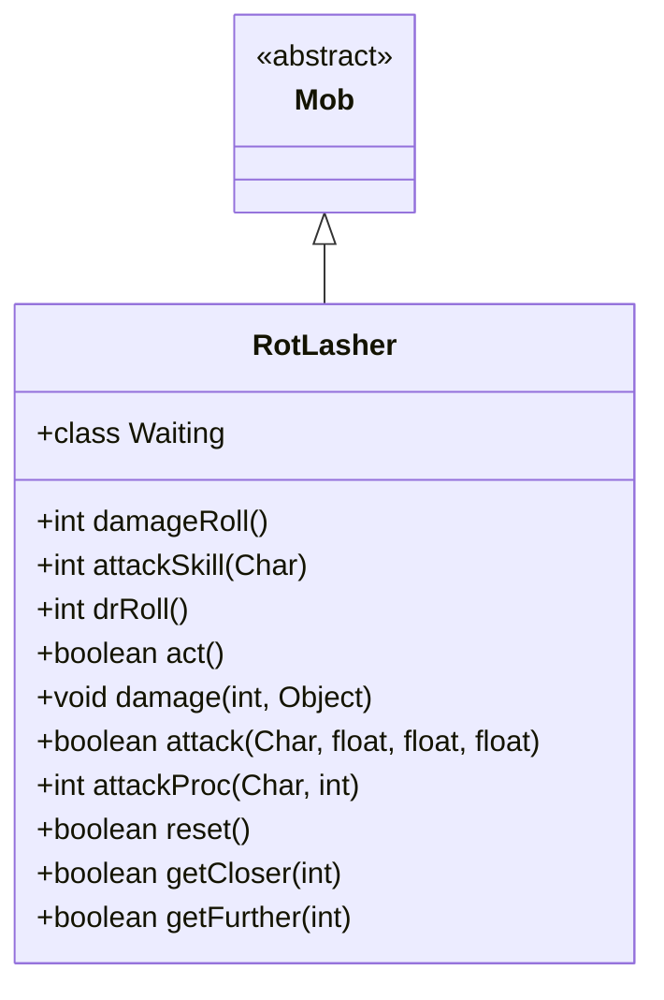

# RotLasher 类文档

## 1. 基本信息
| 属性 | 值 |
|------|-----|
| 文件路径 | core/src/main/java/com/shatteredpixel/shatteredpixeldungeon/actors/mobs/RotLasher.java |
| 包名 | com.shatteredpixel.shatteredpixeldungeon.actors.mobs |
| 类类型 | class |
| 继承关系 | extends Mob |
| 代码行数 | 133 行 |

## 2. 类职责说明
RotLasher（腐烂藤蔓）是一种不可移动的植物敌人，通常围绕 RotHeart（腐烂之心）生成。它攻击范围仅1格，攻击会造成残废效果。火焰可以直接杀死藤蔓。藤蔓会自动恢复生命，攻击玩家会降低任务评分。

## 4. 继承与协作关系


## 静态常量表
（无静态常量）

## 实例字段表
（无额外实例字段，继承自 Mob）

## 7. 方法详解

### act()
**签名**: `protected boolean act()`
**功能**: 每回合自动恢复生命
**返回值**: boolean - 行动结果
**实现逻辑**:
```
第59-62行: 如果HP未满且没有敌人在相邻格子，恢复5点HP
```

### damage(int dmg, Object src)
**签名**: `public void damage(int dmg, Object src)`
**功能**: 受到伤害时的处理
**参数**:
- dmg: int - 伤害值
- src: Object - 伤害来源
**实现逻辑**:
```
第68-70行: 如果来源是火焰，直接死亡
第71-73行: 否则正常处理伤害
```

### attack(Char enemy, float dmgMulti, float dmgBonus, float accMulti)
**签名**: `public boolean attack(Char enemy, float dmgMulti, float dmgBonus, float accMulti)`
**功能**: 攻击目标并降低任务评分
**参数**:
- enemy: Char - 目标
- dmgMulti/dmgBonus/accMulti: float - 攻击参数
**返回值**: boolean - 是否成功攻击
**实现逻辑**:
```
第78-80行: 如果攻击英雄，降低任务评分100分
```

### attackProc(Char enemy, int damage)
**签名**: `public int attackProc(Char enemy, int damage)`
**功能**: 攻击时施加残废
**参数**:
- enemy: Char - 目标
- damage: int - 伤害值
**返回值**: int - 最终伤害
**实现逻辑**:
```
第87行: 施加2回合残废
```

### reset()
**签名**: `public boolean reset()`
**功能**: 重置状态
**返回值**: boolean - true（可重置）

### getCloser(int target) / getFurther(int target)
**签名**: `protected boolean getCloser/getFurther(int target)`
**功能**: 移动方法（不可移动）
**返回值**: boolean - 始终返回 false

### damageRoll()
**签名**: `public int damageRoll()`
**功能**: 计算伤害掷骰
**返回值**: int - 伤害范围 10-20

### attackSkill(Char target)
**签名**: `public int attackSkill(Char target)`
**功能**: 获取攻击技能值
**返回值**: int - 攻击技能值 25

### drRoll()
**签名**: `public int drRoll()`
**功能**: 计算伤害减免
**返回值**: int - 伤害减免 0-8

## 内部类详解

### Waiting（等待状态）
**功能**: 替代游荡状态
**方法**:
- `noticeEnemy()`: 发现敌人时消耗一回合

## 11. 使用示例
```java
// 藤蔓不可移动
RotLasher lasher = new RotLasher();

// 火焰可以直接杀死
if (lasher.buff(Burning.class) != null) {
    lasher.die(null);
}

// 攻击会造成残废
// 会自动恢复生命
```

## 注意事项
1. **不可移动**: 具有 IMMOVABLE 属性
2. **小BOSS属性**: 属于 MINIBOSS 类型
3. **火焰弱点**: 火焰直接杀死
4. **自动恢复**: 每回合恢复5点HP
5. **毒气免疫**: 对毒气免疫
6. **评分影响**: 攻击玩家会降低任务评分

## 最佳实践
1. 使用火焰快速清除藤蔓
2. 保持距离避免被攻击
3. 配合清除腐烂之心一同处理
4. 注意残废效果的限制