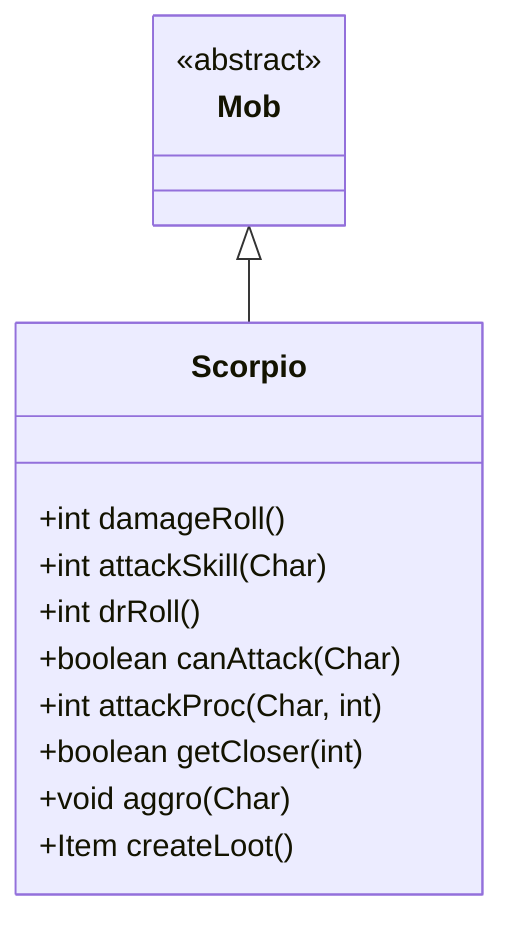

# Scorpio 类文档

## 1. 基本信息
| 属性 | 值 |
|------|-----|
| 文件路径 | core/src/main/java/com/shatteredpixel/shatteredpixeldungeon/actors/mobs/Scorpio.java |
| 包名 | com.shatteredpixel.shatteredpixeldungeon.actors.mobs |
| 类类型 | class |
| 继承关系 | extends Mob |
| 代码行数 | 117 行 |

## 2. 类职责说明
Scorpio（蝎子）是一种恶魔敌人，具有远程攻击能力。它会保持与目标的距离，使用投射物攻击。攻击有50%概率造成残废效果。蝎子掉落普通药水（不含治疗和力量药水）。

## 4. 继承与协作关系


## 静态常量表
（无静态常量）

## 实例字段表
（无额外实例字段，继承自 Mob）

## 7. 方法详解

### damageRoll()
**签名**: `public int damageRoll()`
**功能**: 计算伤害掷骰
**返回值**: int - 伤害范围 30-40

### attackSkill(Char target)
**签名**: `public int attackSkill(Char target)`
**功能**: 获取攻击技能值
**返回值**: int - 攻击技能值 36

### drRoll()
**签名**: `public int drRoll()`
**功能**: 计算伤害减免
**返回值**: int - 伤害减免 0-16

### canAttack(Char enemy)
**签名**: `protected boolean canAttack(Char enemy)`
**功能**: 判断是否能攻击（仅远程）
**参数**:
- enemy: Char - 目标
**返回值**: boolean - 是否能攻击
**实现逻辑**:
```
第74-75行: 目标不在相邻格子且投射物可达
         蝎子偏好远程攻击，不在近战距离攻击
```

### attackProc(Char enemy, int damage)
**签名**: `public int attackProc(Char enemy, int damage)`
**功能**: 攻击时可能造成残废
**参数**:
- enemy: Char - 目标
- damage: int - 伤害值
**返回值**: int - 最终伤害
**实现逻辑**:
```
第81-83行: 50%概率施加残废效果
```

### getCloser(int target)
**签名**: `protected boolean getCloser(int target)`
**功能**: 接近目标时实际保持距离
**参数**:
- target: int - 目标位置
**返回值**: boolean - 是否成功移动
**实现逻辑**:
```
第90-91行: 在追猎状态下，如果有视野则远离目标
         保持远程攻击距离
第92-94行: 其他状态正常移动
```

### aggro(Char ch)
**签名**: `public void aggro(Char ch)`
**功能**: 激活对目标的敌意
**参数**:
- ch: Char - 目标
**实现逻辑**:
```
第101-104行: 只能对视野内的目标激活敌意
           视野未初始化时跳过检查
```

### createLoot()
**签名**: `public Item createLoot()`
**功能**: 创建掉落物品
**返回值**: Item - 随机药水（排除治疗和力量）
**实现逻辑**:
```
第110-112行: 随机选择药水类型，排除治疗和力量
第114行: 创建药水实例
```

## 11. 使用示例
```java
// 蝎子保持远程距离攻击
Scorpio scorpio = new Scorpio();

// 会尝试远离玩家保持距离
// 攻击有50%概率造成残废

// 掉落普通药水
```

## 注意事项
1. **恶魔属性**: 属于 DEMONIC 类型
2. **远程偏好**: 尽量避免近战
3. **残废攻击**: 50%概率造成残废
4. **高伤害减免**: 0-16 点减免
5. **视野依赖**: 只能对看到的敌人激活

## 最佳实践
1. 逼近蝎子迫使其进入近战
2. 使用走廊限制其移动空间
3. 准备解除残废的手段
4. 高伤害输出应对高减免