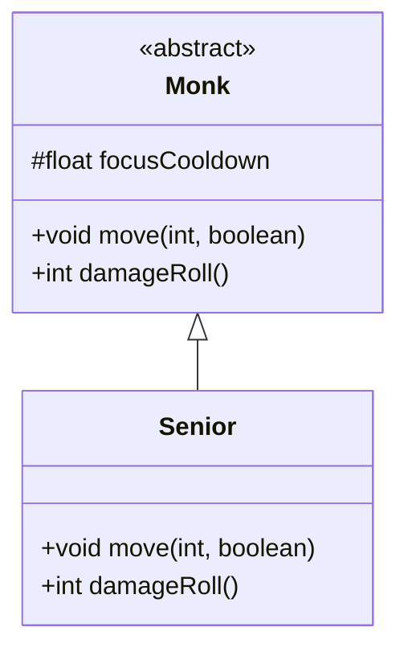

# Senior 类文档

## 1. 基本信息
| 属性 | 值 |
|------|-----|
| 文件路径 | core/src/main/java/com/shatteredpixel/shatteredpixeldungeon/actors/mobs/Senior.java |
| 包名 | com.shatteredpixel.shatteredpixeldungeon.actors.mobs |
| 类类型 | class |
| 继承关系 | extends Monk |
| 代码行数 | 50 行 |

## 2. 类职责说明
Senior（老僧）是 Monk（武僧）的稀有强化变种。老僧拥有更高的伤害输出和更快的专注冷却速度。移动时，老僧的专注冷却速度是普通武僧的两倍，使其能够更频繁地进入专注状态。老僧必定掉落食物。

## 4. 继承与协作关系


## 静态常量表
（无静态常量）

## 实例字段表
（无额外实例字段，继承自 Monk）

## 7. 方法详解

### move(int step, boolean travelling)
**签名**: `public void move(int step, boolean travelling)`
**功能**: 移动时额外减少专注冷却
**参数**:
- step: int - 目标位置
- travelling: boolean - 是否为旅行移动
**实现逻辑**:
```
第41行: 额外减少1.66点专注冷却
       加上继承的1.67，总共减少3.33（普通武僧只有1.67）
第42行: 调用父类移动方法
```

### damageRoll()
**签名**: `public int damageRoll()`
**功能**: 计算伤害掷骰
**返回值**: int - 伤害范围 16-25
**实现逻辑**:
```
第47行: 比普通武僧(12-20)更高的伤害
```

## 11. 使用示例
```java
// 老僧是稀有敌人
Senior senior = new Senior();

// 移动时更快恢复专注能力
// 专注状态下可以格挡攻击

// 必定掉落食物
```

## 注意事项
1. **双倍专注冷却**: 移动时冷却速度是普通武僧的两倍
2. **更高伤害**: 伤害范围16-25（普通武僧12-20）
3. **食物掉落**: 必定掉落馅饼
4. **稀有敌人**: 不常见，通常是特殊生成
5. **继承行为**: 继承武僧的所有行为模式

## 最佳实践
1. 小心频繁的格挡
2. 在其专注时避免攻击
3. 使用无法被格挡的攻击方式
4. 食物掉落对资源补充很有价值