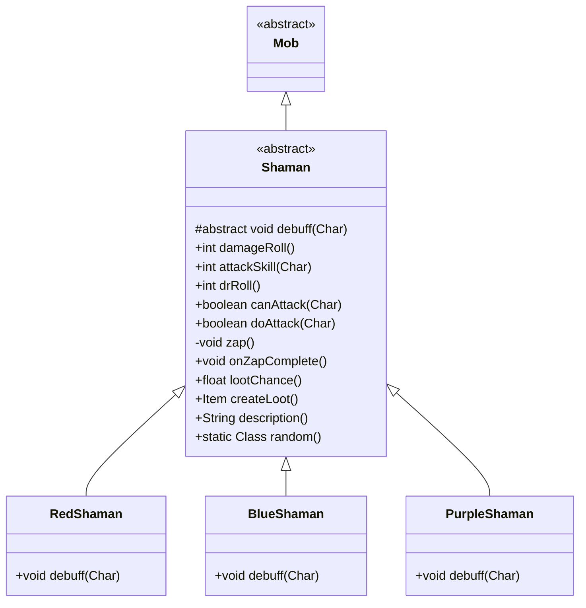

# Shaman 类文档

## 1. 基本信息
| 属性 | 值 |
|------|-----|
| 文件路径 | core/src/main/java/com/shatteredpixel/shatteredpixeldungeon/actors/mobs/Shaman.java |
| 包名 | com.shatteredpixel.shatteredpixeldungeon.actors.mobs |
| 类类型 | abstract class |
| 继承关系 | extends Mob |
| 代码行数 | 194 行 |

## 2. 类职责说明
Shaman（萨满）是一种远程魔法攻击敌人的抽象基类。萨满可以使用魔法弹从远处攻击玩家，并施加负面状态。游戏中有三种萨满变种：红色（虚弱）、蓝色（脆弱）、紫色（妖术）。萨满掉落法杖。

## 4. 继承与协作关系


## 静态常量表
（无静态常量）

## 实例字段表
（无额外实例字段，继承自 Mob）

## 7. 方法详解

### damageRoll()
**签名**: `public int damageRoll()`
**功能**: 计算伤害掷骰
**返回值**: int - 伤害范围 5-10

### attackSkill(Char target)
**签名**: `public int attackSkill(Char target)`
**功能**: 获取攻击技能值
**返回值**: int - 攻击技能值 18

### drRoll()
**签名**: `public int drRoll()`
**功能**: 计算伤害减免
**返回值**: int - 伤害减免 0-6

### canAttack(Char enemy)
**签名**: `protected boolean canAttack(Char enemy)`
**功能**: 判断是否能攻击（近战或远程）
**参数**:
- enemy: Char - 目标
**返回值**: boolean - 是否能攻击
**实现逻辑**:
```
第74-75行: 近战范围内或魔法弹道可达
```

### doAttack(Char enemy)
**签名**: `protected boolean doAttack(Char enemy)`
**功能**: 执行攻击（近战或远程）
**参数**:
- enemy: Char - 目标
**返回值**: boolean - 攻击是否完成
**实现逻辑**:
```
第93-96行: 如果近战范围内或弹道被阻挡，使用近战
第100-106行: 否则使用远程魔法攻击
```

### zap()
**签名**: `private void zap()`
**功能**: 发射魔法弹
**实现逻辑**:
```
第114行: 消耗1回合
第116行: 驱散隐身
第118-136行: 如果命中：
  - 50%概率施加负面状态
  - 造成6-15点魔法伤害
  - 如果杀死英雄，记录失败
  如果未命中，显示躲避消息
```

### debuff(Char enemy)
**签名**: `protected abstract void debuff(Char enemy)`
**功能**: 抽象方法，对目标施加负面状态
**参数**:
- enemy: Char - 目标

### onZapComplete()
**签名**: `public void onZapComplete()`
**功能**: 精灵动画完成后执行魔法攻击
**实现逻辑**:
```
第142行: 执行魔法攻击
第143行: 进入下一回合
```

### lootChance()
**签名**: `public float lootChance()`
**功能**: 计算掉落概率
**返回值**: float - 掉落概率
**实现逻辑**:
```
第82行: 每次掉落后概率降为1/3
```

### createLoot()
**签名**: `public Item createLoot()`
**功能**: 创建掉落物品
**返回值**: Item - 随机法杖
**实现逻辑**:
```
第87行: 增加有限掉落计数
第88行: 返回父类创建的法杖
```

### description()
**签名**: `public String description()`
**功能**: 获取描述
**返回值**: String - 包含魔法描述的文本

### random()
**签名**: `public static Class<? extends Shaman> random()`
**功能**: 随机选择萨满类型
**返回值**: Class - 萨满子类类型
**实现逻辑**:
```
第186-192行: 40%红色，40%蓝色，20%紫色
```

## 内部类详解

### RedShaman（红色萨满）
- **debuff**: 施加 Weakness（虚弱）
- **效果**: 减少目标伤害

### BlueShaman（蓝色萨满）
- **debuff**: 施加 Vulnerable（脆弱）
- **效果**: 增加目标受到的伤害

### PurpleShaman（紫色萨满）
- **debuff**: 施加 Hex（妖术）
- **效果**: 降低目标命中和闪避

## 11. 使用示例
```java
// 随机生成萨满
Class<? extends Shaman> type = Shaman.random();
Shaman shaman = Reflection.newInstance(type);

// 萨满会远程攻击并施加负面状态
// 红色最常见，紫色最稀有
```

## 注意事项
1. **远程攻击**: 可以从远处发射魔法弹
2. **负面状态**: 50%概率施加状态
3. **三种变种**: 红、蓝、紫三种，概率不同
4. **法杖掉落**: 掉落随机法杖
5. **EarthenBolt**: 魔法攻击使用此类型，可被特定抗性减免

## 最佳实践
1. 优先击杀紫色萨满（妖术最危险）
2. 保持移动躲避魔法弹
3. 在门口伏击限制远程优势
4. 准备解除负面状态的手段