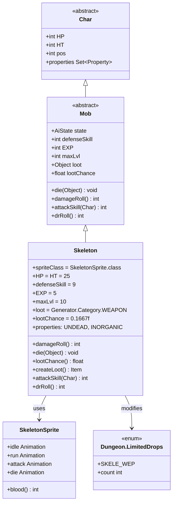
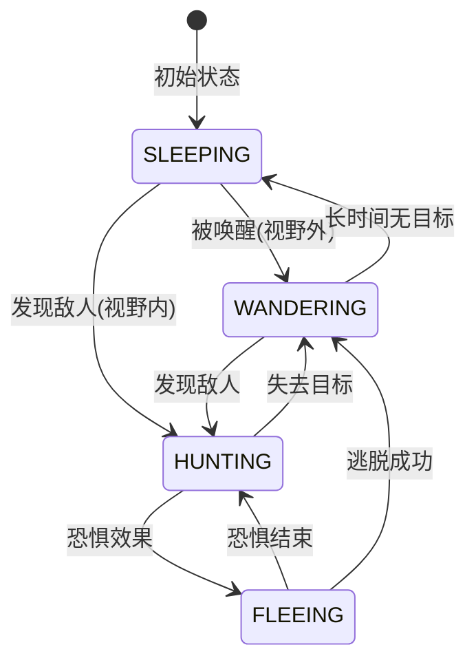

# Skeleton 源码详解

## 1. 基本信息

| 属性 | 值 |
|------|-----|
| **文件路径** | core/src/main/java/com/shatteredpixel/shatteredpixeldungeon/actors/mobs/Skeleton.java |
| **包名** | com.shatteredpixel.shatteredpixeldungeon.actors.mobs |
| **类类型** | public class |
| **继承关系** | extends Mob |
| **代码行数** | 166 |
| **中文名称** | 骷髅 |
| **怪物类型** | 中等难度敌人（监狱区域常见） |

---

## 类职责

Skeleton（骷髅）是游戏中监狱区域的主要敌人之一，具有独特的死亡爆炸机制。

**核心职责**：

1. **战斗威胁**：中等强度的近战敌人，需要玩家谨慎应对
2. **死亡爆炸**：死亡时对周围造成范围伤害，增加战术深度
3. **武器掉落**：有概率掉落武器，鼓励玩家击杀

**设计特点**：
- 拥有UNDEAD（亡灵）和INORGANIC（无机）双重属性
- 死亡爆炸对护甲的减伤效果翻倍，体现骨头碎片可被格挡的设计
- 掉落概率递减机制，防止玩家刷取大量武器

---

## 4. 继承与协作关系



---

## 静态常量表

Skeleton 类没有定义静态常量，但使用了以下外部常量：

| 常量 | 来源 | 用途 |
|------|------|------|
| `PathFinder.NEIGHBOURS8` | PathFinder | 8方向相邻格子偏移量，用于爆炸范围计算 |
| `Assets.Sounds.BONES` | Assets | 骨骼爆炸音效 |
| `Dungeon.LimitedDrops.SKELE_WEP` | Dungeon | 骷髅武器掉落计数器 |

---

## 实例字段表

Skeleton 使用实例初始化块 `{}` 来设置默认值：

| 字段名 | 类型 | 值 | 来源 | 说明 |
|--------|------|-----|------|------|
| `spriteClass` | Class | SkeletonSprite.class | Mob | 精灵类，决定骷髅的视觉表现 |
| `HP` | int | 25 | Char | 当前生命值 |
| `HT` | int | 25 | Char | 最大生命值 |
| `defenseSkill` | int | 9 | Mob | 防御技能值，影响闪避率 |
| `EXP` | int | 5 | Mob | 击杀经验值 |
| `maxLvl` | int | 10 | Mob | 最大有效等级 |
| `loot` | Object | Generator.Category.WEAPON | Mob | 掉落物类型（武器类别） |
| `lootChance` | float | 0.1667f | Mob | 基础掉落概率（1/6） |

**属性标记**：

| 属性 | 说明 |
|------|------|
| `Property.UNDEAD` | 亡灵属性，受圣光等效果影响 |
| `Property.INORGANIC` | 无机属性，不受毒药、流血等有机效果影响 |

**继承的默认值**（来自Mob类）：

| 字段名 | 默认值 | 说明 |
|--------|--------|------|
| `alignment` | Alignment.ENEMY | 敌对阵营 |
| `state` | SLEEPING | 初始为睡眠状态 |

---

## 7. 方法详解

### 1. 实例初始化块

```java
{
    spriteClass = SkeletonSprite.class;
    
    HP = HT = 25;
    defenseSkill = 9;
    
    EXP = 5;
    maxLvl = 10;

    loot = Generator.Category.WEAPON;
    lootChance = 0.1667f; //by default, see lootChance()

    properties.add(Property.UNDEAD);
    properties.add(Property.INORGANIC);
}
```

**逐行解释**：

| 行号 | 代码 | 作用 |
|------|------|------|
| 50 | `spriteClass = SkeletonSprite.class;` | 设置精灵类为SkeletonSprite |
| 52 | `HP = HT = 25;` | 设置生命值为25点 |
| 53 | `defenseSkill = 9;` | 防御技能为9点 |
| 55 | `EXP = 5;` | 击杀获得5点经验 |
| 56 | `maxLvl = 10;` | 最大有效等级10，玩家等级超过12级后击杀不获得经验 |
| 58-59 | `loot = Generator.Category.WEAPON; lootChance = 0.1667f;` | 设置掉落物为武器类别，基础概率1/6 |
| 61-62 | `properties.add(Property.UNDEAD/INORGANIC);` | 添加亡灵和无机属性 |

---

### 2. damageRoll() 方法

```java
@Override
public int damageRoll() {
    return Random.NormalIntRange( 2, 10 );
}
```

**方法作用**：返回骷髅攻击时造成的伤害值。

| 参数 | 说明 |
|------|------|
| 返回值 | 2-10之间的随机整数（均匀分布） |

**伤害分析**：
- 最低伤害：2点
- 最高伤害：10点
- 平均伤害：6点
- 配合较高的攻击技能值，对低护甲玩家威胁较大

---

### 3. die() 方法 —— 核心死亡爆炸逻辑

```java
@Override
public void die( Object cause ) {
    
    super.die( cause );
    
    if (cause == Chasm.class) return;
    
    boolean heroKilled = false;
    for (int i = 0; i < PathFinder.NEIGHBOURS8.length; i++) {
        Char ch = findChar( pos + PathFinder.NEIGHBOURS8[i] );
        if (ch != null && ch.isAlive()) {
            int damage = Math.round(Random.NormalIntRange(6, 12));
            damage = Math.round( damage * AscensionChallenge.statModifier(this));

            //all sources of DR are 2x effective vs. bone explosion
            //this does not consume extra uses of rock armor and earthroot armor
            // ... (护甲减伤处理逻辑)

            //apply DR twice (with 2 rolls for more consistency)
            damage = Math.max( 0,  damage - (ch.drRoll() + ch.drRoll()) );
            ch.damage( damage, this );
            if (ch == Dungeon.hero && !ch.isAlive()) {
                heroKilled = true;
            }
        }
    }
    
    if (Dungeon.level.heroFOV[pos]) {
        Sample.INSTANCE.play( Assets.Sounds.BONES );
    }
    
    if (heroKilled) {
        Dungeon.fail( this );
        GLog.n( Messages.get(this, "explo_kill") );
    }
}
```

**方法作用**：处理骷髅死亡时的骨骼爆炸效果。

**详细逻辑流程**：

| 步骤 | 代码 | 作用 |
|------|------|------|
| 1 | `super.die(cause)` | 调用父类死亡处理 |
| 2 | `if (cause == Chasm.class) return` | 如果死于深渊则不触发爆炸 |
| 3 | `for (int i = 0; i < PathFinder.NEIGHBOURS8.length; i++)` | 遍历周围8格 |
| 4 | `Char ch = findChar(pos + PathFinder.NEIGHBOURS8[i])` | 查找每格的角色 |
| 5 | `int damage = Math.round(Random.NormalIntRange(6, 12))` | 计算基础爆炸伤害6-12点 |
| 6 | `damage = Math.round(damage * AscensionChallenge.statModifier(this))` | 应用飞升挑战修正 |
| 7 | 各种护甲减伤处理（见下文） | 护甲效果翻倍 |
| 8 | `damage = Math.max(0, damage - (ch.drRoll() + ch.drRoll()))` | DR减免翻倍（两次掷骰） |
| 9 | `ch.damage(damage, this)` | 对角色造成伤害 |
| 10 | `Sample.INSTANCE.play(Assets.Sounds.BONES)` | 播放骨骼音效 |
| 11 | `Dungeon.fail(this)` 和 `GLog.n(...)` | 如果英雄被炸死，记录死亡原因 |

**护甲减伤翻倍机制详解**：

```java
// 大地法杖岩石护甲 - 效果翻倍但不消耗额外次数
WandOfLivingEarth.RockArmor rockArmor = ch.buff(WandOfLivingEarth.RockArmor.class);
if (rockArmor != null) {
    int preDmg = damage;
    damage = rockArmor.absorb(damage);
    damage *= Math.round(damage/(float)preDmg); // 百分比减免应用两次
}

// 地根草护甲 - 效果翻倍但不消耗额外次数
Earthroot.Armor armor = ch.buff(Earthroot.Armor.class);
if (damage > 0 && armor != null) {
    int preDmg = damage;
    damage = armor.absorb(damage);
    damage -= (preDmg - damage); // 固定减免应用两次
}

// 圣光护盾（牧师天赋）- 效果翻倍
ShieldOfLight.ShieldOfLightTracker shield = ch.buff(ShieldOfLight.ShieldOfLightTracker.class);
if (shield != null && shield.object == id()) {
    int min = 1 + Dungeon.hero.pointsInTalent(Talent.SHIELD_OF_LIGHT);
    damage -= Random.NormalIntRange(min, 2 * min);
    damage -= Random.NormalIntRange(min, 2 * min); // 应用两次
}

// 圣 ward 护甲
if (ch.buff(HolyWard.HolyArmBuff.class) != null){
    damage -= Dungeon.hero.subClass == HeroSubClass.PALADIN ? 6 : 2; // 翻倍
}

// 基础DR减免 - 两次掷骰
damage = Math.max(0, damage - (ch.drRoll() + ch.drRoll()));
```

**设计意义**：
- 骨骼碎片可以被护甲有效格挡，体现物理合理性
- 护甲效果翻倍但不额外消耗，防止玩家资源过度损失
- 两次DR掷骰提高减免的稳定性

---

### 4. lootChance() 方法

```java
@Override
public float lootChance() {
    //each drop makes future drops 1/3 as likely
    // so loot chance looks like: 1/6, 1/18, 1/54, 1/162, etc.
    return super.lootChance() * (float)Math.pow(1/3f, Dungeon.LimitedDrops.SKELE_WEP.count);
}
```

**方法作用**：返回当前的掉落概率，实现递减机制。

**掉落概率计算**：

| 已掉落次数 | 掉落概率 | 计算公式 |
|-----------|---------|---------|
| 0 | 1/6 ≈ 16.67% | 1/6 × (1/3)^0 |
| 1 | 1/18 ≈ 5.56% | 1/6 × (1/3)^1 |
| 2 | 1/54 ≈ 1.85% | 1/6 × (1/3)^2 |
| 3 | 1/162 ≈ 0.62% | 1/6 × (1/3)^3 |

**设计意义**：防止玩家在监狱层刷取大量武器，保持游戏经济平衡。

---

### 5. createLoot() 方法

```java
@Override
public Item createLoot() {
    Dungeon.LimitedDrops.SKELE_WEP.count++;
    return super.createLoot();
}
```

**方法作用**：创建掉落物并增加掉落计数器。

| 步骤 | 代码 | 作用 |
|------|------|------|
| 1 | `Dungeon.LimitedDrops.SKELE_WEP.count++` | 增加全局掉落计数 |
| 2 | `return super.createLoot()` | 调用父类方法生成武器 |

**注意事项**：
- 计数器在掉落前增加，而非掉落后
- 这确保了 `lootChance()` 使用的是正确的已掉落数量

---

### 6. attackSkill() 方法

```java
@Override
public int attackSkill( Char target ) {
    return 12;
}
```

**方法作用**：返回骷髅对目标攻击时的技能值。

| 参数 | 说明 |
|------|------|
| target | 攻击目标（未使用） |
| 返回值 | 固定12点攻击技能值 |

**命中率计算**：
- 命中率 = 攻击技能 / (攻击技能 + 目标防御技能)
- 对防御技能5的玩家：命中率 = 12/(12+5) ≈ 70.6%
- 对防御技能10的玩家：命中率 = 12/(12+10) ≈ 54.5%

---

### 7. drRoll() 方法

```java
@Override
public int drRoll() {
    return super.drRoll() + Random.NormalIntRange(0, 5);
}
```

**方法作用**：返回骷髅的伤害减免值。

| 参数 | 说明 |
|------|------|
| 返回值 | 父类减免 + 0-5点随机减免 |

**伤害减免分析**：
- 基础减免（父类）：通常为0
- 额外减免：0-5点（均匀分布）
- 平均减免：2.5点
- 相比Rat（0-1点），骷髅有明显更好的防御能力

---

## AI行为说明

Skeleton类没有重写任何AI相关方法，使用Mob类的标准AI行为：



**行为特点**：
- 初始为睡眠状态
- 被动等待玩家接近
- 发现敌人后进入追击状态
- 死亡时触发爆炸，玩家需保持距离

---

## 属性总结表

### 战斗属性

| 属性     | 值    | 评价            |
| ------ | ---- | ------------- |
| HP     | 25   | 中等，需要3-5次攻击击杀 |
| 攻击伤害   | 2-10 | 中等，波动较大       |
| 攻击技能   | 12   | 中等偏高          |
| 防御技能   | 9    | 中等            |
| 伤害减免   | 0-5  | 有一定防御能力       |
| 经验值    | 5    | 中等经验          |
| 最大有效等级 | 10   | 监狱层有效         |

### 特殊能力

| 能力 | 描述 |
|------|------|
| 死亡爆炸 | 死亡时对周围8格造成6-12点伤害 |
| 护甲翻倍 | 所有护甲效果对爆炸伤害减半 |
| 深渊豁免 | 死于深渊时不触发爆炸 |

### 生成位置

| 区域 | 出现层数 |
|------|----------|
| 监狱 | 6-10层 |
| 其他区域 | 可能由死灵法师召唤 |

---

## 11. 使用示例

### 1. 创建具有爆炸机制的敌人

```java
public class BoneGolem extends Mob {
    
    @Override
    public void die(Object cause) {
        super.die(cause);
        
        // 跳过深渊死亡
        if (cause == Chasm.class) return;
        
        // 自定义爆炸逻辑
        for (int i = 0; i < PathFinder.NEIGHBOURS8.length; i++) {
            Char ch = findChar(pos + PathFinder.NEIGHBOURS8[i]);
            if (ch != null && ch.isAlive()) {
                int damage = Random.NormalIntRange(10, 20); // 更高伤害
                // 护甲减半处理...
                ch.damage(damage, this);
            }
        }
    }
}
```

### 2. 检测骷髅的属性

```java
// 检查是否为亡灵
if (skeleton.properties.contains(Char.Property.UNDEAD)) {
    // 对亡灵有额外效果
    damage *= 1.5f;
}

// 检查是否为无机生物
if (skeleton.properties.contains(Char.Property.INORGANIC)) {
    // 毒药无效
    return;
}
```

### 3. 处理掉落概率

```java
// 获取当前掉落概率
float chance = skeleton.lootChance();

// 模拟多次掉落后的概率变化
System.out.println("初始概率: " + (1/6f));          // ~16.67%
System.out.println("一次掉落后: " + (1/6f * 1/3f)); // ~5.56%
System.out.println("两次掉落后: " + (1/6f * 1/9f)); // ~1.85%
```

### 4. 安全击杀骷髅

```java
// 建议：在击杀骷髅前先移动到安全距离
public void safeKillSkeleton(Skeleton skeleton) {
    // 1. 确保不在骷髅相邻格子
    if (Dungeon.level.adjacent(Dungeon.hero.pos, skeleton.pos)) {
        // 先移动开
        Dungeon.hero.moveAway(skeleton.pos);
    }
    
    // 2. 远程击杀
    Dungeon.hero.attack(skeleton); // 使用远程武器
    
    // 3. 死亡爆炸不会伤害到玩家
}
```

---

## 注意事项

### 1. 死亡爆炸的特殊性

- **触发条件**：任何非深渊死因都会触发爆炸
- **伤害范围**：周围8格（Moore邻域）
- **护甲效果**：所有减伤效果翻倍，但不额外消耗资源
- **深渊豁免**：被推入深渊不会爆炸，设计上防止连锁伤害

### 2. 掉落机制

- `Dungeon.LimitedDrops.SKELE_WEP` 是全局计数器
- 掉落概率随游戏进程递减，而非单个存档
- 这意味着新游戏不会重置计数器

### 3. 属性交互

- **UNDEAD属性**：受神圣伤害加成，可被牧师技能克制
- **INORGANIC属性**：免疫毒药、流血等有机效果
- 双重属性使骷髅对多种减益效果有抗性

### 4. 与死灵法师的关系

```java
// 死灵法师可以召唤骷髅
Necromancer.NecroSkeleton skeleton = new Necromancer.NecroSkeleton();
// 召唤的骷髅会在死灵法师死亡时一同死亡
```

---

## 最佳实践

### 1. 应对骷髅的策略

```java
// 玩家策略建议：
// 1. 保持距离 - 使用远程武器击杀
// 2. 利用地形 - 在狭窄通道中战斗，减少爆炸影响范围
// 3. 确保护甲 - 护甲对爆炸伤害效果翻倍
```

### 2. 自定义类似敌人

```java
public class ExplosiveEnemy extends Mob {
    
    @Override
    public void die(Object cause) {
        super.die(cause);
        
        // 参考Skeleton的爆炸实现
        if (cause == Chasm.class) return; // 深渊豁免
        
        // 自定义伤害类型和范围
        int explosionRadius = 2; // 2格半径
        int baseDamage = Random.NormalIntRange(5, 15);
        
        // 使用PathFinder计算范围
        PathFinder.buildDistanceMap(pos, explosionRadius);
        for (int cell = 0; cell < Dungeon.level.length(); cell++) {
            if (PathFinder.distance[cell] <= explosionRadius) {
                Char ch = findChar(cell);
                if (ch != null && ch.isAlive()) {
                    // 护甲减半逻辑...
                    ch.damage(baseDamage, this);
                }
            }
        }
    }
}
```

### 3. 添加护甲翻倍效果

```java
// 对特定伤害类型应用护甲翻倍
public int applyDoubleArmor(Char target, int damage) {
    // 大地护甲
    WandOfLivingEarth.RockArmor rockArmor = target.buff(WandOfLivingEarth.RockArmor.class);
    if (rockArmor != null) {
        int preDmg = damage;
        damage = rockArmor.absorb(damage);
        damage = Math.round(damage * damage / (float)preDmg);
    }
    
    // 地根护甲
    Earthroot.Armor armor = target.buff(Earthroot.Armor.class);
    if (damage > 0 && armor != null) {
        int preDmg = damage;
        damage = armor.absorb(damage);
        damage -= (preDmg - damage);
    }
    
    // 基础DR两次
    damage = Math.max(0, damage - (target.drRoll() + target.drRoll()));
    
    return damage;
}
```

---

## 与相关类的对比

| 类 | HP | 伤害 | 防御 | 特殊能力 | 出现区域 |
|----|-----|------|------|---------|---------|
| **Skeleton** | 25 | 2-10 | 9 | 死亡爆炸 | 监狱 |
| Guard | 30 | 5-10 | 10 | 照明弹 | 监狱 |
| Necromancer | 20 | 2-8 | 8 | 召唤骷髅 | 监狱 |
| Thief | 15 | 1-10 | 8 | 偷窃 | 监狱 |
| Crab | 15 | 3-6 | 5 | 水中加速 | 下水道 |

---

## 版本历史

| 版本 | 变更 |
|------|------|
| 初始版本 | 作为监狱层基础怪物实现，具有死亡爆炸能力 |
| 护甲翻倍更新 | 爆炸伤害对护甲效果翻倍，但不额外消耗资源 |
| 掉落限制 | 添加LimitedDrops.SKELE_WEP实现掉落概率递减 |
| 飞升挑战 | 添加AscensionChallenge.statModifier对爆炸伤害的修正 |
| 牧师天赋整合 | 添加ShieldOfLight等天赋对爆炸伤害的减免处理 |