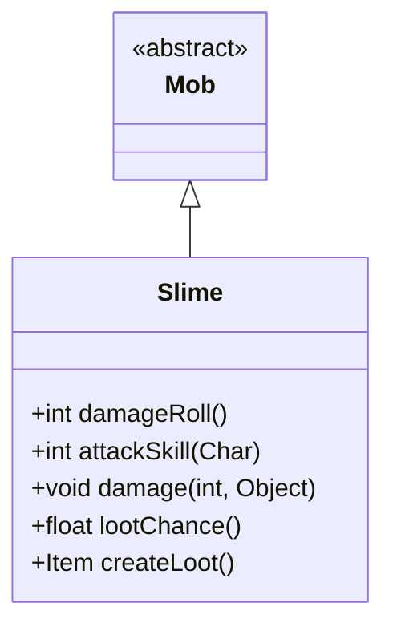

# Slime 类文档

## 1. 基本信息
| 属性 | 值 |
|------|-----|
| 文件路径 | core/src/main/java/com/shatteredpixel/shatteredpixeldungeon/actors/mobs/Slime.java |
| 包名 | com.shatteredpixel.shatteredpixeldungeon.actors.mobs |
| 类类型 | class |
| 继承关系 | extends Mob |
| 代码行数 | 84 行 |

## 2. 类职责说明
Slime（史莱姆）是一种早期敌人，具有独特的伤害减免机制。高伤害会被削减，使得史莱姆对爆发伤害有很好的抵抗能力。史莱姆掉落 T2（第二阶）近战武器，是早期获取更好武器的重要来源。

## 4. 继承与协作关系


## 静态常量表
（无静态常量）

## 实例字段表
（无额外实例字段，继承自 Mob）

## 7. 方法详解

### damageRoll()
**签名**: `public int damageRoll()`
**功能**: 计算伤害掷骰
**返回值**: int - 伤害范围 2-5
**实现逻辑**:
```
第49行: 返回较低的伤害范围
```

### attackSkill(Char target)
**签名**: `public int attackSkill(Char target)`
**功能**: 获取攻击技能值
**返回值**: int - 攻击技能值 12
**实现逻辑**:
```
第54行: 返回中等攻击技能值
```

### damage(int dmg, Object src)
**签名**: `public void damage(int dmg, Object src)`
**功能**: 受到伤害时的特殊处理（伤害减免）
**参数**:
- dmg: int - 原始伤害值
- src: Object - 伤害来源
**实现逻辑**:
```
第59-60行: 获取飞升挑战修正系数
第61-64行: 如果伤害>=5，应用平方根减免公式
         将高伤害削减为更低的值
第65行: 重新应用修正系数
第66行: 调用父类伤害处理
```

### lootChance()
**签名**: `public float lootChance()`
**功能**: 计算掉落概率
**返回值**: float - 掉落概率
**实现逻辑**:
```
第73行: 每次掉落后概率降为1/4
       序列: 1/5, 1/20, 1/80, 1/320...
```

### createLoot()
**签名**: `public Item createLoot()`
**功能**: 创建掉落物品
**返回值**: Item - 随机 T2 近战武器
**实现逻辑**:
```
第78行: 增加有限掉落计数
第79-81行: 生成随机 T2 武器，等级设为0
```

## 11. 使用示例
```java
// 史莱姆减免高伤害
Slime slime = new Slime();

// 原始伤害25 -> 实际伤害约10
// 公式: 4 + (sqrt(8*(dmg-4)+1) - 1) / 2

// 掉落 T2 武器（如长剑、战斧等）
```

## 注意事项
1. **伤害减免**: 高伤害会被平方根公式削减
2. **低伤害有效**: 低伤害攻击不受削减
3. **武器掉落**: 掉落第二阶近战武器
4. **掉落递减**: 每次掉落后概率大幅降低
5. **早期敌人**: 出现在监狱层

## 最佳实践
1. 使用多次低伤害攻击而非单次高伤害
2. 早期击杀获取更好的武器
3. 注意伤害减免对爆发技能的影响
4. 飞升挑战下减免效果更强