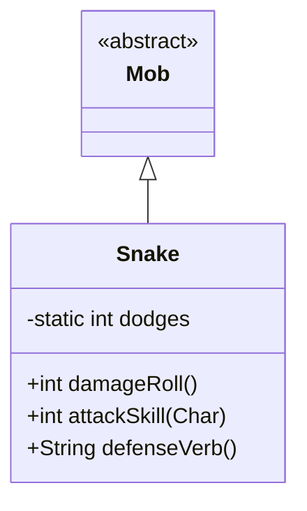

# Snake 类文档

## 1. 基本信息
| 属性 | 值 |
|------|-----|
| 文件路径 | core/src/main/java/com/shatteredpixel/shatteredpixeldungeon/actors/mobs/Snake.java |
| 包名 | com.shatteredpixel.shatteredpixeldungeon.actors.mobs |
| 类类型 | class |
| 继承关系 | extends Mob |
| 代码行数 | 72 行 |

## 2. 类职责说明
Snake（蛇）是一种早期敌人，具有极高的闪避能力。它的防御技能高达 25，是同级别敌人中最高的之一。蛇的主要作用是教导玩家关于伏击攻击和命中机制，当玩家多次被蛇躲避攻击时会触发教程提示。

## 4. 继承与协作关系


## 静态常量表
（无静态常量）

## 实例字段表
| 字段名 | 类型 | 修饰符 | 说明 |
|--------|------|--------|------|
| dodges | int | private static | 玩家被躲避次数计数器 |

## 7. 方法详解

### damageRoll()
**签名**: `public int damageRoll()`
**功能**: 计算伤害掷骰
**返回值**: int - 伤害范围 1-4
**实现逻辑**:
```
第50行: 返回较低的伤害范围
```

### attackSkill(Char target)
**签名**: `public int attackSkill(Char target)`
**功能**: 获取攻击技能值
**参数**:
- target: Char - 目标角色
**返回值**: int - 攻击技能值 10
**实现逻辑**:
```
第55行: 返回较低的攻击技能值
```

### defenseVerb()
**签名**: `public String defenseVerb()`
**功能**: 获取防御动词并触发教程
**返回值**: String - 防御动词
**实现逻辑**:
```
第62-64行: 如果在玩家视野内，增加躲避计数
第65-69行: 如果满足条件触发教程提示：
         - 躲避2次且未阅读伏击教程
         - 躲避4次且未击败第一个boss
         重置计数器
第70行: 返回父类的防御动词
```

## 11. 使用示例
```java
// 蛇是早期敌人，高闪避
Snake snake = new Snake();
snake.defenseSkill = 25;  // 极高的闪避

// 玩家被多次躲避后会收到教程提示
// 教导使用伏击攻击来提高命中率
```

## 注意事项
1. **极高闪避**: 防御技能 25，难以命中
2. **低伤害**: 伤害范围仅 1-4
3. **教程触发**: 多次躲避后触发教程
4. **低攻击**: 攻击技能仅 10，容易躲避
5. **种子掉落**: 掉落植物种子

## 最佳实践
1. 使用伏击攻击提高命中率
2. 在门口或转角处伏击
3. 不要在正面与蛇缠斗
4. 低级别时小心蛇的累积伤害