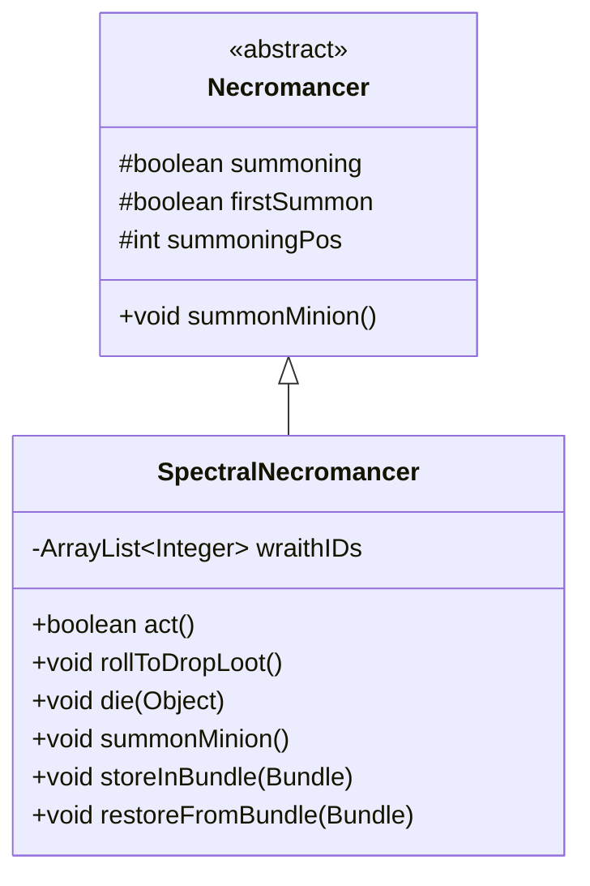

# SpectralNecromancer 类文档

## 1. 基本信息
| 属性 | 值 |
|------|-----|
| 文件路径 | core/src/main/java/com/shatteredpixel/shatteredpixeldungeon/actors/mobs/SpectralNecromancer.java |
| 包名 | com.shatteredpixel.shatteredpixeldungeon.actors.mobs |
| 类类型 | class |
| 继承关系 | extends Necromancer |
| 代码行数 | 165 行 |

## 2. 类职责说明
SpectralNecromancer（幽灵死灵法师）是 Necromancer 的稀有变种。与普通死灵法师不同，它召唤幽灵而非骷髅，并且自身死亡时会带走所有召唤的幽灵。它还会掉落解咒卷轴。幽灵死灵法师使用不同的精灵外观。

## 4. 继承与协作关系


## 静态常量表
| 常量名 | 类型 | 值 | 说明 |
|--------|------|-----|------|
| WRAITH_IDS | String | "wraith_ids" | Bundle 存储键 - 幽灵ID列表 |

## 实例字段表
| 字段名 | 类型 | 修饰符 | 说明 |
|--------|------|--------|------|
| wraithIDs | ArrayList\<Integer\> | private | 已召唤幽灵的 Actor ID 列表 |

## 7. 方法详解

### act()
**签名**: `protected boolean act()`
**功能**: 每回合行动，处理召唤状态
**返回值**: boolean - 行动结果
**实现逻辑**:
```
第50-55行: 如果正在召唤但不在追猎状态，取消召唤
         通知精灵取消召唤动画
第56行: 调用父类 act 方法
```

### rollToDropLoot()
**签名**: `public void rollToDropLoot()`
**功能**: 死亡时掉落额外物品
**实现逻辑**:
```
第61行: 如果英雄等级过高，跳过
第63行: 调用父类掉落处理
第65-69行: 在相邻格子掉落解咒卷轴
```

### die(Object cause)
**签名**: `public void die(Object cause)`
**功能**: 死亡时杀死所有召唤的幽灵
**参数**:
- cause: Object - 死亡原因
**实现逻辑**:
```
第74-79行: 遍历所有记录的幽灵ID，杀死它们
第81行: 调用父类死亡处理
```

### summonMinion()
**签名**: `public void summonMinion()`
**功能**: 召唤幽灵仆从
**实现逻辑**:
```
第105-144行: 如果召唤位置被占用，尝试推开或伤害阻挡者
第147-152行: 取消召唤状态
第149行: 在召唤位置生成幽灵
第154行: 调整幽灵属性（等级4）
第155-156行: 占用格子并完成召唤动画
第158-162行: 复制持久性 Buff
第163行: 记录幽灵 ID
```

### storeInBundle(Bundle bundle)
**签名**: `public void storeInBundle(Bundle bundle)`
**功能**: 保存状态到 Bundle
**实现逻辑**:
```
第88-91行: 保存幽灵 ID 数组
```

### restoreFromBundle(Bundle bundle)
**签名**: `public void restoreFromBundle(Bundle bundle)`
**功能**: 从 Bundle 恢复状态
**实现逻辑**:
```
第97-100行: 恢复幽灵 ID 列表
```

## 11. 使用示例
```java
// 幽灵死灵法师召唤幽灵而非骷髅
SpectralNecromancer necro = new SpectralNecromancer();

// 召唤的幽灵会被记录 ID
// 死灵法师死亡时所有幽灵一起死亡

// 掉落解咒卷轴
// 幽灵属性固定为等级4
```

## 注意事项
1. **召唤幽灵**: 召唤幽灵而非骷髅
2. **连锁死亡**: 死灵法师死亡时带走所有幽灵
3. **推开机制**: 召唤位置被占用时会推开或伤害
4. **解咒掉落**: 额外掉落解咒卷轴
5. **精灵动画**: 有特殊的召唤/取消动画

## 最佳实践
1. 优先击杀死灵法师可同时消灭所有幽灵
2. 使用位移技能阻止召唤
3. 解咒卷轴在诅咒关卡很有价值
4. 注意幽灵的飞行能力