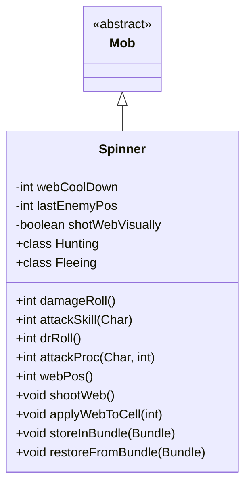

# Spinner 类文档

## 1. 基本信息
| 属性 | 值 |
|------|-----|
| 文件路径 | core/src/main/java/com/shatteredpixel/shatteredpixeldungeon/actors/mobs/Spinner.java |
| 包名 | com.shatteredpixel.shatteredpixeldungeon.actors.mobs |
| 类类型 | class |
| 继承关系 | extends Mob |
| 代码行数 | 274 行 |

## 2. 类职责说明
Spinner（纺织者蜘蛛）是一种具有结网和毒攻击能力的敌人。它会预测玩家的移动方向并在路径上喷射蛛网，减慢玩家速度。近战攻击有50%概率造成中毒效果，施毒后会逃跑。蜘蛛对毒素免疫，并且不会被自己的网困住。

## 4. 继承与协作关系


## 静态常量表
| 常量名 | 类型 | 值 | 说明 |
|--------|------|-----|------|
| WEB_COOLDOWN | String | "web_cooldown" | Bundle 存储键 - 蛛网冷却 |
| LAST_ENEMY_POS | String | "last_enemy_pos" | Bundle 存储键 - 最后敌人位置 |

## 实例字段表
| 字段名 | 类型 | 修饰符 | 说明 |
|--------|------|--------|------|
| webCoolDown | int | private | 蛛网技能冷却时间 |
| lastEnemyPos | int | private | 敌人上次位置 |
| shotWebVisually | boolean | private | 是否刚发射蛛网（视觉效果标记） |

## 7. 方法详解

### damageRoll()
**签名**: `public int damageRoll()`
**功能**: 计算伤害掷骰
**返回值**: int - 伤害范围 10-20

### attackSkill(Char target)
**签名**: `public int attackSkill(Char target)`
**功能**: 获取攻击技能值
**返回值**: int - 攻击技能值 22

### drRoll()
**签名**: `public int drRoll()`
**功能**: 计算伤害减免
**返回值**: int - 伤害减免 0-6

### act()
**签名**: `protected boolean act()`
**功能**: 每回合行动逻辑
**返回值**: boolean - 行动结果
**实现逻辑**:
```
第96-98行: 在追猎或逃跑状态下减少蛛网冷却
第100-114行: 更新敌人位置追踪（用于预测移动方向）
           不在刚发射蛛网的回合更新
```

### attackProc(Char enemy, int damage)
**签名**: `public int attackProc(Char enemy, int damage)`
**功能**: 攻击时可能施毒
**参数**:
- enemy: Char - 目标
- damage: int - 伤害值
**返回值**: int - 最终伤害
**实现逻辑**:
```
第122行: 50%概率触发
第123-126行: 施加7-8回合中毒（受飞升挑战修正）
第127-128行: 重置蛛网冷却，进入逃跑状态
```

### webPos()
**签名**: `public int webPos()`
**功能**: 计算蛛网应该喷射的位置
**返回值**: int - 蛛网位置，无效返回-1
**实现逻辑**:
```
第142-144行: 如果敌人没移动且可以近战攻击，不结网
第148-152行: 计算弹道方向（预测敌人移动方向）
第154-167行: 找到敌人位置后的下一个格子
第170-176行: 确保可以射到目标位置且位置可行
```

### shootWeb()
**签名**: `public void shootWeb()`
**功能**: 喷射蛛网
**实现逻辑**:
```
第184-188行: 确定喷射方向
第191-196行: 在目标位置和相邻两个位置放置蛛网
第198行: 设置10回合冷却
第200-202行: 打断英雄当前动作
第204行: 完成回合
```

### applyWebToCell(int cell)
**签名**: `protected void applyWebToCell(int cell)`
**功能**: 在指定格子放置蛛网
**参数**:
- cell: int - 目标格子
**实现逻辑**:
```
第208行: 添加蛛网 Blob
```

## 内部类详解

### Hunting（追猎状态）
**功能**: 追击敌人并在适当时机发射蛛网
**方法**:
- `act()`: 如果蛛网冷却结束且有有效目标位置，发射蛛网

### Fleeing（逃跑状态）
**功能**: 逃跑但继续使用蛛网
**方法**:
- `act()`: 如果敌人没有中毒，恢复追猎状态；否则继续逃跑并尝试发射蛛网

## 11. 使用示例
```java
// 蜘蛛会预测玩家移动方向并喷射蛛网
Spinner spider = new Spinner();

// 蛛网会减慢玩家速度
// 玩家应该尝试改变移动方向来躲避预测

// 近战攻击有50%概率中毒
// 中毒后蜘蛛会逃跑
```

## 注意事项
1. **毒素抗性**: 对毒素有抗性
2. **蛛网免疫**: 不会被自己的网困住
3. **预测移动**: 会预测玩家移动方向
4. **冷却时间**: 蛛网技能10回合冷却
5. **中毒攻击**: 近战50%概率施毒

## 最佳实践
1. 变换移动方向躲避蛛网预测
2. 准备解毒手段
3. 在蜘蛛施毒后追击（它会逃跑）
4. 注意蛛网会减慢移动速度