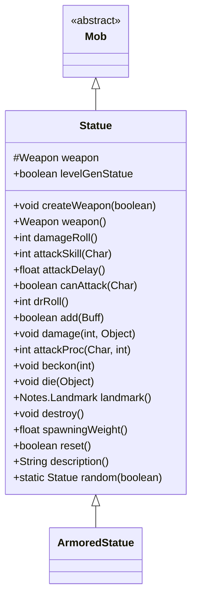

# Statue 类文档

## 1. 基本信息
| 属性 | 值 |
|------|-----|
| 文件路径 | core/src/main/java/com/shatteredpixel/shatteredpixeldungeon/actors/mobs/Statue.java |
| 包名 | com.shatteredpixel.shatteredpixeldungeon.actors.mobs |
| 类类型 | class |
| 继承关系 | extends Mob |
| 代码行数 | 215 行 |

## 2. 类职责说明
Statue（活雕像）是一种被动敌人，持有随机附魔武器。雕像在被攻击或受到负面效果前保持被动状态。击杀雕像可以获得其持有的武器。雕像的属性随地牢深度增长，存在稀有变种 ArmoredStatue（装甲雕像）。

## 4. 继承与协作关系


## 静态常量表
| 常量名 | 类型 | 值 | 说明 |
|--------|------|-----|------|
| WEAPON | String | "weapon" | Bundle 存储键 - 武器 |

## 实例字段表
| 字段名 | 类型 | 修饰符 | 说明 |
|--------|------|--------|------|
| weapon | Weapon | protected | 雕像持有的武器 |
| levelGenStatue | boolean | public | 是否为关卡生成雕像 |

## 7. 方法详解

### 构造函数
**签名**: `public Statue()`
**功能**: 初始化雕像属性
**实现逻辑**:
```
第58-59行: HP/HT = 15 + depth*5，防御 = 4 + depth
```

### createWeapon(boolean useDecks)
**签名**: `public void createWeapon(boolean useDecks)`
**功能**: 生成随机武器
**参数**:
- useDecks: boolean - 是否使用牌组生成
**实现逻辑**:
```
第63-67行: 生成随机近战武器
第68-70行: 标记生成方式，武器不诅咒，随机附魔
```

### weapon()
**签名**: `public Weapon weapon()`
**功能**: 获取持有的武器
**返回值**: Weapon - 武器实例

### damageRoll()
**签名**: `public int damageRoll()`
**功能**: 计算伤害掷骰
**返回值**: int - 使用武器的伤害
**实现逻辑**:
```
第93行: 委托给武器的 damageRoll 方法
```

### attackSkill(Char target)
**签名**: `public int attackSkill(Char target)`
**功能**: 获取攻击技能值
**返回值**: int - (9+depth) * 武器命中因子
**实现逻辑**:
```
第98行: 基础命中 + 深度，乘以武器命中修正
```

### attackDelay()
**签名**: `public float attackDelay()`
**功能**: 获取攻击延迟
**返回值**: float - 正常延迟 * 武器延迟因子
**实现逻辑**:
```
第103行: 使用武器的延迟修正
```

### canAttack(Char enemy)
**签名**: `protected boolean canAttack(Char enemy)`
**功能**: 判断是否能攻击
**参数**:
- enemy: Char - 目标
**返回值**: boolean - 是否能攻击
**实现逻辑**:
```
第108行: 近战范围内或武器可达范围
```

### drRoll()
**签名**: `public int drRoll()`
**功能**: 计算伤害减免
**返回值**: int - 0 到 (depth + 武器防御因子)
**实现逻辑**:
```
第113行: 基础减免 + 深度 + 武器防御修正
```

### add(Buff buff)
**签名**: `public boolean add(Buff buff)`
**功能**: 添加 Buff，可能激活雕像
**参数**:
- buff: Buff - 要添加的 Buff
**返回值**: boolean - 是否成功添加
**实现逻辑**:
```
第118-121行: 如果添加负面 Buff 且处于被动状态，激活雕像
```

### damage(int dmg, Object src)
**签名**: `public void damage(int dmg, Object src)`
**功能**: 受到伤害，激活雕像
**参数**:
- dmg: int - 伤害值
- src: Object - 伤害来源
**实现逻辑**:
```
第130-132行: 如果处于被动状态，激活雕像
第134行: 调用父类伤害处理
```

### attackProc(Char enemy, int damage)
**签名**: `public int attackProc(Char enemy, int damage)`
**功能**: 攻击时触发武器附魔
**参数**:
- enemy: Char - 目标
- damage: int - 伤害值
**返回值**: int - 最终伤害
**实现逻辑**:
```
第140行: 触发武器的附魔效果
第141-144行: 如果杀死英雄，记录失败
```

### beckon(int cell)
**签名**: `public void beckon(int cell)`
**功能**: 响应召唤，被动状态下忽略
**参数**:
- cell: int - 召唤位置
**实现逻辑**:
```
第150-152行: 只有非被动状态才响应
```

### die(Object cause)
**签名**: `public void die(Object cause)`
**功能**: 死亡时掉落武器
**参数**:
- cause: Object - 死亡原因
**实现逻辑**:
```
第157行: 鉴定武器
第158行: 掉落武器
第159行: 调用父类死亡处理
```

### landmark()
**签名**: `public Notes.Landmark landmark()`
**功能**: 获取地图标记
**返回值**: Notes.Landmark - 雕像标记或 null

### destroy()
**签名**: `public void destroy()`
**功能**: 销毁时移除地图标记
**实现逻辑**:
```
第169-171行: 如果有标记则移除
第172行: 调用父类销毁
```

### spawningWeight()
**签名**: `public float spawningWeight()`
**功能**: 获取自然生成权重
**返回值**: float - 0（不自然生成）

### reset()
**签名**: `public boolean reset()`
**功能**: 重置雕像状态
**返回值**: boolean - true（可重置）

### description()
**签名**: `public String description()`
**功能**: 获取描述
**返回值**: String - 包含武器信息的描述
**实现逻辑**:
```
第187-190行: 基础描述 + 武器名称
```

### random(boolean useDecks)
**签名**: `public static Statue random(boolean useDecks)`
**功能**: 随机生成雕像（可能是装甲雕像）
**参数**:
- useDecks: boolean - 是否使用牌组生成
**返回值**: Statue - 生成的雕像
**实现逻辑**:
```
第204-205行: 计算稀有变种概率（默认10%，受饰品影响）
第206-209行: 随机选择普通或装甲雕像
第211行: 创建武器
```

## 11. 使用示例
```java
// 生成随机雕像
Statue statue = Statue.random(true);
statue.pos = position;
GameScene.add(statue);

// 雕像初始为被动状态
// 被攻击或受到负面效果后激活

// 击杀后获得武器
// 武器必定附魔且不诅咒
```

## 注意事项
1. **无机属性**: 属于 INORGANIC 类型
2. **被动状态**: 初始为被动，被触发后激活
3. **武器附魔**: 武器必定有随机附魔
4. **深度缩放**: 属性随地牢深度增长
5. **抗性**: 对 Grim 附魔有抗性

## 最佳实践
1. 在雕像激活前可以安全经过
2. 准备好再攻击雕像
3. 雕像武器通常很有价值
4. 装甲雕像更难对付但掉落更好