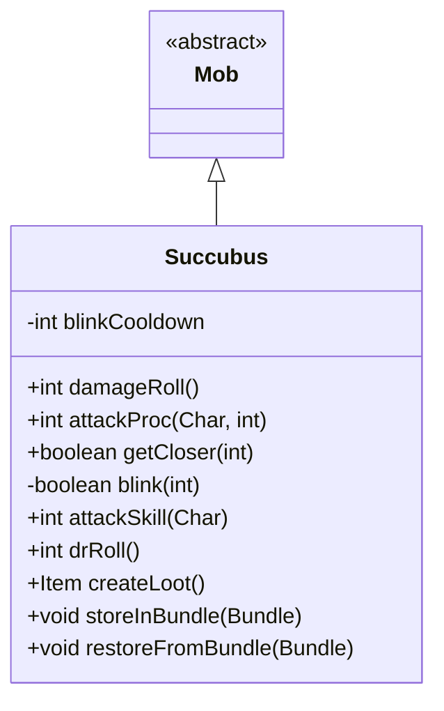

# Succubus 类文档

## 1. 基本信息
| 属性 | 值 |
|------|-----|
| 文件路径 | core/src/main/java/com/shatteredpixel/shatteredpixeldungeon/actors/mobs/Succubus.java |
| 包名 | com.shatteredpixel.shatteredpixeldungeon.actors.mobs |
| 类类型 | class |
| 继承关系 | extends Mob |
| 代码行数 | 199 行 |

## 2. 类职责说明
Succubus（魅魔）是一种恶魔敌人，具有魅惑和瞬移能力。她会魅惑玩家，然后从被魅惑的目标身上吸取生命来治疗自己或获得护盾。魅魔可以瞬移接近目标，免疫魅惑效果，并掉落非基础卷轴。

## 4. 继承与协作关系


## 静态常量表
| 常量名 | 类型 | 值 | 说明 |
|--------|------|-----|------|
| BLINK_CD | String | "blink_cd" | Bundle 存储键 - 瞬移冷却 |

## 实例字段表
| 字段名 | 类型 | 修饰符 | 说明 |
|--------|------|--------|------|
| blinkCooldown | int | private | 瞬移冷却时间 |

## 7. 方法详解

### damageRoll()
**签名**: `public int damageRoll()`
**功能**: 计算伤害掷骰
**返回值**: int - 伤害范围 25-30

### attackProc(Char enemy, int damage)
**签名**: `public int attackProc(Char enemy, int damage)`
**功能**: 攻击时的特殊效果处理
**参数**:
- enemy: Char - 被攻击者
- damage: int - 伤害值
**返回值**: int - 最终伤害值
**实现逻辑**:
```
第80-96行: 如果目标已被魅惑：
  - 计算治疗/护盾值 = (HP-HT) + (5+damage)
  - 如果有剩余护盾值，获得护盾
  - 否则直接治疗
  - 播放魅惑音效
第97-105行: 否则 33% 概率魅惑目标：
  - 持续时间减半
  - 设置忽略下次攻击（避免立即减少持续时间）
  - 播放心形粒子和音效
```

### getCloser(int target)
**签名**: `protected boolean getCloser(int target)`
**功能**: 接近目标，可能使用瞬移
**参数**:
- target: int - 目标位置
**返回值**: boolean - 是否成功移动
**实现逻辑**:
```
第112行: 如果目标在视野内、距离>2、瞬移冷却结束且未被定身
第114-118行: 尝试瞬移，成功则不消耗移动时间
第123-125行: 否则正常移动并减少冷却
```

### blink(int target)
**签名**: `private boolean blink(int target)`
**功能**: 瞬移到目标附近
**参数**:
- target: int - 目标位置
**返回值**: boolean - 是否成功瞬移
**实现逻辑**:
```
第131-136行: 计算弹道路径，如果终点有角色则退后一格
第138-154行: 如果终点不可通行，寻找相邻可用格子
第156行: 使用传送效果出现在目标位置
第158行: 设置 4-6 回合冷却
```

### attackSkill(Char target)
**签名**: `public int attackSkill(Char target)`
**功能**: 获取攻击技能值
**返回值**: int - 攻击技能值 40

### drRoll()
**签名**: `public int drRoll()`
**功能**: 计算伤害减免
**返回值**: int - 伤害减免 0-10

### createLoot()
**签名**: `public Item createLoot()`
**功能**: 创建掉落物品
**返回值**: Item - 随机卷轴（排除鉴定和升级卷轴）
**实现逻辑**:
```
第175-177行: 随机选择卷轴类型，排除鉴定和升级
第179行: 创建卷轴实例
```

## 11. 使用示例
```java
// 魅魔会瞬移接近并尝试魅惑玩家
Succubus succubus = new Succubus();

// 攻击被魅惑的目标时获得治疗或护盾
// 攻击未魅惑的目标时 33% 概率魅惑

// 魅魔免疫魅惑
immunities.add(Charm.class);
```

## 注意事项
1. **恶魔属性**: 属于 DEMONIC 类型
2. **瞬移能力**: 可以瞬移接近目标，4-6回合冷却
3. **魅惑攻击**: 33%概率魅惑，被魅惑目标会被吸取生命
4. **护盾机制**: 超过满 HP 的治疗转化为护盾
5. **卷轴掉落**: 掉落普通卷轴（不含鉴定和升级）

## 最佳实践
1. 避免被魅惑，被魅惑时魅魔会获得优势
2. 注意瞬移带来的突袭
3. 高伤害输出快速击杀
4. 准备解除魅惑的手段