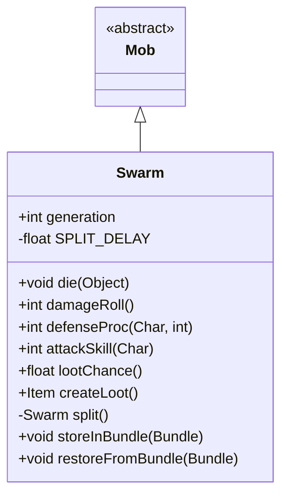

# Swarm 类文档

## 1. 基本信息
| 属性 | 值 |
|------|-----|
| 文件路径 | core/src/main/java/com/shatteredpixel/shatteredpixeldungeon/actors/mobs/Swarm.java |
| 包名 | com.shatteredpixel.shatteredpixeldungeon.actors.mobs |
| 类类型 | class |
| 继承关系 | extends Mob |
| 代码行数 | 156 行 |

## 2. 类职责说明
Swarm（虫群）是一种飞行敌人，具有分裂繁殖的特殊能力。当受到伤害时，如果剩余 HP 足够，虫群会分裂成两个较小的群体。分裂后的虫群属于更高世代，不提供经验值。原始虫群最多可以分裂多次，对新手玩家构成威胁。

## 4. 继承与协作关系


## 静态常量表
| 常量名 | 类型 | 值 | 说明 |
|--------|------|-----|------|
| SPLIT_DELAY | float | 1f | 分裂延迟时间 |
| GENERATION | String | "generation" | Bundle 存储键 - 世代 |

## 实例字段表
| 字段名 | 类型 | 修饰符 | 说明 |
|--------|------|--------|------|
| generation | int | - | 世代数（0为原始，分裂后+1） |

## 7. 方法详解

### die(Object cause)
**签名**: `public void die(Object cause)`
**功能**: 死亡时停止飞行
**参数**:
- cause: Object - 死亡原因
**实现逻辑**:
```
第78行: 设置飞行属性为 false（死亡动画需要）
第79行: 调用父类死亡方法
```

### damageRoll()
**签名**: `public int damageRoll()`
**功能**: 计算伤害掷骰
**返回值**: int - 伤害范围 1-4
**实现逻辑**:
```
第84行: 返回较低的伤害范围
```

### defenseProc(Char enemy, int damage)
**签名**: `public int defenseProc(Char enemy, int damage)`
**功能**: 防御时尝试分裂
**参数**:
- enemy: Char - 攻击者
- damage: int - 伤害值
**返回值**: int - 实际伤害
**实现逻辑**:
```
第90行: 检查 HP 是否足够分裂（>= damage + 2）
第91-101行: 查找可行的分裂位置（相邻格子）
第105-116行: 如果有可用位置：
  - 创建分裂副本
  - 分配 HP（各一半）
  - 添加推开动画
  - 占用新格子
第119行: 返回父类处理结果
```

### attackSkill(Char target)
**签名**: `public int attackSkill(Char target)`
**功能**: 获取攻击技能值
**返回值**: int - 攻击技能值 10

### split()
**签名**: `private Swarm split()`
**功能**: 创建分裂副本
**返回值**: Swarm - 新的虫群实例
**实现逻辑**:
```
第128-129行: 创建新虫群，世代+1
第130行: 分裂后不提供经验
第131-136行: 如果原虫群有燃烧或中毒，传染给分裂体
第137-141行: 复制持久性 Buff
第142行: 返回新虫群
```

### lootChance()
**签名**: `public float lootChance()`
**功能**: 计算掉落概率
**返回值**: float - 掉落概率
**实现逻辑**:
```
第147行: 概率随世代降低：1/(6*(generation+1))
第148行: 概率随已掉落数量降低
```

### createLoot()
**签名**: `public Item createLoot()`
**功能**: 创建掉落物品
**返回值**: Item - 治疗药水
**实现逻辑**:
```
第153行: 增加有限掉落计数
第154行: 返回父类创建的物品（治疗药水）
```

## 11. 使用示例
```java
// 虫群被攻击时自动分裂
Swarm swarm = new Swarm();
swarm.HP = swarm.HT = 50;

// 受到10点伤害时，如果 HP >= 12，会分裂
// 原虫群: HP = 50 - 10 - (50-10)/2 = 20
// 分裂体: HP = (50-10)/2 = 20

// 分裂后的虫群 generation = 1，不提供经验
```

## 注意事项
1. **飞行能力**: 活着时可以飞越障碍
2. **分裂条件**: HP >= damage + 2 才能分裂
3. **世代系统**: 每次分裂世代+1，分裂体无经验
4. **状态传染**: 燃烧和中毒会传染给分裂体
5. **掉落递减**: 每次掉落治疗药水后概率降低

## 最佳实践
1. 使用高伤害一击杀死，避免分裂
2. 火焰可以同时伤害分裂体
3. 分裂体会继承部分状态效果
4. 低级玩家应小心虫群的累积伤害