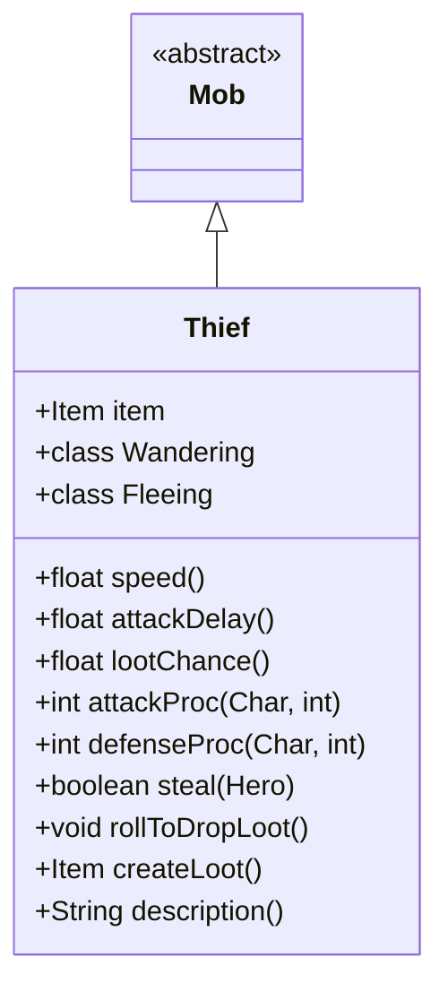

# Thief 类文档

## 1. 基本信息
| 属性 | 值 |
|------|-----|
| 文件路径 | core/src/main/java/com/shatteredpixel/shatteredpixeldungeon/actors/mobs/Thief.java |
| 包名 | com.shatteredpixel.shatteredpixeldungeon.actors.mobs |
| 类类型 | class |
| 继承关系 | extends Mob |
| 代码行数 | 230 行 |

## 2. 类职责说明
Thief（盗贼）是一种不死族敌人，具有偷窃玩家物品的特殊能力。它会偷取玩家的非装备物品，然后试图逃跑。如果盗贼成功逃脱，物品会永久丢失。盗贼攻击速度快，但如果持有物品则会减速。击杀盗贼可取回被盗物品。

## 4. 继承与协作关系


## 静态常量表
| 常量名 | 类型 | 值 | 说明 |
|--------|------|-----|------|
| ITEM | String | "item" | Bundle 存储键 - 偷窃物品 |

## 实例字段表
| 字段名 | 类型 | 修饰符 | 说明 |
|--------|------|--------|------|
| item | Item | public | 被偷窃的物品 |

## 7. 方法详解

### speed()
**签名**: `public float speed()`
**功能**: 获取移动速度
**返回值**: float - 速度值
**实现逻辑**:
```
第77行: 如果持有物品，速度降为原来的5/6
第78行: 否则使用正常速度
```

### damageRoll()
**签名**: `public int damageRoll()`
**功能**: 计算伤害掷骰
**返回值**: int - 伤害范围 1-10
**实现逻辑**:
```
第83行: 返回较低的伤害范围
```

### attackDelay()
**签名**: `public float attackDelay()`
**功能**: 获取攻击延迟
**返回值**: float - 攻击延迟（正常的一半）
**实现逻辑**:
```
第88行: 返回正常攻击延迟的50%
```

### lootChance()
**签名**: `public float lootChance()`
**功能**: 计算掉落概率
**返回值**: float - 掉落概率
**实现逻辑**:
```
第95行: 每次掉落后概率降为1/3
       序列: 1/33, 1/100, 1/300, 1/900...
```

### rollToDropLoot()
**签名**: `public void rollToDropLoot()`
**功能**: 死亡时掉落物品
**实现逻辑**:
```
第100-104行: 如果持有物品，掉落在死亡位置
            特殊处理蜜罐碎片
第106行: 调用父类方法处理其他掉落
```

### createLoot()
**签名**: `public Item createLoot()`
**功能**: 创建掉落物品
**返回值**: Item - 掉落的物品（戒指或神器）
**实现逻辑**:
```
第111行: 增加有限掉落计数
第112行: 返回父类创建的物品
```

### attackProc(Char enemy, int damage)
**签名**: `public int attackProc(Char enemy, int damage)`
**功能**: 攻击时的处理
**参数**:
- enemy: Char - 被攻击者
- damage: int - 伤害值
**返回值**: int - 最终伤害值
**实现逻辑**:
```
第129-131行: 如果是敌对、未持有物品、目标是英雄，尝试偷窃
           成功后进入逃跑状态
```

### defenseProc(Char enemy, int damage)
**签名**: `public int defenseProc(Char enemy, int damage)`
**功能**: 防御时的处理
**参数**:
- enemy: Char - 攻击者
- damage: int - 伤害值
**返回值**: int - 最终伤害值
**实现逻辑**:
```
第139-141行: 如果在逃跑状态，掉落金币分散注意力
```

### steal(Hero hero)
**签名**: `protected boolean steal(Hero hero)`
**功能**: 尝试偷窃英雄物品
**参数**:
- hero: Hero - 目标英雄
**返回值**: boolean - 是否偷窃成功
**实现逻辑**:
```
第148-158行: 随机选择一个未装备物品
           检查物品是否可偷（非唯一、等级<1）
           成功则分离物品并更新快捷栏
第159-163行: 特殊处理蜜罐相关物品
第165-168行: 返回是否成功
```

### description()
**签名**: `public String description()`
**功能**: 获取描述
**返回值**: String - 描述文本
**实现逻辑**:
```
第173-179行: 基础描述加上持有的物品信息
```

## 内部类详解

### Wandering（游荡状态）
**功能**: 如果持有物品则不战斗直接逃跑
**方法**:
- `act()`: 发现敌人时检查是否持有物品，有则逃跑

### Fleeing（逃跑状态）
**功能**: 逃离玩家并在足够远时消失
**方法**:
- `escaped()`: 当离开玩家视野6格以上时传送到新位置并消失

## 11. 使用示例
```java
// 盗贼生成时会自动偷窃玩家物品
Thief thief = new Thief();
GameScene.add(thief);

// 玩家击杀盗贼取回物品
// 如果盗贼逃脱，物品永久丢失

// 盗贼攻击时尝试偷窃
if (thief.steal(hero)) {
    thief.state = thief.FLEEING;  // 成功后逃跑
}
```

## 注意事项
1. **不死属性**: 盗贼属于 UNDEAD 类型
2. **快速攻击**: 攻击速度是正常的一半延迟
3. **偷窃条件**: 只偷非唯一、等级<1的未装备物品
4. **逃脱机制**: 盗贼逃脱后物品永久丢失
5. **掉落递减**: 每次掉落后概率大幅下降

## 最佳实践
1. 优先击杀持有物品的盗贼
2. 被偷后立即追击
3. 在盗贼逃跑路径上设置陷阱
4. 蜜罐是有效的诱饵物品
5. 注意盗贼会掉落金币分散注意力