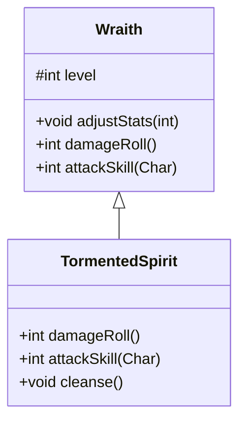

# TormentedSpirit 类文档

## 1. 基本信息
| 属性 | 值 |
|------|-----|
| 文件路径 | core/src/main/java/com/shatteredpixel/shatteredpixeldungeon/actors/mobs/TormentedSpirit.java |
| 包名 | com.shatteredpixel.shatteredpixeldungeon.actors.mobs |
| 类类型 | class |
| 继承关系 | extends Wraith |
| 代码行数 | 86 行 |

## 2. 类职责说明
TormentedSpirit（受折磨的灵魂）是 Wraith 的稀有变种，具有50%更高的属性成长。与普通幽灵不同，受折磨的灵魂可以被净化，净化后会感谢玩家并掉落一件高质量的附魔武器或护甲作为奖励。

## 4. 继承与协作关系


## 静态常量表
（无静态常量）

## 实例字段表
（无额外实例字段，继承自 Wraith）

## 7. 方法详解

### damageRoll()
**签名**: `public int damageRoll()`
**功能**: 计算伤害掷骰（比普通幽灵高50%）
**返回值**: int - 伤害范围
**实现逻辑**:
```
第47行: 伤害成长系数为1.5倍，而非普通幽灵的1倍
```

### attackSkill(Char target)
**签名**: `public int attackSkill(Char target)`
**功能**: 获取攻击技能值（比普通幽灵高50%）
**参数**:
- target: Char - 目标角色
**返回值**: int - 攻击技能值
**实现逻辑**:
```
第53行: 攻击技能成长系数为1.5倍
       注意：闪避也相应提升（因为 defenseSkill = attackSkill * 5）
```

### cleanse()
**签名**: `public void cleanse()`
**功能**: 净化灵魂，获得奖励物品
**实现逻辑**:
```
第57-58行: 播放幽灵音效并喊出感谢消息
第62-68行: 50%概率生成武器或护甲
         武器必定附魔，护甲必定刻印
第69-70行: 物品必定不诅咒且已知不诅咒
第72-74行: 如果物品等级为0，50%概率+1强化
第76行: 在当前位置掉落物品
第78-82行: 销毁灵魂并播放净化特效（光芒粒子）
```

## 11. 使用示例
```java
// 净化受折磨的灵魂
TormentedSpirit spirit = new TormentedSpirit();
spirit.adjustStats(depth);

// 玩家使用净化能力
spirit.cleanse();  // 灵魂消失，掉落高质量装备

// 在生成幽灵时有小概率出现
// Wraith.spawnAt() 中有 1% 概率（受饰品加成）
```

## 注意事项
1. **更高属性**: 伤害和命闪成长比普通幽灵高50%
2. **净化奖励**: 可获得一件必定附魔/刻印且不诅咒的装备
3. **稀有度**: 默认只有1%概率生成（可被饰品影响）
4. **视觉效果**: 使用不同的精灵和粒子效果（挑战粒子而非诅咒粒子）
5. **继承行为**: 其他行为（飞行、不死属性等）与普通幽灵相同

## 最佳实践
1. 尽量净化而非击杀，可获得高质量装备
2. 注意更高属性带来的战斗难度
3. 配合 RatSkull 饰品可提高出现概率
4. 在高层级净化可获得更好的基础装备