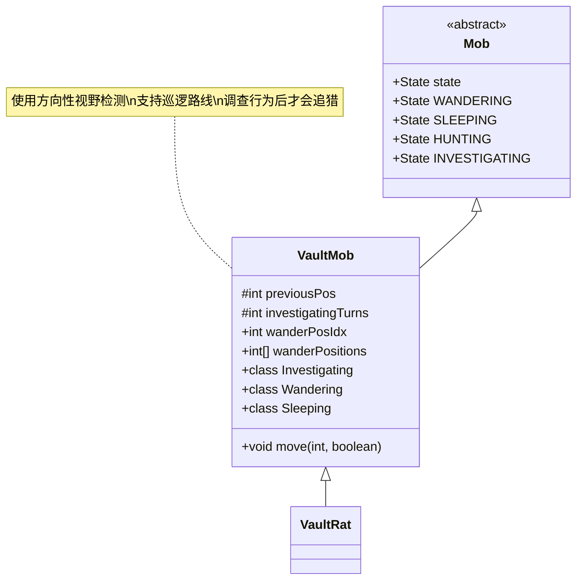

# VaultMob 类文档

## 1. 基本信息
| 属性 | 值 |
|------|-----|
| 文件路径 | core/src/main/java/com/shatteredpixel/shatteredpixeldungeon/actors/mobs/VaultMob.java |
| 包名 | com.shatteredpixel.shatteredpixeldungeon.actors.mobs |
| 类类型 | class |
| 继承关系 | extends Mob |
| 代码行数 | 225 行 |

## 2. 类职责说明
VaultMob 是宝库层敌人的抽象基类。它实现了复杂的警觉和调查 AI 系统，包括基于移动方向的视野检测、调查行为和睡眠状态。这些敌人会先调查可疑情况，确认威胁后才进入追猎状态，并可能触发警报效果。

## 4. 继承与协作关系


## 静态常量表
| 常量名 | 类型 | 值 | 说明 |
|--------|------|-----|------|
| PREV_POS | String | "prev_pos" | Bundle 存储键 - 上一位置 |
| INVEST_TURNS | String | "invest_turns" | Bundle 存储键 - 调查回合 |
| WANDER_POSITIONS | String | "wander_positions" | Bundle 存储键 - 巡逻位置 |
| WANDER_POS_IDX | String | "wander_pos_idx" | Bundle 存储键 - 巡逻索引 |

## 实例字段表
| 字段名 | 类型 | 修饰符 | 说明 |
|--------|------|--------|------|
| previousPos | int | private | 上一回合位置（用于方向检测） |
| investigatingTurns | int | private | 调查状态持续回合 |
| wanderPosIdx | int | public | 当前巡逻位置索引 |
| wanderPositions | int[] | public | 巡逻路线位置数组 |

## 7. 方法详解

### move(int step, boolean travelling)
**签名**: `public void move(int step, boolean travelling)`
**功能**: 移动时记录位置并在不可见时显示爆炸波纹
**参数**:
- step: int - 目标位置
- travelling: boolean - 是否为旅行移动
**实现逻辑**:
```
第47-48行: 记录前一位置并执行移动
第49-57行: 如果移动时不可见且距离玩家<=6，显示对应状态的爆炸波纹
         红色=追猎，橙色=调查，默认=游荡
```

### storeInBundle(Bundle bundle)
**签名**: `public void storeInBundle(Bundle bundle)`
**功能**: 保存状态到 Bundle
**实现逻辑**:
```
第67-73行: 保存前一位置、调查回合、巡逻路线和索引
```

### restoreFromBundle(Bundle bundle)
**签名**: `public void restoreFromBundle(Bundle bundle)`
**功能**: 从 Bundle 恢复状态
**实现逻辑**:
```
第78-84行: 恢复所有保存的状态
```

## 内部类详解

### Investigating（调查状态）
**功能**: 继承自 Mob.Investigating，增强调查检测
**方法**:
- `act()`: 追踪调查回合数
- `detectionChance()`: 第一回合检测概率降低33%

### Wandering（游荡状态）
**功能**: 继承自 Mob.Wandering，实现方向性视野检测
**方法**:
- `detectionChance()`: 基于移动方向的视野锥检测
  - 90度锥内: 经典游荡检测
  - 180度锥内: 标准睡眠检测
  - 其他方向: 极低概率检测
- `noticeEnemy()`: 发现敌人时进入调查状态而非追猎
- `randomDestination()`: 按预设巡逻路线移动

### Sleeping（睡眠状态）
**功能**: 继承自 Mob.Sleeping，实现更低的检测概率
**方法**:
- `awaken()`: 醒来时进入调查状态
- `detectionChance()`: 使用平方反比概率（4格以上几乎为0）

## 11. 使用示例
```java
// 创建宝库守卫
VaultMob guard = new VaultRat();

// 设置巡逻路线
guard.wanderPositions = new int[]{pos1, pos2, pos3, pos4};

// 守卫会自动按路线巡逻
// 发现玩家后会先调查再追猎
```

## 注意事项
1. **方向性视野**: 敌人朝向影响检测能力
2. **调查优先**: 不会立即追猎，先调查确认
3. **巡逻路线**: 可设置固定巡逻路径
4. **爆炸波纹**: 移动时显示状态指示
5. **玩家通知**: 发现玩家时给玩家发送感知

## 最佳实践
1. 设置合理的巡逻路线覆盖关键区域
2. 利用方向性视野让敌人有"盲区"
3. 给玩家足够时间躲避调查中的敌人
4. 配合 TalismanOfForesight 的感知机制