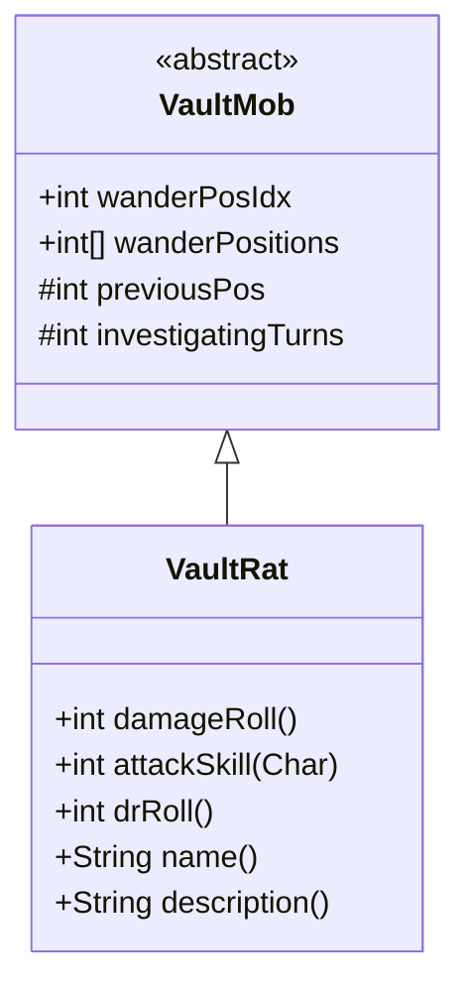

# VaultRat 类文档

## 1. 基本信息
| 属性 | 值 |
|------|-----|
| 文件路径 | core/src/main/java/com/shatteredpixel/shatteredpixeldungeon/actors/mobs/VaultRat.java |
| 包名 | com.shatteredpixel.shatteredpixeldungeon.actors.mobs |
| 类类型 | class |
| 继承关系 | extends VaultMob |
| 代码行数 | 64 行 |

## 2. 类职责说明
VaultRat（宝库老鼠）是一种出现在宝库层的特殊敌人。它继承自 VaultMob，具有独特的警觉和调查行为。这种老鼠不造成伤害，但会触发警报并召唤其他敌人。它们主要用于宝库的守卫机制。

## 4. 继承与协作关系


## 静态常量表
（无静态常量）

## 实例字段表
（无额外实例字段，继承自 VaultMob）

## 7. 方法详解

### damageRoll()
**签名**: `public int damageRoll()`
**功能**: 计算伤害掷骰
**返回值**: int - 始终返回 0
**实现逻辑**:
```
第42行: 宝库老鼠不造成伤害
```

### attackSkill(Char target)
**签名**: `public int attackSkill(Char target)`
**功能**: 获取攻击技能值
**参数**:
- target: Char - 目标角色
**返回值**: int - 攻击技能值 8
**实现逻辑**:
```
第47行: 返回固定的攻击技能值
```

### drRoll()
**签名**: `public int drRoll()`
**功能**: 计算伤害减免
**返回值**: int - 伤害减免 0-1
**实现逻辑**:
```
第52行: 返回父类值加随机 0-1
```

### name()
**签名**: `public String name()`
**功能**: 获取名称
**返回值**: String - 使用普通老鼠的名称
**实现逻辑**:
```
第57行: 从 Rat 类获取名称消息
```

### description()
**签名**: `public String description()`
**功能**: 获取描述
**返回值**: String - 使用普通老鼠描述加 VaultMob 描述
**实现逻辑**:
```
第62行: 组合 Rat 描述和父类描述
```

## 11. 使用示例
```java
// 在宝库层创建巡逻老鼠
VaultRat rat = new VaultRat();
rat.pos = patrolRoute[0];
rat.wanderPositions = patrolRoute;  // 设置巡逻路线
GameScene.add(rat);

// 老鼠发现玩家后会触发调查状态
// 如果确认威胁，会进入追猎状态并可能触发警报
```

## 注意事项
1. **零伤害**: 宝库老鼠不造成伤害
2. **警卫角色**: 主要用于发现和报告入侵者
3. **巡逻路线**: 可通过 wanderPositions 设置巡逻路径
4. **继承行为**: 继承 VaultMob 的特殊检测机制
5. **外观**: 使用普通老鼠的精灵和名称

## 最佳实践
1. 将宝库老鼠放置在关键通道作为警报触发器
2. 配合其他更强的敌人使用
3. 利用巡逻路线覆盖重要区域
4. 考虑老鼠的视野范围设置警报范围