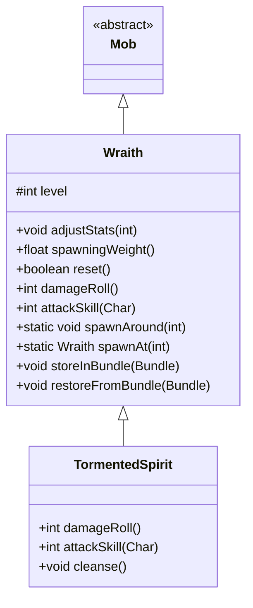

# Wraith 类文档

## 1. 基本信息
| 属性 | 值 |
|------|-----|
| 文件路径 | core/src/main/java/com/shatteredpixel/shatteredpixeldungeon/actors/mobs/Wraith.java |
| 包名 | com.shatteredpixel.shatteredpixeldungeon.actors.mobs |
| 类类型 | class |
| 继承关系 | extends Mob |
| 代码行数 | 175 行 |

## 2. 类职责说明
Wraith（幽灵）是一种可飞行的不死生物敌人。它们通常从被诅咒的物品中生成，属性随地牢深度缩放。幽灵具有简单但危险的 AI：一旦生成就立即追击玩家。存在稀有变种 TormentedSpirit（受折磨的灵魂），可通过净化获得奖励。

## 4. 继承与协作关系


## 静态常量表
| 常量名 | 类型 | 值 | 说明 |
|--------|------|-----|------|
| SPAWN_DELAY | float | 2f | 生成延迟时间 |
| LEVEL | String | "level" | Bundle 存储键 - 等级 |

## 实例字段表
| 字段名 | 类型 | 修饰符 | 说明 |
|--------|------|--------|------|
| level | int | protected | 幽灵等级（影响属性） |

## 7. 方法详解

### damageRoll()
**签名**: `public int damageRoll()`
**功能**: 计算伤害掷骰
**返回值**: int - 伤害范围 (1+level/2 到 2+level)
**实现逻辑**:
```
第77行: 返回基于等级的伤害范围
```

### attackSkill(Char target)
**签名**: `public int attackSkill(Char target)`
**功能**: 获取攻击技能值
**参数**:
- target: Char - 目标角色
**返回值**: int - 攻击技能值 (10 + level)
**实现逻辑**:
```
第82行: 返回基础攻击技能加等级
```

### adjustStats(int level)
**签名**: `public void adjustStats(int level)`
**功能**: 根据等级调整属性
**参数**:
- level: int - 目标等级
**实现逻辑**:
```
第86-89行: 设置等级，防御技能为攻击技能的5倍，设置为已发现敌人状态
```

### spawningWeight()
**签名**: `public float spawningWeight()`
**功能**: 获取自然生成权重
**返回值**: float - 0（不自然生成）
**实现逻辑**:
```
第93行: 返回0，幽灵只能通过特殊方式生成
```

### reset()
**签名**: `public boolean reset()`
**功能**: 重置幽灵状态
**返回值**: boolean - true
**实现逻辑**:
```
第98-99行: 设置为游荡状态并返回true
```

### spawnAround(int pos)
**签名**: `public static void spawnAround(int pos)`
**功能**: 在指定位置周围生成幽灵
**参数**:
- pos: int - 中心位置
**实现逻辑**:
```
第107-109行: 在4个相邻格子尝试生成幽灵
```

### spawnAt(int pos, Class wraithClass, boolean allowAdjacent)
**签名**: `private static Wraith spawnAt(int pos, Class wraithClass, boolean allowAdjacent)`
**功能**: 在指定位置生成幽灵
**参数**:
- pos: int - 目标位置
- wraithClass: Class - 幽灵类型（null表示随机）
- allowAdjacent: boolean - 是否允许在相邻位置生成
**返回值**: Wraith - 生成的幽灵，失败返回null
**实现逻辑**:
```
第123-138行: 如果位置被阻挡，尝试相邻位置或返回失败
第144-153行: 根据类型或随机选择创建幽灵实例
           有1%概率（受饰品影响）生成 TormentedSpirit
第154-158行: 设置位置、状态、添加到游戏
第160-167行: 设置渐入动画和粒子效果
```

### storeInBundle(Bundle bundle)
**签名**: `public void storeInBundle(Bundle bundle)`
**功能**: 保存状态到 Bundle
**实现逻辑**:
```
第64-66行: 保存等级信息
```

### restoreFromBundle(Bundle bundle)
**签名**: `public void restoreFromBundle(Bundle bundle)`
**功能**: 从 Bundle 恢复状态
**实现逻辑**:
```
第69-73行: 恢复等级并重新调整属性
```

## 11. 使用示例
```java
// 在被诅咒的物品位置生成幽灵
Wraith.spawnAt(cursedItemPos);

// 在某位置周围生成多个幽灵
Wraith.spawnAround(position);

// 强制生成特定类型
Wraith.spawnAt(pos, TormentedSpirit.class);

// 调整幽灵等级
wraith.adjustStats(Dungeon.scalingDepth());
```

## 注意事项
1. **飞行能力**: 幽灵可以飞越水面和陷阱
2. **属性缩放**: 等级影响伤害、命中和闪避
3. **稀有变种**: 1%概率生成 TormentedSpirit
4. **立即追击**: 生成后立即进入追猎状态
5. **不死属性**: 属于 UNDEAD 和 INORGANIC 类型

## 最佳实践
1. 使用 spawnAround 在玩家周围制造威胁
2. 等级应与当前深度匹配以保证难度平衡
3. 利用渐入动画给玩家反应时间
4. 考虑 RatSkull 饰品对稀有变种概率的影响