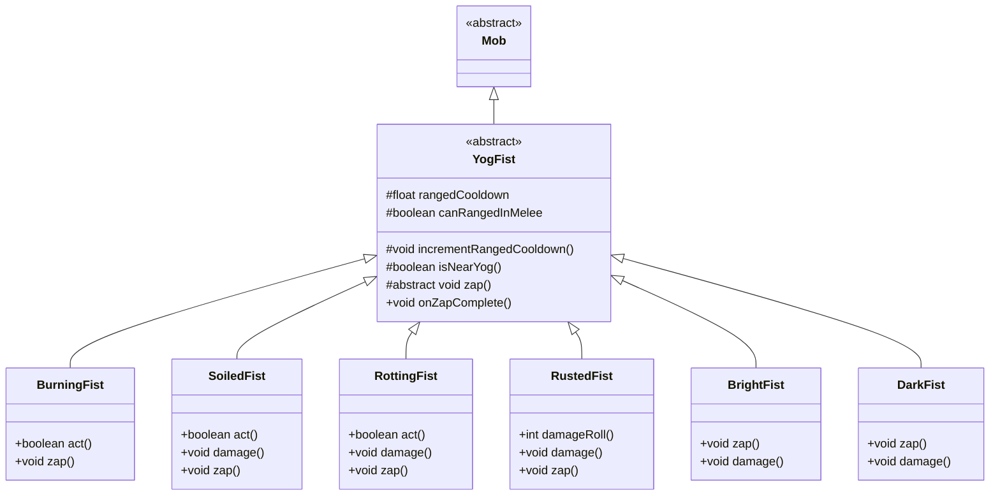

# YogFist 类文档

## 1. 基本信息
| 属性 | 值 |
|------|-----|
| 文件路径 | core/src/main/java/com/shatteredpixel/shatteredpixeldungeon/actors/mobs/YogFist.java |
| 包名 | com.shatteredpixel.shatteredpixeldungeon.actors.mobs |
| 类类型 | abstract class |
| 继承关系 | extends Mob |
| 代码行数 | 630 行 |

## 2. 类职责说明
YogFist 是 Yog-Dzewa boss 战中的拳头仆从的抽象基类。它定义了拳头的基本行为模式：远程攻击能力、在 Yog 附近的无敌机制、以及死亡时通知主 boss。游戏包含 6 种不同类型的拳头，每种都有独特的攻击方式和属性。

## 4. 继承与协作关系


## 静态常量表
| 常量名 | 类型 | 值 | 说明 |
|--------|------|-----|------|
| RANGED_COOLDOWN | String | "ranged_cooldown" | Bundle 存储键 - 远程冷却 |

## 实例字段表
| 字段名 | 类型 | 修饰符 | 说明 |
|--------|------|--------|------|
| rangedCooldown | float | private | 远程攻击冷却时间 |
| canRangedInMelee | boolean | protected | 是否能在近战距离使用远程攻击 |
| invulnWarned | boolean | private | 是否已警告玩家无敌状态 |

## 7. 方法详解

### act()
**签名**: `protected boolean act()`
**功能**: 每回合执行的行动逻辑
**返回值**: boolean - 行动结果
**实现逻辑**:
```
第92行: 如果未麻痹，减少远程冷却
第94-98行: 如果英雄可见且在游荡状态，立即进入追猎状态
```

### canAttack(Char enemy)
**签名**: `protected boolean canAttack(Char enemy)`
**功能**: 判断是否能攻击目标
**参数**:
- enemy: Char - 目标角色
**返回值**: boolean - 是否能攻击
**实现逻辑**:
```
第105-106行: 如果远程冷却结束，检查魔法弹道是否能命中
第108行: 否则调用父类的近战判断
```

### isNearYog()
**签名**: `protected boolean isNearYog()`
**功能**: 检查是否在 Yog 附近（无敌区域）
**返回值**: boolean - 是否在 Yog 附近
**实现逻辑**:
```
第115-116行: 计算 Yog 位置（出口下方3行），检查距离是否<=4
```

### isInvulnerable(Class effect)
**签名**: `public boolean isInvulnerable(Class effect)`
**功能**: 判断是否对指定效果无敌
**参数**:
- effect: Class - 效果类型
**返回值**: boolean - 是否无敌
**实现逻辑**:
```
第121-124行: 如果靠近 Yog 且未警告，显示警告信息
第125行: 在 Yog 附近时完全无敌
```

### doAttack(Char enemy)
**签名**: `protected boolean doAttack(Char enemy)`
**功能**: 执行攻击动作
**参数**:
- enemy: Char - 目标角色
**返回值**: boolean - 攻击是否完成
**实现逻辑**:
```
第131-133行: 如果在近战距离且不能远程攻击，使用近战
第137-144行: 否则执行远程攻击，触发精灵动画
```

### damage(int dmg, Object src)
**签名**: `public void damage(int dmg, Object src)`
**功能**: 受到伤害时的处理
**参数**:
- dmg: int - 伤害值
- src: Object - 伤害来源
**实现逻辑**:
```
第150-152行: 记录伤害前后 HP
第154-158行: 根据挑战模式延长楼层锁定时间
```

### die(Object cause)
**签名**: `public void die(Object cause)`
**功能**: 死亡时通知 Yog-Dzewa
**参数**:
- cause: Object - 死亡原因
**实现逻辑**:
```
第163-168行: 查找 Yog-Dzewa 并通知拳头死亡
```

### zap()
**签名**: `protected abstract void zap()`
**功能**: 抽象方法，由子类实现远程攻击

## 内部类详解

### BurningFist（燃烧之拳）
- **属性**: 火焰属性
- **能力**: 蒸发水格，在周围生成火焰
- **攻击**: 远程点燃目标和周围区域
- **免疫**: 冰霜

### SoiledFist（泥土之拳）
- **能力**: 生成草皮，受伤时根据周围草数量减伤
- **攻击**: 远程定身目标并在周围生成草
- **免疫**: 火焰伤害（虽然可被点燃）

### RottingFist（腐烂之拳）
- **属性**: 酸性属性
- **能力**: 在水中恢复 HP，将伤害转化为流血效果
- **攻击**: 远程释放毒气，近战有概率施加酸蚀
- **免疫**: 毒气

### RustedFist（锈蚀之拳）
- **属性**: 大型、无机属性
- **能力**: 更高的近战伤害，将伤害转化为延迟伤害
- **攻击**: 远程造成残废效果

### BrightFist（光明之拳）
- **属性**: 电击属性
- **能力**: 无远程冷却，半血时传送并致盲玩家
- **攻击**: 远程光束造成伤害和致盲

### DarkFist（黑暗之拳）
- **能力**: 无远程冷却，半血时传送并熄灭玩家光源
- **攻击**: 远程暗影箭造成伤害并削弱光源

## 11. 使用示例
```java
// 在 Yog-Dzewa 战斗中生成拳头
BurningFist fist = new BurningFist();
fist.pos = spawnPosition;
GameScene.add(fist);

// 拳头会自动追击玩家并使用远程攻击
// 靠近 Yog 时拳头无敌
```

## 注意事项
1. **无敌区域**: 拳头在 Yog 附近4格内完全无敌
2. **远程冷却**: 默认8-12回合冷却，光明/黑暗拳头无冷却
3. **boss 交互**: 拳头死亡会通知 Yog-Dzewa 处理
4. **挑战模式**: 强boss挑战下减少锁定时间恢复
5. **属性免疫**: 所有拳头免疫睡眠

## 最佳实践
1. 引导拳头离开 Yog 附近再攻击
2. 针对不同拳头使用不同策略：
   - 燃烧之拳：远离水域
   - 泥土之拳：先烧毁周围草地
   - 腐烂之拳：避免近战，使用流血效果
   - 锈蚀之拳：注意延迟伤害的累积
   - 光明/黑暗之拳：准备应对传送和致盲