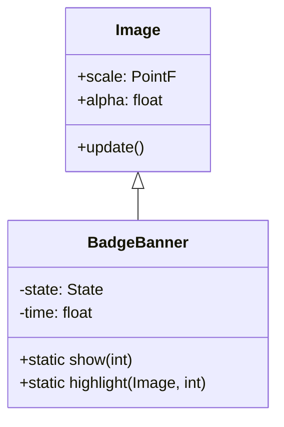

# BadgeBanner 源码详解

## 1. 基本信息

| 属性 | 值 |
|------|-----|
| **文件路径** | core/src/main/java/com/shatteredpixel/shatteredpixeldungeon/effects/BadgeBanner.java |
| **包名** | com.shatteredpixel.shatteredpixeldungeon.effects |
| **文件类型** | class |
| **继承关系** | extends Image |
| **代码行数** | 185 |
| **所属模块** | core |

## 2. 文件职责说明

### 核心职责
`BadgeBanner` 负责在玩家获得成就（勋章）时，在屏幕中央显示一个巨大的、带有动画效果的勋章图标。它包含淡入、停留和淡出的完整生命周期。

### 系统定位
位于视觉效果层，主要由 `Badges` 系统调用。它不仅是一个图像，还负责触发勋章的高亮效果（星星粒子）。

### 不负责什么
- 不负责勋章的逻辑判定（由 `Badges` 负责）。
- 不负责勋章的持久化存储。

## 3. 结构总览

### 主要成员概览
- **枚举 State**: 定义了粒子的三个生命周期阶段：`FADE_IN`, `STATIC`, `FADE_OUT`。
- **常量**: `DEFAULT_SCALE` (3倍缩放), `SIZE` (16像素), 各阶段持续时间。
- **静态集合 showing**: 跟踪当前正在显示的勋章 Banner。
- **highlight() 方法**: 负责在勋章上产生一个闪烁的星星效果。

### 生命周期/调用时机
1. **触发**：`Badges` 判定达成成就，调用 `BadgeBanner.show(index)`。
2. **FADE_IN (0.25s)**: 缩放从 6 倍缩小到 3 倍，透明度从 0 增加到 1。
3. **STATIC (1.0s)**: 在屏幕中央静止显示。在进入此阶段瞬间触发 `highlight()`。
4. **FADE_OUT (1.75s)**: 透明度逐渐归零。
5. **销毁**: 动画结束调用 `killAndErase()`。

## 4. 继承与协作关系

### 父类提供的能力
继承自 `Image`：
- 纹理渲染、缩放、透明度控制。

### 覆写的方法
- `update()`: 驱动状态机动画。
- `kill()` / `destroy()`: 维护 `showing` 列表的清理。

### 协作对象
- **Assets.Interfaces.BADGES**: 勋章图集资源。
- **TextureFilm (atlas)**: 16x16 像素的切片管理。
- **Speck**: 用于 `highlight` 效果的粒子。
- **SmartTexture / TextureCache**: 用于分析勋章像素以定位高亮位置。



## 5. 字段/常量详解

### 静态常量
| 常量名 | 类型 | 值 | 说明 |
|--------|------|-----|------|
| `DEFAULT_SCALE` | float | 3f | 最终显示的缩放倍率 |
| `FADE_IN_TIME` | float | 0.25f | 淡入时长 |
| `STATIC_TIME` | float | 1f | 停留时长 |
| `FADE_OUT_TIME` | float | 1.75f | 淡出时长 |

### 实例字段
| 字段名 | 类型 | 说明 |
|--------|------|------|
| `state` | State | 当前动画状态 |
| `time` | float | 当前状态剩余时间 |

## 6. 构造与初始化机制

### 私有构造器
```java
private BadgeBanner( int index ) {
    super( Assets.Interfaces.BADGES );
    // ... 初始化 atlas ...
    setup(index);
}
```

### setup(int index)
初始化勋章索引、起始透明度(0)和起始缩放(6)，并播放 `Assets.Sounds.BADGE` 音效。

## 7. 方法详解

### update()

**核心实现逻辑分析**：
状态机驱动。
- **FADE_IN 阶段**: `scale.set( (1 + p) * DEFAULT_SCALE ); alpha( 1 - p );`。这是一个“从大变小并显现”的冲击效果。
- **STATIC 阶段结束时**: 切换到 `FADE_OUT`。
- **FADE_OUT 阶段**: `alpha( time / FADE_OUT_TIME );` 线性淡出。

---

### highlight(Image image, int index) [核心技术点]

**方法职责**：在勋章的非背景像素上产生一个“闪光”粒子。

**核心逻辑分析**：
该方法包含一个有趣的**像素分析逻辑**：
1. 检查 `highlightPositions` 缓存。
2. 若无缓存，获取勋章的 `SmartTexture`。
3. **寻找非空像素**：
   - 默认取坐标 (3, 4) 作为背景色参考。
   - 沿 X 轴 (3到12) 扫描，寻找第一个颜色与背景色不同的像素。
   - 如果整行都相同，则下移一行 (y=5) 继续扫描。
4. 将找到的像素坐标换算为世界坐标。
5. 在该位置发射一个 `Speck.DISCOVER` 类型的星星粒子。

**设计意图**：通过代码自动定位勋章的轮廓位置，避免为每个勋章手动硬编码高亮位置。

## 8. 对外暴露能力
- `show(imageIndex)`: 触发显示。
- `isShowingBadges()`: 检查当前是否有勋章正在显示（常用于暂停游戏逻辑）。

## 9. 运行机制与调用链
1. 玩家完成特定行为（如击败 Boss）。
2. `Badges.Badge.validate()` 触发。
3. 如果是新勋章，调用 `BadgeBanner.show()`。
4. 勋章动画播放，期间可能通过 `isShowingBadges()` 阻塞某些 UI 操作。

## 10. 资源、配置与国际化关联
- **Assets.Interfaces.BADGES**: 勋章图集。
- **Assets.Sounds.BADGE**: 成就达成音效。

## 11. 使用示例

### 在控制台手动触发显示第1个勋章
```java
BadgeBanner.show(0);
```

## 12. 开发注意事项

### 像素分析开销
由于 `highlight` 方法会调用 `tx.getPixel`，这在某些平台上可能涉及从 GPU 回读数据，因此该类使用了 `highlightPositions` HashMap 进行位置缓存，确保每个勋章只分析一次。

### 线程安全
`BadgeBanner` 必须在渲染线程更新，因为它直接操作 `Image` 的属性。

## 13. 修改建议与扩展点
如果勋章形状非常特殊（例如中心全透明），默认的 (3, 4) 背景色参考点可能失效，届时需在静态块中手动添加 `highlightPositions.put()`。

## 14. 事实核查清单

- [x] 是否分析了 State 状态机：是。
- [x] 是否解释了 highlight 的像素扫描逻辑：是。
- [x] 缩放倍率是否与源码一致：是。
- [x] 是否包含显示状态检查方法：是。
