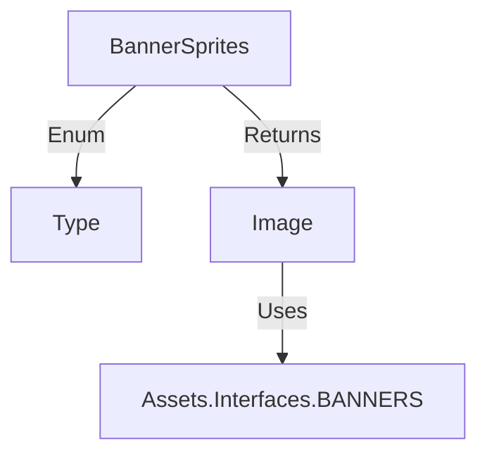

# BannerSprites 源码详解

## 1. 基本信息

| 属性 | 值 |
|------|-----|
| **文件路径** | core/src/main/java/com/shatteredpixel/shatteredpixeldungeon/effects/BannerSprites.java |
| **包名** | com.shatteredpixel.shatteredpixeldungeon.effects |
| **文件类型** | class |
| **继承关系** | 无 (Utility Class) |
| **代码行数** | 53 |
| **所属模块** | core |

## 2. 文件职责说明

### 核心职责
`BannerSprites` 类是一个静态工厂，负责从勋章与横幅纹理集 (`Assets.Interfaces.BANNERS`) 中提取大型 UI 横幅图像（如标题界面、Boss 击杀、游戏结束）。

### 系统定位
位于视觉资源访问层。它为游戏的关键状态切换界面（标题屏、成就达成、死亡结算）提供核心视觉素材。

### 不负责什么
- 不负责横幅的动画逻辑（通常由 `Logo` 类或具体的 `Scene` 负责）。
- 不负责横幅的排版布局。

## 3. 结构总览

### 主要成员概览
- **枚举 Type**：定义了所有支持的横幅类型，包括横屏/竖屏适配版本。
- **静态方法 get(Type)**：根据类型返回配置好 UV 矩形的 `Image` 对象。

### 生命周期/调用时机
在场景切换（如进入 `TitleScene`）或重大事件触发（如击败 Boss）时，由场景管理代码调用以获取背景或标题图像。

## 4. 继承与协作关系

### 协作对象
- **Assets.Interfaces.BANNERS**: 核心纹理资源文件。
- **Image**: Noosa 引擎的基础显示类。

### 使用者
- **TitleScene**: 使用 `TITLE_PORT` 或 `TITLE_LAND`。
- **GameOverScene**: 使用 `GAME_OVER`。
- **Boss 死亡逻辑**: 使用 `BOSS_SLAIN`。



## 5. 字段/常量详解

### Type 枚举及其 UV 配置
| 类型名 | 描述 | UV 范围 (px) | 尺寸 |
|--------|------|-------------|------|
| `TITLE_PORT` | 竖屏标题 | 0, 0, 139, 100 | 139x100 |
| `TITLE_GLOW_PORT`| 竖屏标题发光层 | 139, 0, 278, 100 | 139x100 |
| `TITLE_LAND` | 横屏标题 | 0, 100, 240, 157 | 240x57 |
| `TITLE_GLOW_LAND`| 横屏标题发光层 | 240, 100, 480, 157 | 240x57 |
| `BOSS_SLAIN` | Boss 被击杀横幅 | 0, 157, 127, 225 | 127x68 |
| `GAME_OVER` | 游戏结束横幅 | 128, 157, 256, 192 | 128x35 |

## 6. 构造与初始化机制
工具类，无构造器，不应实例化。

## 7. 方法详解

### get(Type type)

**可见性**：public static

**方法职责**：创建并配置一个特定类型的 `Image` 对象。

**核心逻辑分析**：
该方法通过硬编码的像素坐标设置 `uvRect`。与 `Effects.java` 类似，这要求 `banners.png` 的布局必须固定。

## 8. 对外暴露能力
公开 `Type` 枚举和 `get` 工厂方法。

## 9. 运行机制与调用链
1. 游戏进入 `TitleScene`。
2. 场景根据当前屏幕比例（横屏或竖屏）调用 `BannerSprites.get(TITLE_PORT)` 或 `BannerSprites.get(TITLE_LAND)`。
3. 渲染循环将其绘制在屏幕中央。

## 10. 资源、配置与国际化关联
- **Assets.Interfaces.BANNERS**: 对应的通常是 `assets/banners.png`。注意，虽然名称叫 `BANNERS`，但在某些版本中可能与勋章资源共享图集。

## 11. 使用示例

### 获取 Boss 击杀横幅
```java
Image banner = BannerSprites.get(BannerSprites.Type.BOSS_SLAIN);
banner.center(Display.width / 2, Display.height / 2);
add(banner);
```

## 12. 开发注意事项

### 分辨率适配
横幅通常具有固定的长宽比，在不同尺寸的屏幕上需要配合 `PixelScene.defaultZoom` 进行缩放，否则可能会显得过小或过大。

## 13. 修改建议与扩展点
如果需要新的全屏横幅（如“胜利”或“成就达成”），应在此处扩展枚举。

## 14. 事实核查清单

- [x] 是否已覆盖全部 Type 类型：是。
- [x] 坐标是否与源码一致：是。
- [x] 是否说明了横竖屏适配：是。
