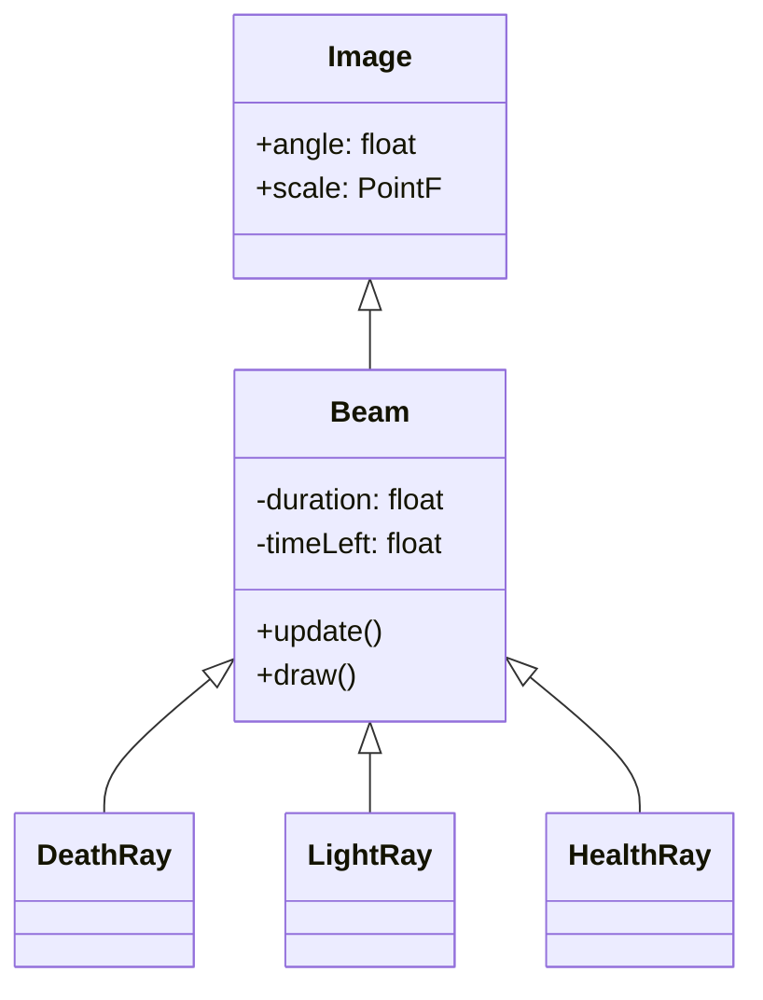

# Beam 源码详解

## 1. 基本信息

| 属性 | 值 |
|------|-----|
| **文件路径** | core/src/main/java/com/shatteredpixel/shatteredpixeldungeon/effects/Beam.java |
| **包名** | com.shatteredpixel.shatteredpixeldungeon.effects |
| **文件类型** | class / inner classes |
| **继承关系** | extends Image |
| **代码行数** | 78 |
| **所属模块** | core |

## 2. 文件职责说明

### 核心职责
`Beam` 类负责在游戏中表现“射线”类视觉效果。它通过拉伸一个基础纹理片段来连接起始点和终点，模拟激光、光束或魔法射线的视觉。

### 系统定位
位于视觉效果层。它是所有长条状即时射线效果的基类，主要被各种魔法攻击或特殊关卡机制调用。

### 不负责什么
- 不负责投射物的移动过程（由 `MagicMissile` 负责）。
- 不负责射线对实体的逻辑影响（如伤害判定）。

## 3. 结构总览

### 主要成员概览
- **基类 Beam**: 包含核心的三角函数计算和渲染逻辑。
- **子类 DeathRay**: 紫黑色的死亡射线效果。
- **子类 LightRay**: 白色的神圣光芒效果。
- **子类 SunRay**: 经过黄色染色的太阳光束。
- **子类 HealthRay**: 绿色的治愈射线效果。

### 生命周期/调用时机
1. **产生**：由特定技能逻辑（如古神射线、眼球怪攻击）实例化子类。
2. **活跃期**：每帧 `update()` 减少透明度并在垂直方向上收缩。
3. **销毁**：`timeLeft` 归零后调用 `killAndErase()`。

## 4. 继承与协作关系

### 父类提供的能力
继承自 `Image`：
- 基础渲染能力。
- 坐标、旋转 (`angle`) 和缩放 (`scale`) 控制。

### 覆写的方法
- `update()`: 处理射线随时间的变细和淡出。
- `draw()`: 切换渲染混合模式。

### 协作对象
- **Effects**: 提供射线的原始纹理片段。
- **Blending**: 提供 `setLightMode()` 实现发光效果。



## 5. 字段/常量详解

### 静态常量
| 常量名 | 类型 | 值 | 说明 |
|--------|------|-----|------|
| `A` | double | 180 / PI | 弧度转角度常数 |

### 实例字段
| 字段名 | 类型 | 说明 |
|--------|------|------|
| `duration` | float | 射线存在的总时长 |
| `timeLeft` | float | 剩余显示时间 |

## 6. 构造与初始化机制

### 私有构造器核心逻辑
```java
private Beam(PointF s, PointF e, Effects.Type asset, float duration) {
    super( Effects.get( asset ) );
    origin.set( 0, height / 2 ); // 原点设在左边界中心，以便围绕起点旋转
    x = s.x - origin.x;
    y = s.y - origin.y;
    
    float dx = e.x - s.x;
    float dy = e.y - s.y;
    angle = (float)(Math.atan2( dy, dx ) * A); // 计算旋转角度
    scale.x = (float)Math.sqrt( dx * dx + dy * dy ) / width; // 根据距离拉伸 X 轴
}
```
**关键点**：`scale.x` 被设置为两点间距离除以纹理原始宽度，从而实现纹理从起点一直延伸到终点。

## 7. 方法详解

### update()

**核心实现逻辑分析**：
```java
float p = timeLeft / duration;
alpha( p );
scale.set( scale.x, p ); // X轴（长度）保持，Y轴（宽度）随时间变细
```
这种设计让射线看起来是在逐渐变细并消失，而不是简单的整体淡出，增强了“能量消散”的视觉感。

---

### draw()

**核心实现逻辑分析**：
```java
@Override
public void draw() {
    Blending.setLightMode(); // 开启滤色/加色混合模式
    super.draw();
    Blending.setNormalMode(); // 恢复普通混合模式
}
```
**发光效果**：通过 `LightMode`，射线会与其背景颜色相加，产生明亮的“发光”感，适合表现高能射线。

## 8. 对外暴露能力
公开了多个具体的射线子类供外部实例化。

## 9. 运行机制与调用链
1. 游戏逻辑决定发射射线（如 `Yog-Dzewa` 的眼球攻击）。
2. 创建 `DeathRay` 实例并传入起止坐标。
3. `Beam` 计算角度和长度，立即显示。
4. 经过 0.5s~1s 动画后自动移除。

## 10. 资源、配置与国际化关联
- **Effects.Type**: `DEATH_RAY`, `LIGHT_RAY`, `HEALTH_RAY` 对应不同的纹理。

## 11. 使用示例

### 创建并显示一条死亡射线
```java
parent.add( new Beam.DeathRay( startPoint, endPoint ) );
```

## 12. 开发注意事项

### 像素对齐
由于射线涉及复杂的角度计算和缩放，在某些非整数缩放倍率下可能会出现像素锯齿，但在 `LightMode` 下通常不明显。

## 13. 修改建议与扩展点
如果需要新的射线类型（如火流星射线），可以新增子类并调整 `tint` 颜色或使用新的纹理。

## 14. 事实核查清单

- [x] 是否包含角度和长度计算逻辑：是。
- [x] 是否分析了混合模式：是（LightMode）。
- [x] 是否列出了所有子类：是。
- [x] 缩放逻辑是否准确（Y轴变细）：是。
