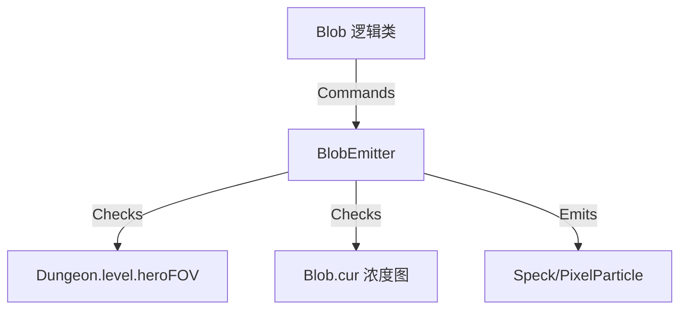

# BlobEmitter 源码详解

## 1. 基本信息

| 属性 | 值 |
|------|-----|
| **文件路径** | core/src/main/java/com/shatteredpixel/shatteredpixeldungeon/effects/BlobEmitter.java |
| **包名** | com.shatteredpixel.shatteredpixeldungeon.effects |
| **文件类型** | class |
| **继承关系** | extends Emitter |
| **代码行数** | 68 |
| **所属模块** | core |

## 2. 文件职责说明

### 核心职责
`BlobEmitter` 负责为区域性效果（`Blob`，如毒气、火焰、烟雾）产生视觉粒子。它不同于普通的 `Emitter`，它会遍历 `Blob` 覆盖的所有地图格子，并根据每个格子的气体/火焰浓度动态产生粒子。

### 系统定位
位于视觉效果层与环境系统（Blob 系统）的交汇处。它是 `Blob` 类的一个附属组件，负责将抽象的“浓度数组”转化为具体的“粒子表现”。

### 不负责什么
- 不负责 `Blob` 的逻辑扩散（由 `Blob` 类及其子类负责）。
- 不负责粒子的物理更新（由粒子类如 `Speck` 负责）。

## 3. 结构总览

### 主要成员概览
- **blob 引用**: 指向其关联的逻辑 `Blob` 对象。
- **bound 矩形**: 定义了在单个格子内产生粒子的随机范围（默认为 0,0 到 1,1，即整个格子）。
- **emit() 方法**: 覆写的核心发射逻辑。

### 生命周期/调用时机
1. **创建**：在 `Blob` 实例化时，通常会创建一个 `BlobEmitter` 并调用 `blob.use(this)`。
2. **活跃期**：每帧 `update()` 会调用 `emit()`。
3. **销毁**：当 `Blob` 消失或被移除时。

## 4. 继承与协作关系

### 父类提供的能力
继承自 `Emitter`：
- 对象池管理。
- 基础的发射频率控制。
- 渲染容器功能。

### 覆写的方法
- `emit(int index)`: 彻底重写了发射逻辑，从“单点/单区域发射”变为“基于地图掩码的多点发射”。

### 协作对象
- **Blob**: 提供 `volume`（总体积）、`cur`（当前浓度分布图）和 `area`（活动矩形区域）。
- **Dungeon.level**: 用于获取关卡宽度和 `heroFOV`（视野）。
- **DungeonTilemap**: 提供 `SIZE` (16) 进行坐标转换。



## 5. 字段/常量详解

### 实例字段
| 字段名 | 类型 | 默认值 | 说明 |
|--------|------|--------|------|
| `blob` | Blob | - | 关联的逻辑对象 |
| `bound` | RectF | 0,0,1,1 | 在每个 Cell 内产生粒子的相对坐标范围 |

## 6. 构造与初始化机制

### 构造器
```java
public BlobEmitter( Blob blob ) {
    super();
    this.blob = blob;
    blob.use( this ); // 建立双向关联
}
```

## 7. 方法详解

### emit(int index)

**可见性**：protected (Override)

**核心实现逻辑分析**：
这是该类最核心且最消耗性能的方法。
1. **空置检查**：如果 `blob.volume <= 0` 直接返回。
2. **区域准备**：如果 `blob.area` 为空则初始化。
3. **双重循环遍历**：遍历 `blob.area` 定义的矩形区域（`left` 到 `right`，`top` 到 `bottom`）。
4. **有效性过滤**：
   - 检查格子索引 `cell` 是否越界。
   - **视野检查**：只有在玩家视野内 (`Dungeon.level.heroFOV[cell]`) 或者是“始终可见”的 Blob (`blob.alwaysVisible`) 时才处理。
   - **浓度检查**：该格子的当前浓度 `map[cell] > 0`。
5. **发射粒子**：
   ```java
   float x = (i + Random.Float(bound.left, bound.right)) * size;
   float y = (j + Random.Float(bound.top, bound.bottom)) * size;
   factory.emit(this, index, x, y);
   ```
   在满足条件的每个格子里，根据 `bound` 随机生成一个坐标点并调用工厂发射粒子。

## 8. 对外暴露能力
主要作为 `Blob` 的内部组件运行，不直接对外提供 API。

## 9. 运行机制与调用链
1. 玩家丢出一枚毒气弹。
2. `ToxicGas` 对象创建，并关联一个 `BlobEmitter`。
3. 每帧渲染时，`BlobEmitter` 扫描整个毒气覆盖区。
4. 在玩家能看见的每一个毒气格子里产生绿色的 `Speck`。

## 10. 资源、配置与国际化关联
不适用。

## 11. 使用示例
通常在 `Blob` 子类中自动使用：
```java
// 在 Blob 的子类中
@Override
public void use( Emitter emitter ) {
    super.use( emitter );
    emitter.setFactory( Speck.factory( Speck.TOXIC ) );
}
```

## 12. 开发注意事项

### 性能风险
由于 `emit()` 包含双重循环，在大面积 `Blob`（如全屏火焰或烟雾）且粒子密度较高时，会产生显著的 CPU 开销。
**优化点**：`Blob.area` 动态缩小了扫描范围，只扫描有浓度的最小包围矩形。

### 可见性逻辑
注意 `alwaysVisible` 标志。某些特殊的 Blob（如觉察之泉的效果）即使不在视野内也会产生粒子。

## 13. 修改建议与扩展点
如果需要改变粒子在格子内的分布（例如只在格子中心产生），可以修改 `bound` 字段。

## 14. 事实核查清单

- [x] 是否分析了双重循环扫描逻辑：是。
- [x] 是否说明了视野 (`heroFOV`) 的影响：是。
- [x] 是否明确了与 `Blob` 的协作关系：是。
- [x] 是否提到了性能风险：是。
| [x] 是否核对了坐标转换逻辑：是。
