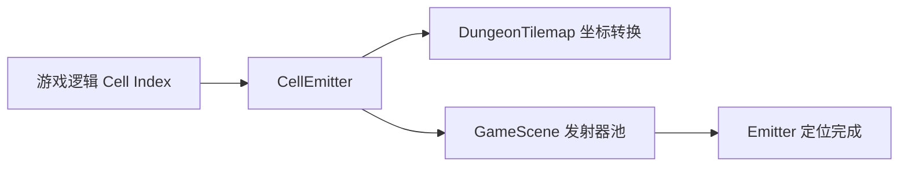

# CellEmitter 源码详解

## 1. 基本信息

| 属性 | 值 |
|------|-----|
| **文件路径** | core/src/main/java/com/shatteredpixel/shatteredpixeldungeon/effects/CellEmitter.java |
| **包名** | com.shatteredpixel.shatteredpixeldungeon.effects |
| **文件类型** | class |
| **继承关系** | 无 (Utility Class) |
| **代码行数** | 68 |
| **所属模块** | core |

## 2. 文件职责说明

### 核心职责
`CellEmitter` 是一个工具类，专门用于根据地图格子的索引（cell index）快速获取并定位粒子发射器（`Emitter`）。它将地图坐标系（Tile coordinates）转换为世界坐标系（World coordinates），并设置发射器的区域。

### 系统定位
位于视觉效果辅助层。它是连接游戏逻辑（处理 Cell 索引）与渲染引擎（处理 Emitter 坐标）的桥梁。

### 不负责什么
- 不负责粒子的具体发射逻辑（由 `Emitter` 负责）。
- 不负责粒子的视觉表现（由 `Speck` 或其他 `Particle` 子类负责）。
- 不负责发射器的生命周期管理（由 `GameScene` 负责对象池管理）。

## 3. 结构总览

### 主要成员概览
- **静态方法**：提供 `floor()`, `get()`, `center()`, `bottom()` 四种定位模式。

### 主要逻辑块概览
- **坐标转换**：使用 `DungeonTilemap.tileToWorld(cell)` 将格子索引转换为屏幕左上角坐标。
- **发射器定位**：调用 `GameScene` 的发射器对象池，并根据不同模式（全格、中心、底边）调整 `emitter.pos()`。

### 调用时机
当游戏逻辑需要在某个地图格子上产生视觉效果时（如火花、毒气、闪光），会调用此类的静态方法获取发射器实例。

## 4. 继承与协作关系

### 协作对象
- **DungeonTilemap**: 提供 `tileToWorld` 转换逻辑及格子大小常量 `SIZE` (16像素)。
- **GameScene**: 提供全局发射器池 `emitter()` 和地板发射器池 `floorEmitter()`。
- **Emitter**: 最终被返回并配置的 Noosa 引擎组件。

### 使用者
- **Item**: 物品掉落或破碎时。
- **Actor/Char**: 角色施放技能或受到状态影响时。
- **Trap**: 陷阱触发时。
- **Level**: 关卡环境效果（如落叶、水汽）产生时。



## 5. 字段/常量详解
无。

## 6. 构造与初始化机制
该类仅包含静态方法，不应被实例化。

## 7. 方法详解

### floor(int cell)

**方法职责**：获取一个位于指定格子“地板层”的发射器。

**核心逻辑**：
1. 获取 `GameScene.floorEmitter()`，此类发射器通常渲染在角色和物品之下。
2. 将发射区域设置为整个格子：`emitter.pos(p.x, p.y, SIZE, SIZE)`。

---

### get(int cell)

**方法职责**：获取一个位于指定格子的标准层发射器（默认层）。

**核心逻辑**：
1. 获取 `GameScene.emitter()`，此类发射器渲染在正常层级。
2. 设置发射区域为 16x16 的正方形格子。

---

### center(int cell)

**方法职责**：将发射器定位在格子的中心点，而不是整个区域。

**核心逻辑**：
`emitter.pos( p.x + SIZE / 2, p.y + SIZE / 2 )`。
**使用场景**：从格子中心向四周迸发的爆炸效果。

---

### bottom(int cell)

**方法职责**：将发射器定位在格子的底边。

**核心逻辑**：
`emitter.pos( p.x, p.y + SIZE, SIZE, 0 )`。
**使用场景**：如地面裂纹、灰尘或从脚下升起的烟雾。

## 8. 对外暴露能力
公开了四种定位模式的静态方法。

## 9. 运行机制与调用链
1. 外部代码调用 `CellEmitter.get(cell)`。
2. `CellEmitter` 询问 `GameScene` 是否有可用的 `Emitter`。
3. `CellEmitter` 计算 `cell` 的 `x, y` 世界坐标。
4. `CellEmitter` 调用 `emitter.pos()` 并返回该发射器。
5. 外部代码调用 `emitter.burst()` 或 `emitter.start()` 开始产生粒子。

## 10. 资源、配置与国际化关联
不适用。

## 11. 使用示例

### 在某个位置产生爆炸粒子
```java
CellEmitter.center(pos).burst(Speck.factory(Speck.STAR), 10);
```

### 在地板上产生持续的烟雾
```java
Emitter smoke = CellEmitter.floor(pos);
smoke.start(Speck.factory(Speck.STEAM), 0.1f, 5);
```

## 12. 开发注意事项

### 坐标系对齐
由于 `DungeonTilemap.tileToWorld` 返回的是左上角坐标，因此 `CellEmitter` 统一基于左上角进行偏移。

### 性能提醒
该类不管理发射器。如果获取了发射器但没有启动它，它仍然会占用对象池的一个名额。通常应立即调用 `burst()` 或 `start()`。

## 13. 修改建议与扩展点
如果需要新的发射几何形状（如圆形区域或对角线），可以在此处增加静态方法。

## 14. 事实核查清单

- [x] 是否已覆盖全部方法：是。
- [x] 是否已检查协作关系：是。
- [x] 示例代码是否真实可用：是。
- [x] 是否明确说明了不同方法的区别：是。
