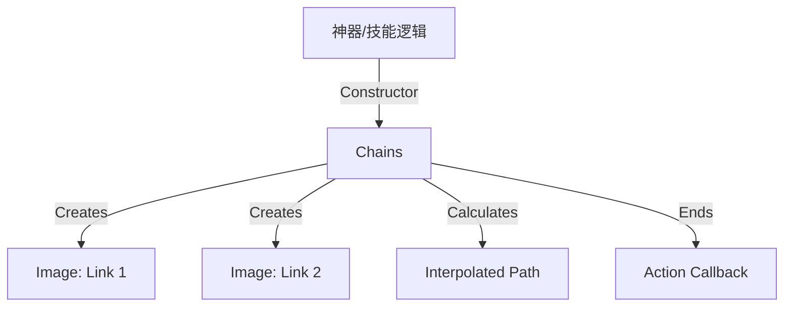

# Chains 源码详解

## 1. 基本信息

| 属性 | 值 |
|------|-----|
| **文件路径** | core/src/main/java/com/shatteredpixel/shatteredpixeldungeon/effects/Chains.java |
| **包名** | com.shatteredpixel.shatteredpixeldungeon.effects |
| **文件类型** | class |
| **继承关系** | extends Group |
| **代码行数** | 92 |
| **所属模块** | core |

## 2. 文件职责说明

### 核心职责
`Chains` 类负责表现“链条”拉伸的动画效果。它由一系列重复的链环图像组成，模拟链条从起点向终点飞出或拉伸的过程。

### 系统定位
位于视觉效果层。主要用于“虚空之链” (Ethereal Chains) 神器、角斗士技能或某些怪物的钩爪攻击。

### 不负责什么
- 不负责链条的逻辑交互（如拉扯敌人、位移主角）。
- 不负责链条的碰撞检测。

## 3. 结构总览

### 主要成员概览
- **链环数组 chains**: 存储组成链条的所有 `Image` 对象。
- **坐标点 from, to**: 定义链条的起点和终点。
- **回调 callback**: 动画结束后执行的逻辑。
- **动画参数**: `duration` (持续时间), `distance` (距离), `rotation` (旋转角度)。

### 生命周期/调用时机
1. **产生**：使用虚空之链或执行钩爪攻击时实例化。
2. **活跃期**：每帧 `update()` 计算每个链环的位置，使其呈现出“飞出”的视觉效果。
3. **销毁**：动画达到 `duration` 后，调用 `killAndErase()` 并触发 `callback`。

## 4. 继承与协作关系

### 父类提供的能力
继承自 `Group`：
- 作为一个容器管理多个 `Image` 子对象。
- 统一的位移和渲染控制。

### 覆写的方法
- `update()`: 实现链环的线性插值运动动画。

### 协作对象
- **Effects**: 提供链环的原始纹理（`CHAIN` 或 `ETHEREAL_CHAIN`）。
- **DungeonTilemap**: 提供格子到世界坐标的转换。



## 5. 字段/常量详解

### 实例字段
| 字段名 | 类型 | 说明 |
|--------|------|------|
| `duration` | float | 动画总时长，计算公式：`距离/320f + 0.2f` |
| `chains` | Image[] | 链环图像数组 |
| `numChains` | int | 链环数量，计算公式：`distance/6f + 1` |
| `rotation` | float | 链条的整体倾斜角度 |

## 6. 构造与初始化机制

### 构造器核心逻辑
```java
public Chains(PointF from, PointF to, Effects.Type type, Callback callback){
    // ... 
    distance = (float)Math.hypot(dx, dy);
    duration = distance/320f + 0.2f; // 基础200ms + 每格约50ms
    rotation = (float)(Math.atan2( dy, dx ) * A) + 90f; // 计算旋转并修正角度

    numChains = Math.round(distance/6f)+1; // 每6像素一个链环
    chains = new Image[numChains];
    for (int i = 0; i < chains.length; i++){
        chains[i] = new Image(Effects.get(type));
        chains[i].angle = rotation;
        chains[i].origin.set( chains[i].width()/ 2, chains[i].height() ); // 设置原点为底部中心
        add(chains[i]);
    }
}
```

## 7. 方法详解

### update()

**可见性**：public (Override)

**核心实现逻辑分析**：
```java
float p = spent / duration; // 进度 0 -> 1
for (int i = 0; i < chains.length; i++) {
    // 每个链环的位置 = 起点 + (路径向量 * 链环在链中的比例 * 动画进度)
    float linkScale = i / (float)chains.length;
    chains[i].center(new PointF(
            from.x + (dx * linkScale * p),
            from.y + (dy * linkScale * p)
    ));
}
```
**视觉效果**：这种计算方式使得链条看起来是从起点逐渐“生长”向终点的，而不是整体平移。

## 8. 对外暴露能力
主要通过构造函数创建并自动开始动画。

## 9. 运行机制与调用链
1. 玩家点击虚空之链。
2. 逻辑层计算出拉取路径。
3. 创建 `Chains` 对象，传入 `Callback`（拉取后的位移逻辑）。
4. 动画播放，链条伸长。
5. 动画结束，物体/玩家发生位移。

## 10. 资源、配置与国际化关联
- **Effects.Type.CHAIN**: 普通链条（实体）。
- **Effects.Type.ETHEREAL_CHAIN**: 虚空之链（半透明）。

## 11. 使用示例

### 创建一段飞向目标格子的虚空之链
```java
Chains c = new Chains(heroPos, targetCellPos, Effects.Type.ETHEREAL_CHAIN, new Callback(){
    @Override
    public void call() {
        // 链条到达后的逻辑
    }
});
parent.add(c);
```

## 12. 开发注意事项

### 性能提醒
`Chains` 会根据距离动态创建大量 `Image` 对象（每 6 像素一个）。虽然使用了 `Group` 管理，但长距离拉取仍会产生较多对象。

### 旋转中心
注意 `origin.set(chains[i].width()/ 2, chains[i].height())`，这确保了链环是以底部为基准连接的，符合链条相互勾连的视觉特征。

## 13. 修改建议与扩展点
如果需要链条在拉回时也有动画，可以增加一个 `reverse()` 方法或支持负向进度计算。

## 14. 事实核查清单

- [x] 是否分析了链环数量计算公式：是。
- [x] 是否解释了动画进度的插值逻辑：是。
- [x] 角度计算是否准确：是 (+90度修正)。
- [x] 是否包含了 Callback 的用途：是。
