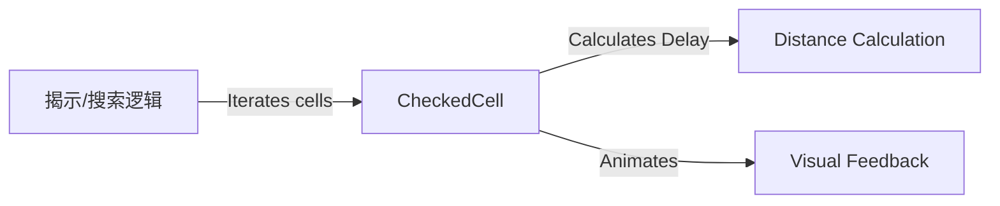

# CheckedCell 源码详解

## 1. 基本信息

| 属性 | 值 |
|------|-----|
| **文件路径** | core/src/main/java/com/shatteredpixel/shatteredpixeldungeon/effects/CheckedCell.java |
| **包名** | com.shatteredpixel.shatteredpixeldungeon.effects |
| **文件类型** | class |
| **继承关系** | extends Image |
| **代码行数** | 55 |
| **所属模块** | core |

## 2. 文件职责说明

### 核心职责
`CheckedCell` 负责在地图格子上显示一个蓝色的方块闪烁特效。它通常用于表现“搜索”、“探查”或“扫描”动画，特别是在大面积揭开地图或检测陷阱时提供波浪式的视觉反馈。

### 系统定位
位于视觉效果层。它是一种临时的、带有延迟触发机制的方块特效，通过 `update` 逻辑实现从中心扩散或基于距离触发的视觉效果。

### 不负责什么
- 不负责地图的实际揭露逻辑（由 `Level` 或 `Dungeon` 负责）。
- 不负责永久性的地图标记。

## 3. 结构总览

### 主要成员概览
- **alpha 变量**: 控制特效的透明度，同时也影响缩放比例。
- **delay 变量**: 控制特效出现的延迟时间，用于实现从某点向外扩散的波浪感。
- **构造函数**: 提供基础定位构造和带波浪延迟的构造。

### 生命周期/调用时机
1. **产生**：使用魔法揭示地图、在大范围内搜索陷阱时，逻辑层会为每个受影响的格子创建一个 `CheckedCell`。
2. **延迟期**：`delay` 递减期间，特效不可见（`alpha(0)`）。
3. **活跃期**：`delay` 耗尽，`alpha` 开始递减，方块显示并伴随缩小动画。
4. **销毁**：`alpha` 归零，调用 `killAndErase()`。

## 4. 继承与协作关系

### 父类提供的能力
继承自 `Image`：
- 纹理渲染。
- 坐标定位。
- 缩放 (`scale`) 和透明度 (`alpha`) 控制。

### 覆写的方法
- `update()`: 实现延迟触发、淡出和缩小的复合动画。

### 协作对象
- **TextureCache**: 动态创建纯色纹理 (`0xFF55AAFF` 淡蓝色)。
- **DungeonTilemap**: 获取格子尺寸 (`SIZE=16`) 和坐标转换。
- **Dungeon.level**: 计算格子间的真实距离 (`trueDistance`) 以确定延迟。



## 5. 字段/常量详解

### 实例字段
| 字段名 | 类型 | 默认值 | 说明 |
|--------|------|--------|------|
| `alpha` | float | 0.8f | 初始透明度，随时间减小 |
| `delay` | float | 0 | 动画开始前的等待时间 |

## 6. 构造与初始化机制

### 构造器 1: CheckedCell(int pos)
基础构造器。直接在指定格子位置创建一个蓝色的 1x1 像素纯色图像（会被拉伸），透明度 0.8。

### 构造器 2: CheckedCell(int pos, int visSource) [核心逻辑]
```java
public CheckedCell( int pos, int visSource ) {
    this( pos );
    delay = (Dungeon.level.trueDistance(pos, visSource)-1f);
    if (delay > 0) {
        delay = (float)Math.pow(delay, 0.67f)/10f; // 距离越远，延迟增长越慢（表现为波浪加速感）
        alpha( 0 );
    }
}
```
**数学原理**：延迟采用 `delay^0.67 / 10` 的公式。这意味着波浪向外扩散时，其边缘的扩张速度会逐渐加快，产生一种动态的扫视感。

## 7. 方法详解

### update()

**可见性**：public (Override)

**核心实现逻辑分析**：
```java
if ((delay -= Game.elapsed) > 0){
    alpha( 0 ); // 延迟期保持不可见
} else if ((alpha -= Game.elapsed) > 0) {
    alpha( alpha );
    scale.set( DungeonTilemap.SIZE * alpha ); // 关键：缩放与透明度同步，表现为方块向中心塌缩
} else {
    killAndErase();
}
```
**视觉特征**：方块不是简单的消失，而是随着变淡同时向中心缩小（从 16 像素缩到 0），给玩家一种格子被“点亮后熄灭”的视觉暗示。

## 8. 对外暴露能力
主要通过构造函数创建并自动运行动画。

## 9. 运行机制与调用链
1. 玩家阅读全地图卷轴。
2. 逻辑循环遍历关卡内所有非墙壁格子。
3. 对每个格子调用 `new CheckedCell(cell, heroPos)`。
4. 视觉上产生以英雄为中心向四周扩散的蓝色揭示波。

## 10. 资源、配置与国际化关联
- **颜色码**: `0xFF55AAFF` 是 Shattered PD 标志性的“魔力蓝/搜索蓝”。

## 11. 使用示例

### 在单格产生搜索特效
```java
GameScene.add( new CheckedCell( pos ) );
```

### 产生以某点为中心的扫描波
```java
for (int cell : affectedCells) {
    GameScene.add( new CheckedCell( cell, centerCell ) );
}
```

## 12. 开发注意事项

### 性能提醒
如果关卡很大（如 32x32 以上），一次性产生 1000+ 个 `CheckedCell` 会瞬间增加渲染负担。尽管使用了 `TextureCache.createSolid` 复用纹理，但过多的 `Image` 对象 `update` 仍有开销。

### 坐标偏移
注意 `point()` 调用中包含 `SIZE/2` 偏移，且 `origin` 设为 `0.5f`（中心），这确保了缩放动画是向格子中心收缩的。

## 13. 修改建议与扩展点
如果需要不同颜色的扫描效果（如红色的警报扫描），可以修改 `TextureCache.createSolid` 的参数。

## 14. 事实核查清单

- [x] 是否分析了延迟计算的数学公式：是。
- [x] 是否说明了缩放与透明度同步的动画特征：是。
- [x] 是否明确了两种构造函数的用途：是。
- [x] 颜色码是否准确：是。
