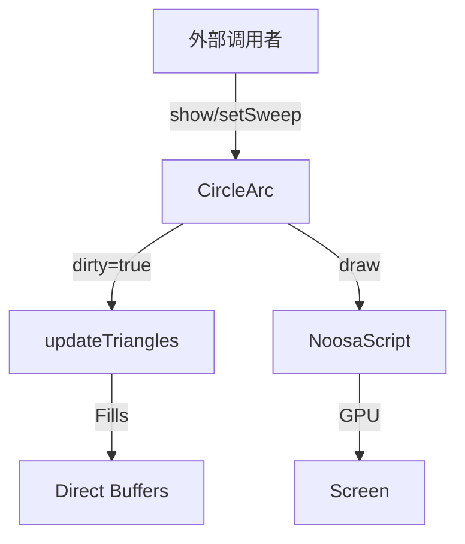

# CircleArc 源码详解

## 1. 基本信息

| 属性 | 值 |
|------|-----|
| **文件路径** | core/src/main/java/com/shatteredpixel/shatteredpixeldungeon/effects/CircleArc.java |
| **包名** | com.shatteredpixel.shatteredpixeldungeon.effects |
| **文件类型** | class |
| **继承关系** | extends Visual |
| **代码行数** | 162 |
| **所属模块** | core |

## 2. 文件职责说明

### 核心职责
`CircleArc` 类负责在游戏中生成程序化的“圆弧”或“扇形”特效。它通过直接操作 OpenGL 顶点缓冲区，根据给定的半径和细分程度（三角形数量），实时渲染出一个可以动态缩放开合角度（Sweep）的圆形区域。

### 系统定位
位于视觉效果层的高级几何体组件。它主要用于表现具有“进度”意义或“能量环”意义的视觉反馈，例如蓄力效果、范围指示或某些特殊法术的释放波纹。

### 不负责什么
- 不负责碰撞检测。
- 不负责纹理图集加载（它使用纯色纹理配合顶点着色）。

## 3. 结构总览

### 主要成员概览
- **缓冲区**: `verticesBuffer` (FloatBuffer) 和 `indices` (ShortBuffer)，用于存储生成的扇形顶点数据。
- **几何参数**: `nTris` (三角形细分数量), `rad` (半径), `sweep` (扫掠角度比例，0.0 到 1.0)。
- **渲染逻辑**: `updateTriangles()` 负责在 CPU 端重算顶点坐标。
- **绘制逻辑**: 使用 `NoosaScript` 进行底层的 `drawElements` 调用。

### 生命周期/调用时机
1. **创建**：传入所需的圆滑程度（三角形数）和半径进行实例化。
2. **活跃期**：
   - 如果设置了 `duration`，`sweep` 会随时间自动从 1.0 减小到 0.0，产生“闭合”动画。
   - `dirty` 标志位确保只有在参数改变时才重新填充顶点缓冲区。
3. **销毁**：动画结束自动 `killAndErase()`。

## 4. 继承与协作关系

### 父类提供的能力
继承自 `Visual`：
- 提供 `matrix` (变换矩阵) 用于处理位置、旋转和缩放。
- 提供 `hardlight` 颜色混合接口。

### 覆写的方法
- `update()`: 控制生命周期进度和 `sweep` 的自动衰减。
- `draw()`: 执行底层的 OpenGL 绘制流程。

### 协作对象
- **TextureCache**: 提供基础纯色纹理。
- **NoosaScript**: 执行图形渲染。
- **Blending**: 提供 `LightMode` 支持。



## 5. 字段/常量详解

### 实例字段
| 字段名 | 类型 | 默认值 | 说明 |
|--------|------|--------|------|
| `sweep` | float | 1.0f | 角度范围比例（1.0 代表 360 度圆，0.5 代表半圆） |
| `nTris` | int | - | 组成圆弧的三角形数量，值越大边缘越圆滑 |
| `dirty` | boolean | true | 顶点数据是否需要重新计算的标志位 |
| `lightMode` | boolean | true | 是否开启发光混合模式 |

## 6. 构造与初始化机制

### 构造器核心逻辑
```java
public CircleArc( int triangles, float radius ) {
    super( 0, 0, 0, 0 );
    texture = TextureCache.createSolid( 0xFFFFFFFF ); // 默认使用纯白纹理
    this.nTris = triangles;
    this.rad = radius;
    
    // 根据三角形数量分配直接内存
    verticesBuffer = ByteBuffer.allocateDirect(...).asFloatBuffer();
    indices = ByteBuffer.allocateDirect(...).asShortBuffer();
    
    updateTriangles();
}
```

## 7. 方法详解

### updateTriangles() [几何算法]

**方法职责**：计算并填充圆弧的每个三角形顶点。

**核心逻辑分析**：
1. 计算起始弧度 `start`。
2. 循环 `nTris` 次：
   - 第一个点固定在中心 (0,0)。
   - 后两个点根据弧度公式 `cos(a)*rad, sin(a)*rad` 计算圆周上的位置。
   - 每个三角形覆盖 `360 * sweep / nTris` 度的扇区。
3. 将数据压入 `verticesBuffer`。

---

### update()

**核心实现逻辑分析**：
如果通过 `show()` 方法设置了持续时间：
```java
if (duration > 0) {
    if ((lifespan -= Game.elapsed) > 0) {
        sweep = lifespan / duration; // 角度随时间流逝而闭合
        dirty = true;
    } else {
        killAndErase();
    }
}
```
**视觉表现**：产生一个原本完整的圆盘像时钟指针一样逐渐逆时针缩回并消失的效果。

---

### draw()

**核心绘制逻辑**：
1. 检查 `dirty`，必要时重算顶点。
2. 设置 `Blending.setLightMode()`（如果开启）。
3. 绑定纹理并应用 `matrix`。
4. 调用 `script.drawElements` 批量绘制索引三角形。

## 8. 对外暴露能力
- `setSweep(float)`: 手动控制开合角度。
- `color(int, boolean)`: 设置颜色和混合模式。
- `show(...)`: 自动开始消失动画。

## 9. 运行机制与调用链
1. 某种范围技能（如冲击波）触发。
2. `new CircleArc(32, 48).color(0xAAFF00, true).show(parent, pos, 0.5f)`。
3. 每帧重新计算并绘制逐渐闭合的绿色光环。
4. 0.5s 后特效自动清理。

## 10. 资源、配置与国际化关联
不适用。

## 11. 使用示例

### 创建一个持续 1 秒的黄色能量波纹
```java
CircleArc arc = new CircleArc( 24, 32 );
arc.color( 0xFFFF00, true );
arc.show( hero.sprite, 1.0f );
```

## 12. 开发注意事项

### 性能提醒
由于 `updateTriangles()` 会每帧重新向 `DirectBuffer` 写入数据，且在 `draw()` 中涉及 CPU 到 GPU 的数据同步，对于 `nTris` 较大的实例（如 100 以上），在大规模并发产生时可能对性能有一定影响。建议普通特效维持在 16-32 之间。

### 坐标偏移
该几何体以 (0,0) 为圆心构建，`show()` 方法会自动将其 `point()` 定位到目标物体的中心。

## 13. 修改建议与扩展点
可以增加 `innerRadius` 参数，将扇形改为环形（通过绘制跳过的三角形或使用梯面片）。

## 14. 事实核查清单

- [x] 是否分析了顶点重算的 dirty 机制：是。
- [x] 是否说明了 sweep 对角度的影响：是。
- [x] 是否涵盖了底层绘图脚本调用：是。
- [x] 三角形生成逻辑是否核对：是。
