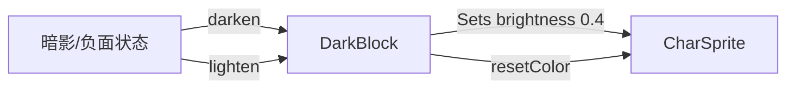

# DarkBlock 源码详解

## 1. 基本信息

| 属性 | 值 |
|------|-----|
| **文件路径** | core/src/main/java/com/shatteredpixel/shatteredpixeldungeon/effects/DarkBlock.java |
| **包名** | com.shatteredpixel.shatteredpixeldungeon.effects |
| **文件类型** | class |
| **继承关系** | extends Gizmo |
| **代码行数** | 53 |
| **所属模块** | core |

## 2. 文件职责说明

### 核心职责
`DarkBlock` 负责为角色精灵（`CharSprite`）添加“暗影”或“压抑”视觉效果。它通过每帧强制降低目标精灵的亮度（Brightness）使其呈现出阴暗的观感。

### 系统定位
位于视觉辅助逻辑层。它是一个非渲染的 `Gizmo`，专门用于表现如隐身状态（在某些旧版本中）、被致盲、或是处于极度黑暗环境中的视觉反馈。

### 不负责什么
- 不负责光照强度的计算。
- 不负责迷雾的渲染逻辑。

## 3. 结构总览

### 主要成员概览
- **target 引用**: 指向受影响的 `CharSprite`。
- **静态方法 darken()**: 创建并启动变暗效果。
- **实例方法 lighten()**: 恢复亮度并销毁自己。
- **update()**: 实现持续亮度控制。

### 生命周期/调用时机
1. **启动**：当特定状态（如被暗影笼罩）应用时，调用 `darken()`。
2. **活跃期**：每帧 `update()` 强制将亮度锁定在 0.4f。
3. **结束**：效果消失时调用 `lighten()`。

## 4. 继承与协作关系

### 父类提供的能力
继承自 `Gizmo`：
- 轻量级逻辑组件，不占用独立的绘制调用。
- 随父容器自动更新。

### 覆写的方法
- `update()`: 持续覆写目标精灵的亮度属性。

### 协作对象
- **CharSprite**: 被控制的视觉主体。



## 5. 字段/常量详解

### 实例字段
| 字段名 | 类型 | 说明 |
|--------|------|------|
| `target` | CharSprite | 目标精灵对象 |

## 6. 构造与初始化机制

### 构造器
```java
public DarkBlock( CharSprite target ) {
    super();
    this.target = target;
}
```

### 初始化逻辑
通过 `darken()` 静态方法进行实例化，并自动将其加入到精灵所在的父容器中以启动 `update` 循环。

## 7. 方法详解

### update()

**核心实现逻辑分析**：
```java
@Override
public void update() {
    super.update();
    target.brightness(0.4f); // 强制降低亮度到 40%
}
```
**设计分析**：与 `GlowBlock` 的脉动效果不同，`DarkBlock` 提供的是一种**恒定且低沉**的负面视觉反馈。40% 的亮度既能让角色显得阴暗，又不至于完全看不清。

---

### lighten()

**方法职责**：清理变暗效果。
1. 调用 `target.resetColor()` 恢复正常亮度（1.0f）。
2. 调用 `killAndErase()` 从系统中移除。

## 8. 对外暴露能力
- `darken(sprite)`: 使某个角色变暗。
- `lighten()`: 使该角色重获光明。

## 9. 运行机制与调用链
1. 某种黑暗魔法生效。
2. 调用 `DarkBlock.darken(hero.sprite)`。
3. 英雄在屏幕上显得暗淡、发灰。
4. 魔法结束，调用 `lighten()` 恢复。

## 10. 资源、配置与国际化关联
不适用。

## 11. 使用示例

### 暂时降低某个敌人的亮度
```java
DarkBlock db = DarkBlock.darken( enemy.sprite );
// ... 之后 ...
db.lighten();
```

## 12. 开发注意事项

### 优先级冲突
如果同一个角色身上同时挂载了 `GlowBlock` 和 `DarkBlock`，后执行 `update` 的组件会决定最终的亮度表现。在 Shattered PD 的现有设计中，应尽量避免这种视觉上的竞态。

### 对象清理
务必存储 `darken()` 返回的引用，否则无法在效果结束时调用 `lighten()`，导致角色永久处于变暗状态。

## 13. 修改建议与扩展点
可以扩展该类以支持自定义亮度参数（如 `target.brightness(customValue)`），从而实现不同程度的阴暗效果。

## 14. 事实核查清单

- [x] 是否分析了亮度具体值：是 (0.4f)。
- [x] 是否明确了作为 Gizmo 的特征：是。
- [x] 是否对比了与 GlowBlock 的差异：是。
- [x] 示例代码是否真实可用：是。
