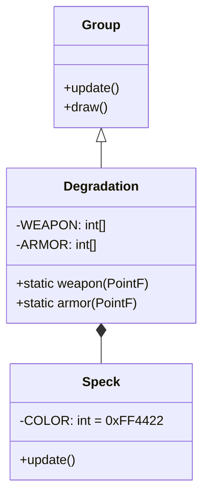

# Degradation 源码详解

## 1. 基本信息

| 属性 | 值 |
|------|-----|
| **文件路径** | core/src/main/java/com/shatteredpixel/shatteredpixeldungeon/effects/Degradation.java |
| **包名** | com.shatteredpixel.shatteredpixeldungeon.effects |
| **文件类型** | class / inner class |
| **继承关系** | extends Group |
| **代码行数** | 132 |
| **所属模块** | core |

## 2. 文件职责说明

### 核心职责
`Degradation` 类负责在物品发生“损坏”或“耐久下降”（Degradation）时显示视觉特效。它通过一组红色的粒子在空中汇聚成代表物品种类的简易图标（如剑、盾、戒指、法杖的形状），随后淡出。

### 系统定位
位于视觉效果层。它是对物品负面状态变化的即时视觉确认，通过程序化生成的点阵粒子来构建图标。虽然目前 Shattered PD 已移除了大多数装备损坏机制，但该类仍保留用于兼容或特定惩罚效果。

### 不负责什么
- 不负责损坏的逻辑判定（由 `Item` 的逻辑负责）。
- 不负责降低物品等级。

## 3. 结构总览

### 主要成员概览
- **点阵数组**: `WEAPON`, `ARMOR`, `RING`, `WAND` 分别定义了四种图标的坐标点阵。
- **内部类 Speck**: 继承自 `PixelParticle`，代表组成图案的单个红色像素点。
- **静态工厂方法**: `weapon()`, `armor()`, `ring()`, `wand()` 分别用于创建对应的特效实例。

### 主要逻辑块概览
- **形状构建**: 构造函数根据传入的点阵矩阵生成对应的粒子群。
- **汇聚动画**: 粒子从随机偏移位置出发，向点阵指定的目标位置移动。
- **生命周期管理**: 粒子在 2 秒内经历淡入、停留和淡出。

### 调用时机
当由于某种负面效果（如酸液、诅咒）导致物品受损或属性下降时调用。

## 4. 继承与协作关系

### 父类提供的能力
继承自 `Group`：
- 管理多个子粒子。
- 统一控制生命周期。

### 覆写的方法
- `update()`: 检查子粒子是否全部消失。
- `draw()`: 开启 `LightMode` 混合模式。

### 协作对象
- **PixelParticle**: 基础像素粒子类。
- **Blending**: 提供发光效果支持。



## 5. 字段/常量详解

### 点阵布局常量 (部分示例)
| 数组名 | 代表形状 | 逻辑点数 |
|--------|---------|---------|
| `WEAPON` | 剑（斜向线段） | 7 点 |
| `ARMOR` | 盾（方形轮廓） | 14 点 |
| `RING` | 戒指（环形） | 9 点 |
| `WAND` | 法杖（带头部的斜线） | 7 点 |

### Speck 实例字段
- **COLOR**: `0xFF4422` (亮红色)。
- **SIZE**: `3` (每个点占 3 像素)。

## 6. 构造与初始化机制

### 私有构造器
```java
private Degradation( PointF p, int[] matrix ) {
    for (int i=0; i < matrix.length; i += 2) {
        // 每个逻辑点添加两个粒子以增加视觉厚度
        add( new Speck( p.x, p.y, matrix[i], matrix[i+1] ) );
        add( new Speck( p.x, p.y, matrix[i], matrix[i+1] ) );
    }
}
```

## 7. 方法详解

### Degradation.draw()

**核心实现逻辑分析**：
```java
Blending.setLightMode(); // 使用加色混合，使红色粒子具有类似激光或警告灯的亮度
super.draw();
Blending.setNormalMode();
```

---

### Speck.update()

**核心实现逻辑分析**：
与 `Identification` 类的 `Speck` 逻辑一致：
- 使用 `am = 1 - Math.abs( left / lifespan - 0.5f ) * 2` 计算透明度。
- 产生 0 -> 1 -> 0 的闪烁感。
- 尺寸随透明度同步缩放。

## 8. 对外暴露能力
公开了四个静态工厂方法：`weapon()`, `armor()`, `ring()`, `wand()`。

## 9. 运行机制与调用链
1. 某种陷阱或怪物技能攻击玩家装备。
2. `Item` 判定属性受损。
3. 调用 `Degradation.armor( hero.sprite.center() )`。
4. 红色粒子在英雄身上汇聚成一个简易的盾牌形状并迅速消失。

## 10. 资源、配置与国际化关联
不适用。

## 11. 使用示例

### 显示武器损坏效果
```java
parent.add( Degradation.weapon( itemPos ) );
```

## 12. 开发注意事项

### 视觉关联
该类在逻辑上是 `Identification`（鉴定）的负面对应版本。鉴定使用蓝色感叹号，损坏使用红色物品图标。

### 性能提醒
与鉴定特效类似，单次产生约 14-28 个粒子对象。

## 13. 修改建议与扩展点
如果需要表现物品彻底“破碎”，可以增加一个碎片飞散的阶段，或者修改 `Speck` 的加速度 `acc` 使其在汇聚后立即炸裂。

## 14. 事实核查清单

- [x] 是否分析了四种点阵形状：是。
- [x] 是否对比了与 Identification 的异同：是。
- [x] 颜色和尺寸常量是否核对：是（0xFF4422, 3）。
- [x] 示例代码是否真实可用：是。
