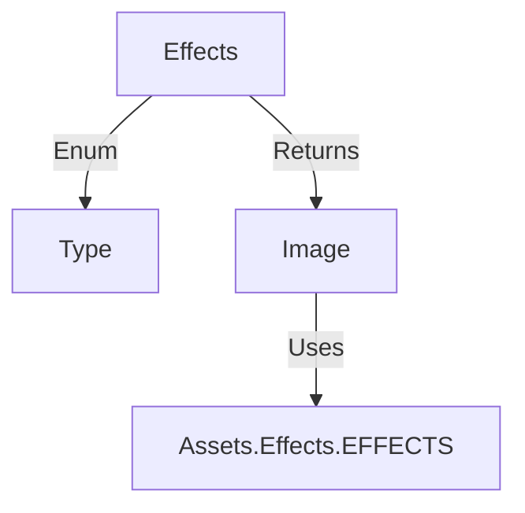

# Effects 源码详解

## 1. 基本信息

| 属性 | 值 |
|------|-----|
| **文件路径** | core/src/main/java/com/shatteredpixel/shatteredpixeldungeon/effects/Effects.java |
| **包名** | com.shatteredpixel.shatteredpixeldungeon.effects |
| **文件类型** | class |
| **继承关系** | 无 (Utility Class) |
| **代码行数** | 68 |
| **所属模块** | core |

## 2. 文件职责说明

### 核心职责
`Effects` 类是一个静态工厂，负责从统一的效果纹理集 (`Assets.Effects.EFFECTS`) 中提取特定类型的图像片段。它通过枚举 `Type` 定义了游戏中几种常见的静态或基础动画帧（如波纹、闪电、伤口、链条等）。

### 系统定位
位于视觉资源访问层。它是一个低级工具类，为更复杂的特效类（如 `Ripple`, `Lightning`, `Chains`）提供原始的 `Image` 对象和 UV 坐标配置。

### 不负责什么
- 不负责特效的逻辑更新或行为（由具体的特效子类负责）。
- 不负责粒子的发射（由 `Emitter` 负责）。

## 3. 结构总览

### 主要成员概览
- **枚举 Type**：定义了所有支持的特效图标类型。
- **静态方法 get(Type)**：根据类型返回配置好纹理和 UV 矩形的 `Image` 对象。

### 生命周期/调用时机
通常在复杂特效对象初始化时调用，用于获取其所需的纹理片段。

## 4. 继承与协作关系

### 协作对象
- **Assets.Effects.EFFECTS**: 核心纹理资源文件。
- **Image**: Noosa 引擎的基础显示类。

### 使用者
- **Ripple**: 水波纹特效。
- **Lightning**: 电击特效。
- **Chains / Ethereal Chains**: 链条相关特效。
- **Wound**: 伤口视觉效果。



## 5. 字段/常量详解

### Type 枚举
| 类型名 | 描述 | UV 范围 (px) |
|--------|------|-------------|
| `RIPPLE` | 波纹 | 0, 0, 16, 16 |
| `LIGHTNING` | 闪电片段 | 16, 0, 32, 8 |
| `WOUND` | 伤口 | 16, 8, 32, 16 |
| `EXCLAMATION` | 感叹号 | 0, 16, 6, 25 |
| `CHAIN` | 普通链条 | 6, 16, 11, 22 |
| `ETHEREAL_CHAIN` | 虚空链条 | 11, 16, 16, 22 |
| `DEATH_RAY` | 死亡射线 | 16, 16, 32, 24 |
| `LIGHT_RAY` | 光之射线 | 16, 23, 32, 31 |
| `HEALTH_RAY` | 治愈射线 | 16, 30, 32, 38 |

## 6. 构造与初始化机制
工具类，无构造器，不应实例化。

## 7. 方法详解

### get(Type type)

**可见性**：public static

**方法职责**：创建并配置一个特定类型的 `Image` 对象。

**核心逻辑分析**：
```java
Image icon = new Image( Assets.Effects.EFFECTS );
switch (type) {
    case RIPPLE:
        icon.frame(icon.texture.uvRect(0, 0, 16, 16));
        break;
    // ... 其他 case
}
return icon;
```
该方法直接操作 `uvRect` 来设置 `Image` 的显示范围。这种硬编码像素坐标的方式要求纹理资源 `effects.png` 必须保持严格的布局一致性。

## 8. 对外暴露能力
公开 `Type` 枚举和 `get` 工厂方法。

## 9. 运行机制与调用链
1. 某种特效类（如 `Ripple`）被实例化。
2. 构造函数调用 `Effects.get(Type.RIPPLE)`。
3. 返回的 `Image` 被作为该特效类的组成部分或基础。

## 10. 资源、配置与国际化关联
- **Assets.Effects.EFFECTS**: 对应的通常是 `assets/effects.png`。

## 11. 使用示例

### 获取一个感叹号图标
```java
Image exclamation = Effects.get(Effects.Type.EXCLAMATION);
parent.add(exclamation);
```

## 12. 开发注意事项

### 维护成本
由于 UV 坐标（如 `uvRect(16, 30, 32, 38)`）是硬编码在 Java 代码中的，如果美术资源 `effects.png` 发生重排，必须同步修改此文件，否则会导致图标错位。

## 13. 修改建议与扩展点
如果增加了新的全局静态效果图标，应在此枚举中添加新类型，并在 `get` 方法中配置其对应的 UV 坐标。

## 14. 事实核查清单

- [x] 是否已覆盖全部 Type 类型：是。
- [x] 坐标是否与源码一致：是。
- [x] 是否说明了资源依赖：是。
