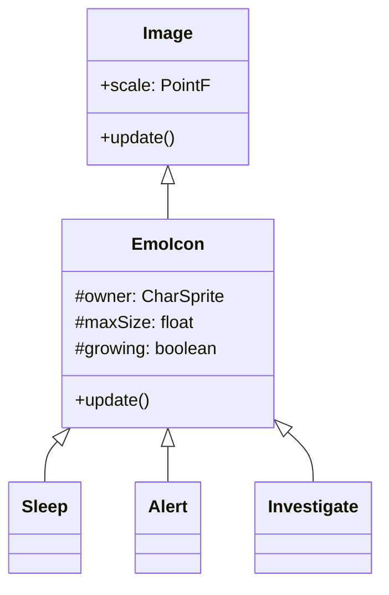

# EmoIcon 源码详解

## 1. 基本信息

| 属性 | 值 |
|------|-----|
| **文件路径** | core/src/main/java/com/shatteredpixel/shatteredpixeldungeon/effects/EmoIcon.java |
| **包名** | com.shatteredpixel.shatteredpixeldungeon.effects |
| **文件类型** | class / inner classes |
| **继承关系** | extends Image |
| **代码行数** | 155 |
| **所属模块** | core |

## 2. 文件职责说明

### 核心职责
`EmoIcon` 类及其子类负责在角色（主要是怪物）头顶显示表示“情绪”或“状态”的图标（如 Zzz、感叹号、问号）。这些图标带有持续的脉动动画，用于直观地向玩家展示怪物的 AI 状态。

### 系统定位
位于视觉效果层。它是怪物 AI 状态机的视觉呈现组件，直接挂载在 `CharSprite` 的位置之上。

### 不负责什么
- 不负责 AI 逻辑判断（由 `Mob` 及其 `AiState` 负责）。
- 不负责图标的图标素材管理（由 `Icons` 类负责）。

## 3. 结构总览

### 主要成员概览
- **基类 EmoIcon**: 提供核心的脉动（缩放）动画逻辑。
- **子类 Sleep**: 显示睡觉图标 (Zzz)。
- **子类 Alert**: 显示警觉图标 (!)。
- **子类 Investigate**: 显示调查图标 (?)。
- **子类 Lost**: 显示丢失目标图标 (...)。

### 主要逻辑块概览
- **脉动动画**: 在 `update()` 中通过 `growing` 布尔值控制缩放比例在 1.0 到 `maxSize` 之间往复循环。
- **位置锚定**: 在 `update()` 中实时计算 `owner` 精灵的位置，确保图标始终跟随角色移动。

### 生命周期/调用时机
1. **创建**：当怪物进入相应 AI 状态时，由 `CharSprite.showAlert()` 等方法实例化。
2. **活跃期**：持续更新位置并播放缩放动画。
3. **销毁**：当 AI 状态改变或角色死亡时，由 `owner` 显式隐藏并移除。

## 4. 继承与协作关系

### 父类提供的能力
继承自 `Image`：
- 纹理渲染。
- 基础变换支持（位置、缩放、透明度）。

### 覆写的方法
- `update()`: 实现了图标随时间的脉动缩放以及相对于宿主的像素完美对齐。

### 协作对象
- **CharSprite**: 作为图标的“宿主”，提供位置参考。
- **Icons**: 提供具体的图标纹理片段。
- **PixelScene**: 提供像素对齐工具。



## 5. 字段/常量详解

### 实例字段
| 字段名 | 类型 | 默认值 | 说明 |
|--------|------|--------|------|
| `maxSize` | float | 2f | 缩放动画的最大倍率（子类会覆写） |
| `timeScale` | float | 1f | 动画速度倍率 |
| `growing` | boolean | true | 当前是处于变大阶段还是缩小阶段 |
| `owner` | CharSprite | - | 该图标所属的角色精灵 |

## 6. 构造与初始化机制

### 构造器
```java
public EmoIcon( CharSprite owner ) {
    super();
    this.owner = owner;
    GameScene.add( this ); // 自动添加到当前场景渲染列表
}
```

### 子类初始化特征
子类（如 `Alert`）会调用 `copy(Icons.get(Icons.ALERT))` 来拷贝图标纹理，并设置差异化的 `maxSize` 和 `timeScale`（例如 `Alert` 脉动极快）。

## 7. 方法详解

### update()

**可见性**：public (Override)

**核心实现逻辑分析**：
1. **动画逻辑**：
   ```java
   if (growing) {
       scale.set( Math.min(scale.x + Game.elapsed * timeScale, maxSize ));
       if (scale.x >= maxSize) growing = false;
   } else {
       scale.set( Math.max(scale.x - Game.elapsed * timeScale, 1f ));
       if (scale.x <= 1) growing = true;
   }
   ```
2. **对齐逻辑**：
   ```java
   PointF center = centerPoint();
   x = PixelScene.align(camera, owner.x + owner.width() - center.x);
   y = PixelScene.align(camera, owner.y - center.y);
   ```
   使用 `PixelScene.align` 确保图标在像素点上对齐，防止在缩放过程中产生抖动或模糊。

---

### centerPoint()

**方法职责**：定义图标相对于宿主精灵右上角的偏移中心。

**差异化实现**：
- **Sleep**: 稍微向上偏移，模拟气泡飘出的感觉。
- **Alert/Investigate**: 稍微向左偏移，使其在怪物侧面显示。

## 8. 对外暴露能力
主要通过具体的子类构造函数对外提供。

## 9. 运行机制与调用链
1. 怪物监听到玩家声音。
2. `Mob` AI 切换到 `Wandering`。
3. `CharSprite` 创建并显示 `Investigate` (?) 图标。
4. `Investigate.update()` 驱动动画。
5. 怪物发现玩家，旧图标销毁，切换为 `Alert` (!) 图标。

## 10. 资源、配置与国际化关联
- **Icons**: 图标资源来自 `assets/items.png`（或其他 UI 图集）。

## 11. 使用示例

### 为一个精灵手动添加警觉图标
```java
EmoIcon alert = new EmoIcon.Alert( mobSprite );
// 图标会自动开始在 mobSprite 头顶脉动
```

## 12. 开发注意事项

### 自动添加
构造函数中包含 `GameScene.add(this)`，因此只要 `new` 出来就会出现在屏幕上。销毁时需调用 `remove()` 或让 `owner` 处理。

### 性能提醒
图标直接参与 `Group` 的 `update` 遍历。虽然开销较小，但在有大量可见怪物时（如 50+），应注意控制特效数量。

## 13. 修改建议与扩展点
如果需要增加新的状态（如“魅惑”或“恐惧”），可以新增子类并调整 `timeScale` 使其具有独特的节奏感（如恐惧可以是不规则的快速抖动）。

## 14. 事实核查清单

- [x] 是否分析了脉动动画逻辑：是。
- [x] 是否说明了与 CharSprite 的锚定关系：是。
- [x] 是否列出了所有内置的情绪类型：是。
- [x] 像素对齐逻辑是否准确：是。
