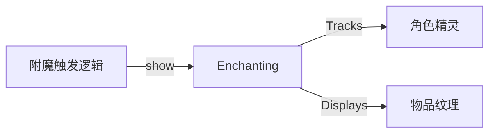

# Enchanting 源码详解

## 1. 基本信息

| 属性 | 值 |
|------|-----|
| **文件路径** | core/src/main/java/com/shatteredpixel/shatteredpixeldungeon/effects/Enchanting.java |
| **包名** | com.shatteredpixel.shatteredpixeldungeon.effects |
| **文件类型** | class |
| **继承关系** | extends ItemSprite |
| **代码行数** | 102 |
| **所属模块** | core |

## 2. 文件职责说明

### 核心职责
`Enchanting` 类负责表现物品“附魔”或“刻印”效果被触发时的视觉反馈。当角色的武器附魔或护甲刻印生效时，该类会在角色头顶上方显示一个该物品的半透明图标，并伴随特定的动画效果。

### 系统定位
位于视觉效果层。它利用 `ItemSprite` 渲染具体的物品图标，通过状态机管理其生命周期，是战斗系统中附魔触发的关键视觉指示器。

### 不负责什么
- 不负责附魔的逻辑判定（由 `Weapon` 或 `Armor` 的相关附魔类负责）。
- 不负责永久性的 UI 显示。

## 3. 结构总览

### 主要成员概览
- **枚举 Phase**: 定义了动画的三个阶段：`FADE_IN`, `STATIC`, `FADE_OUT`。
- **时间常量**: `FADE_IN_TIME` (0.2s), `STATIC_TIME` (1.0s), `FADE_OUT_TIME` (0.4s)。
- **静态方法 show()**: 触发显示的全局入口。
- **字段**: `target` (关联的角色), `color` (附魔发光的颜色)。

### 生命周期/调用时机
1. **触发**：战斗中附魔触发，调用 `Enchanting.show(char, item)`。
2. **FADE_IN**: 图标从中心变大并逐渐显现（透明度最高 0.6）。
3. **STATIC**: 停留阶段，如果物品有发光效果，会应用颜色混合。
4. **FADE_OUT**: 图标继续变大并逐渐消失。
5. **销毁**: 调用 `kill()`。

## 4. 继承与协作关系

### 父类提供的能力
继承自 `ItemSprite`：
- 支持根据 `Item` 自动选择纹理和切片。
- 基础的缩放、旋转和颜色混合（`tint`）支持。

### 覆写的方法
- `update()`: 驱动状态机动画，并实时同步到角色的头顶位置。

### 协作对象
- **Char / CharSprite**: 作为特效跟随的目标。
- **Item**: 提供纹理索引和发光颜色。



## 5. 字段/常量详解

### 静态常量
| 常量名 | 类型 | 值 | 说明 |
|--------|------|-----|------|
| `ALPHA` | float | 0.6f | 最大不透明度 |
| `FADE_IN_TIME` | float | 0.2f | 出现时间 |
| `STATIC_TIME` | float | 1.0f | 持续时间 |
| `FADE_OUT_TIME` | float | 0.4f | 消失时间 |

### 实例字段
| 字段名 | 类型 | 说明 |
|--------|------|------|
| `color` | int | 附魔发光的颜色（如火附魔为红色） |
| `target` | Char | 动画跟随的目标角色 |
| `phase` | Phase | 当前动画阶段 |

## 6. 构造与初始化机制

### 构造器
```java
public Enchanting( Item item ) {
    super( item.image(), null );
    if (item.glowing() != null) {
        color = item.glowing().color;
    } else {
        color = -1;
    }
    phase = Phase.FADE_IN;
    duration = FADE_IN_TIME;
    passed = 0;
}
```
**关键点**：它会从 `item.glowing()` 中获取颜色，这是为了让特效的颜色与物品实际的附魔颜色保持一致。

## 7. 方法详解

### update()

**可见性**：public (Override)

**核心实现逻辑分析**：
1. **坐标定位**：
   ```java
   x = target.sprite.center().x - width() / 2;
   y = target.sprite.y - 8 - height()/2; // 位于角色头顶上方 8 像素处
   ```
2. **状态机动画**：
   - **FADE_IN**: `scale` 随时间从 0 到 1 线性增加。
   - **STATIC**: 如果有颜色，应用 `tint(color, passed / duration * 0.8f)`，产生呼吸感颜色效果。
   - **FADE_OUT**: `scale` 从 1 增加到 2，`alpha` 从 0.6 减到 0。

---

### show(Char ch, Item item)

**方法职责**：静态工厂入口。

**核心逻辑**：
- 检查 `ch.sprite.visible`，如果玩家看不见该角色，则不产生特效（节省开销）。
- 实例化并将其添加到角色精灵所在的父容器中。

## 8. 对外暴露能力
公开了 `show()` 静态方法作为唯一交互点。

## 9. 运行机制与调用链
1. 玩家攻击敌人。
2. `FireWeapon.proc()` 被调用。
3. 如果概率触发，调用 `Enchanting.show(enemy, this)`。
4. 敌人头顶闪烁火属性附魔图标。

## 10. 资源、配置与国际化关联
不适用。

## 11. 使用示例

### 手动为角色显示某个物品的附魔触发
```java
Enchanting.show(hero, hero.belongings.weapon());
```

## 12. 开发注意事项

### 位置同步
由于 `update()` 中每一帧都在重新计算 `x, y`，因此即使角色正在移动或受到击退，该特效图标也会平滑地粘在角色头顶。

### 视觉透明度
该类最大透明度硬编码为 0.6，这确保了它既能引起注意又不会完全遮挡角色。

## 13. 修改建议与扩展点
如果需要区分“正面附魔”和“负面诅咒”的触发，可以增加一个 Phase 阶段，或者改变 `FADE_OUT` 的缩放方向。

## 14. 事实核查清单

- [x] 是否分析了动画三阶段：是。
- [x] 是否说明了颜色来自 Glowing：是。
- [x] 是否解释了坐标对齐逻辑：是。
- [x] 示例代码是否真实可用：是。
