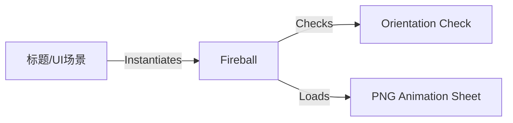

# Fireball 源码详解

## 1. 基本信息

| 属性 | 值 |
|------|-----|
| **文件路径** | core/src/main/java/com/shatteredpixel/shatteredpixeldungeon/effects/Fireball.java |
| **包名** | com.shatteredpixel.shatteredpixeldungeon.effects |
| **文件类型** | class |
| **继承关系** | extends MovieClip |
| **代码行数** | 52 |
| **所属模块** | core |

## 2. 文件职责说明

### 核心职责
`Fireball` 类负责显示循环播放的“火球”动画。它是一个复杂的帧动画组件，通常用于游戏的背景装饰（如标题界面的火球效果），具有横屏和竖屏不同的表现形式。

### 系统定位
位于视觉效果层的高级组件。相比于简单的 `Speck` 或 `Image`，它继承自 `MovieClip`，支持多帧连续播放。

### 不负责什么
- 不负责火球的物理位移（由其宿主类管理位置）。
- 不负责伤害判定。

## 3. 结构总览

### 主要成员概览
- **静态变量 second**: 用于在多个火球同时存在时，交替设置动画偏移和镜像，增加视觉差异。
- **TextureFilm**: 管理火球动画的切片（24帧）。
- **MovieClip.Animation**: 定义了 24 帧的循环动画逻辑。

### 生命周期/调用时机
由 UI 或背景装饰逻辑（如 `TitleScene`）实例化并添加。

## 4. 继承与协作关系

### 父类提供的能力
继承自 `MovieClip`：
- 序列帧播放管理（FPS 控制、循环控制）。
- 基础图像渲染、翻转 (`flipHorizontal`)。

### 协作对象
- **PixelScene**: 通过 `landscape()` 检查当前屏幕方向，选择对应的纹理资源。



## 5. 字段/常量详解

### 静态字段
| 字段名 | 类型 | 默认值 | 说明 |
|--------|------|--------|------|
| `second` | boolean | false | 用于交替火球状态的静态标志位 |

## 6. 构造与初始化机制

### 默认构造器
```java
public Fireball() {
    this(second);
    second = !second; // 每次实例化后取反，确保下一个火球状态不同
}
```

### 核心初始化逻辑
根据屏幕方向加载不同的素材：
- **横屏 (Landscape)**:
  - 纹理: `effects/fireball-tall.png`
  - 切片尺寸: 61x61 像素。
- **竖屏 (Portrait)**:
  - 纹理: `effects/fireball-short.png`
  - 切片尺寸: 47x47 像素。

### 视觉差异化处理
```java
if (second){
    flipHorizontal = true; // 水平镜像翻转
    curFrame = 12; // 动画进度偏移半个周期（24/2）
    frame( curAnim.frames[curFrame] );
}
```
**设计目的**：如果屏幕上有两个火球，由于该逻辑的存在，它们将以相反的方向旋转/流动，且动画进度错开，避免产生呆板的同步感。

## 7. 方法详解
该类主要逻辑集中在构造器中，通过 `play(anim)` 启动动画。其 `update` 和 `draw` 逻辑由父类 `MovieClip` 实现。

## 8. 对外暴露能力
公开两个构造函数，允许手动指定是否作为“第二个”火球实例。

## 9. 运行机制与调用链
1. `TitleScene` 启动。
2. 调用 `new Fireball()`。
3. 构造器根据 `landscape()` 加载 24 帧动画图集。
4. 动画进入循环播放模式（24 FPS）。

## 10. 资源、配置与国际化关联
### 依赖素材
- `assets/effects/fireball-tall.png`
- `assets/effects/fireball-short.png`

## 11. 使用示例

### 在当前场景添加一个火球
```java
Fireball fb = new Fireball();
fb.setPos( 100, 100 );
add( fb );
```

## 12. 开发注意事项

### 屏幕旋转适配
该类在构造时检查屏幕方向。如果游戏在运行中动态切换横竖屏，已存在的火球实例不会自动切换纹理，可能需要重新实例化。

## 13. 修改建议与扩展点
如果需要不同颜色的火球（如蓝火），可以添加 `tint()` 调用或增加新的纹理路径分支。

## 14. 事实核查清单

- [x] 是否分析了横竖屏素材差异：是。
- [x] 是否解释了 `second` 标志位的用途：是（视觉差异化）。
- [x] 帧数和 FPS 是否与源码一致：是 (24帧, 24FPS)。
- [x] 示例代码是否真实可用：是。
