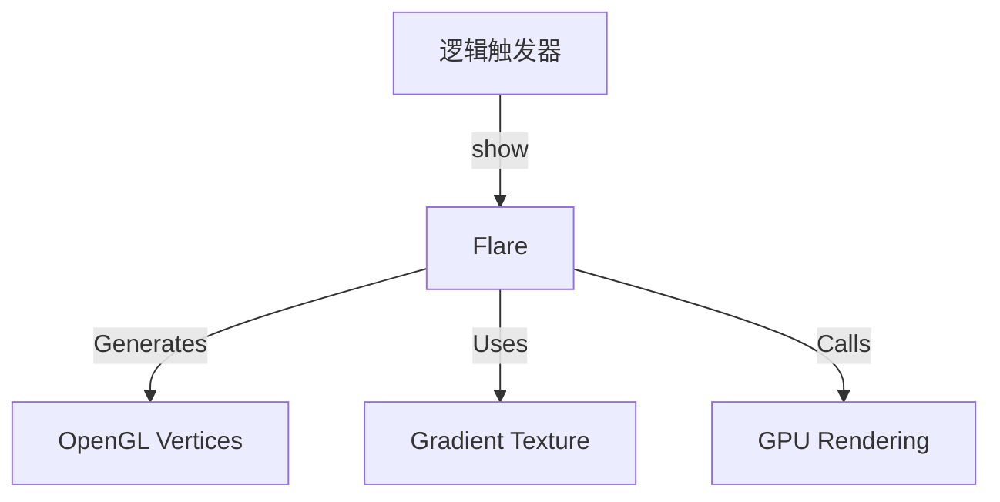

# Flare 源码详解

## 1. 基本信息

| 属性 | 值 |
|------|-----|
| **文件路径** | core/src/main/java/com/shatteredpixel/shatteredpixeldungeon/effects/Flare.java |
| **包名** | com.shatteredpixel.shatteredpixeldungeon.effects |
| **文件类型** | class |
| **继承关系** | extends Visual |
| **代码行数** | 165 |
| **所属模块** | core |

## 2. 文件职责说明

### 核心职责
`Flare` 类负责在游戏中生成放射状的“闪光”或“光芒”特效。它不同于普通的 `Image`，它是通过直接操作顶点缓冲区（Vertex Buffers）程序化生成的几何体，呈现为一个带有多条射线的发光圆盘。

### 系统定位
位于视觉效果层。它主要用于增强高光时刻的视觉表现，如财富之戒掉落奖励、升级、发现特殊物品等。

### 不负责什么
- 不负责具体的触发逻辑。
- 不负责纹理图像加载（它使用程序化生成的渐变纹理）。

## 3. 结构总览

### 主要成员概览
- **顶点/索引缓冲区**: `vertices` (FloatBuffer) 和 `indices` (ShortBuffer)，用于高性能 OpenGL 绘制。
- **射线参数**: `nRays` 定义射线数量，`radius` 定义长度。
- **状态机**: `lifespan` 和 `duration` 管理淡入淡出的缩放动画。
- **渲染脚本**: `NoosaScript` 调用，实现底层图形绘制。

### 主要逻辑块概览
- **几何体构建**: 在构造函数中根据 `nRays` 计算每个射线的三角面片顶点。
- **脉动动画**: 在 `update()` 中根据生命周期进度 `p` 计算缩放倍率，实现先快速变大再缓慢消失的效果。
- **底层绘制**: 在 `drawRays()` 中直接绑定纹理、应用矩阵并调用 `drawElements`。

### 调用时机
当需要引起玩家注意的视觉反馈时（如 `RingOfWealth.showFlareForBonusDrop()`）。

## 4. 继承与协作关系

### 父类提供的能力
继承自 `Visual`：
- 基础的变换矩阵 (`matrix`)。
- 坐标、旋转 (`angle`, `angularSpeed`)、缩放 (`scale`)。
- 颜色混合属性 (`rm`, `gm`, `bm`, `am`)。

### 覆写的方法
- `update()`: 驱动缩放和透明度动画。
- `draw()`: 组合基础绘制与射线的 `LightMode` 绘制。

### 协作对象
- **TextureCache**: 动态创建渐变纹理 (`createGradient`)。
- **NoosaScript**: 执行 OpenGL ES 绘图指令。
- **Blending**: 开启 `setLightMode()` 实现叠加发光效果。



## 5. 字段/常量详解

### 实例字段
| 字段名 | 类型 | 默认值 | 说明 |
|--------|------|--------|------|
| `nRays` | int | - | 射线的数量 |
| `lightMode` | boolean | true | 是否使用滤色混合模式 |
| `angularSpeed` | float | 180 | 默认旋转速度 |

## 6. 构造与初始化机制

### 构造器核心逻辑
```java
public Flare( int nRays, float radius ) {
    super( 0, 0, 0, 0 );
    // 创建一个从白到透明的 5 级阶梯渐变纹理
    int gradient[] = {0xFFFFFFFF, 0xBBFFFFFF, 0x88FFFFFF, 0x00FFFF, 0x00FFFFFF};
    texture = TextureCache.createGradient( gradient );
    
    // 分配直接内存缓冲区 (Direct Buffer)
    vertices = ByteBuffer.allocateDirect(...).asFloatBuffer();
    indices = ByteBuffer.allocateDirect(...).asShortBuffer();
    
    // 程序化生成扇形面片顶点
    for (int i=0; i < nRays; i++) {
        // 计算每个射线的两个边缘顶点，共同连接中心点 (0,0)
        // ... Math.cos/sin 旋转计算 ...
    }
}
```

## 7. 方法详解

### update()

**核心实现逻辑分析**：
```java
float p = 1 - lifespan / duration; // 进度 0 -> 1
// 动画曲线：前 25% 时间迅速扩大到 1.0，后 75% 时间缓慢缩小并消失
p = p < 0.25f ? p * 4 : (1 - p) * 1.333f;
scale.set( p );
alpha( p );
```
这种非线性的 `p` 值计算赋予了闪光“瞬间迸发”的质感。

---

### drawRays() [底层逻辑]

**方法职责**：执行实际的射线图形绘制。

**核心步骤**：
1. `texture.bind()`: 绑定渐变纹理。
2. `script.uModel.valueM4(matrix)`: 应用旋转和缩放变换矩阵。
3. `script.lighting(...)`: 应用 `hardlight` 设置的颜色。
4. `script.drawElements(...)`: 向 GPU 发送绘制索引三角形的指令。

## 8. 对外暴露能力
- `color(color, lightMode)`: 设置发光颜色。
- `show(visual, duration)`: 在指定物体（如角色）中心显示。

## 9. 运行机制与调用链
1. `Lucky` 附魔触发。
2. 调用 `new Flare(8, 32).color(0xFFFFEE, true).show(target, 0.5f)`。
3. `Flare` 每帧旋转 180 度，并按照迸发曲线缩放。
4. GPU 渲染出旋转的金光效果。

## 10. 资源、配置与国际化关联
不适用。纹理为运行时动态生成。

## 11. 使用示例

### 在角色脚下显示一个 12 条射线的蓝色闪光
```java
Flare f = new Flare( 12, 24 );
f.color( 0x00AAFF, true );
f.show( hero.sprite, 0.8f );
```

## 12. 开发注意事项

### 内存管理
由于使用了 `allocateDirect`，这些缓冲区在 Java 堆外。大量频繁创建 `Flare` 对象可能导致性能抖动，建议在复用率高的场景考虑对象池化（虽然当前源码未实现）。

### 坐标系
`origin` 默认为中心，因此 `show()` 方法中直接使用 `visual.center()` 即可完美对齐。

## 13. 修改建议与扩展点
可以修改构造函数中的 `gradient` 数组，实现不同质感（如边缘更柔和或带有光晕）的射线。

## 14. 事实核查清单

- [x] 是否分析了顶点缓冲区的构建：是。
- [x] 是否说明了动画的非线性曲线：是（迸发式曲线）。
- [x] 是否涵盖了底层绘图脚本调用：是。
- [x] 渐变色阶是否核对：是（5级阶梯）。
