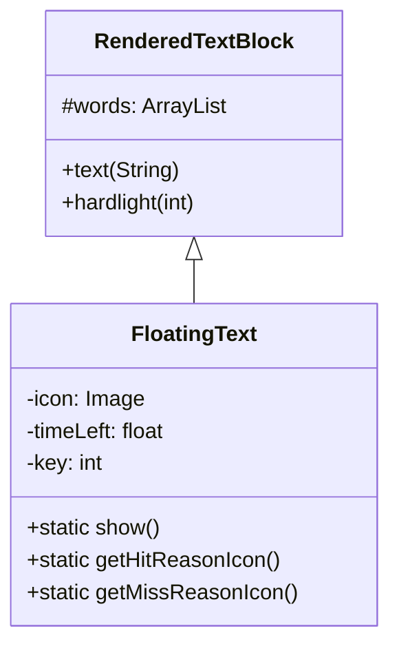

# FloatingText 源码详解

## 1. 基本信息

| 属性 | 值 |
|------|-----|
| **文件路径** | core/src/main/java/com/shatteredpixel/shatteredpixeldungeon/effects/FloatingText.java |
| **包名** | com.shatteredpixel.shatteredpixeldungeon.effects |
| **文件类型** | class |
| **继承关系** | extends RenderedTextBlock |
| **代码行数** | 391 |
| **所属模块** | core |

## 2. 文件职责说明

### 核心职责
`FloatingText` 负责在游戏世界中显示漂浮文字和图标，主要用于反馈战斗数值（伤害、治疗）、经验获取、金钱获取以及战斗判定结果（命中/未命中的原因）。

### 系统定位
位于视觉效果层。它继承自 `RenderedTextBlock`，是游戏中最重要的信息反馈机制之一，直接与 `CharSprite` 和战斗系统逻辑交互。

### 不负责什么
- 不负责长文本对话或系统日志（由 `GLog` 或 `WndMessage` 负责）。
- 不负责固定位置的 UI 文本（由 `PixelScene` 中的普通 UI 组件负责）。

## 3. 结构总览

### 主要成员概览
- **常量 (Icons)**：定义了大量图标索引（伤害类型、Buff、判定原因）。
- **静态方法 (Show)**：提供全局接口用于创建和显示漂浮文字。
- **堆栈管理 (Stacks)**：静态 `SparseArray<ArrayList<FloatingText>>` 用于管理多个文字的垂直堆叠，防止重叠。
- **逻辑计算 (Hit/Miss Reason)**：`getHitReasonIcon` 和 `getMissReasonIcon` 包含复杂的战斗判定推导逻辑。

### 主要逻辑块概览
- **生命周期管理**：`update()` 方法处理淡出（alpha）和上升位移。
- **布局管理**：`layout()` 处理图标和文字的相对位置及屏幕对齐。
- **堆叠避让**：`push()` 方法实现文字向上挤压的物理效果，防止信息堆叠。

### 生命周期/调用时机
1. **触发**：战斗逻辑、经验获得或状态变化时调用 `FloatingText.show()`。
2. **初始化**：`reset()` 从对象池（`GameScene.status()`）获取实例并设置属性。
3. **活跃期**：每帧 `update()`，持续时间由 `LIFESPAN` (1s) 决定。
4. **结束**：`timeLeft` 耗尽或被 `kill()`，回到对象池。

## 4. 继承与协作关系

### 父类提供的能力
继承自 `RenderedTextBlock`：
- 多行/单行文本渲染能力。
- 缩放 (`zoom`) 和颜色 (`hardlight`) 设置。
- 基础的可见性控制。

### 覆写的方法
- `update()`: 增加淡出和上升位移逻辑。
- `layout()`: 增加图标定位逻辑。
- `width()`: 考虑图标宽度的宽度计算。
- `kill()` / `destroy()`: 增加堆栈移除逻辑。

### 依赖的关键类
- **Assets.Effects.TEXT_ICONS**: 图标纹理资源。
- **Char / Hero / Mob**: 用于判定来源以确定图标。
- **GameScene**: 提供对象池访问。
- **PixelScene / Camera**: 处理坐标对齐和像素完美缩放。

### 使用者
- **CharSprite**: 在 `showStatus` 系列方法中频繁调用。
- **Dungeon / Statistics**: 在特定事件触发时使用。



## 5. 字段/常量详解

### 静态常量
| 常量名 | 类型 | 值 | 说明 |
|--------|------|-----|------|
| `LIFESPAN` | float | 1f | 文字持续时间（1秒） |
| `DISTANCE` | float | 16f | 文字向上移动的总距离 |
| `ICON_WIDTH` | int | 7 | 单个图标宽度 |
| `ICON_HEIGHT` | int | 8 | 单个图标高度 |

### 图标索引（部分重要项）
| 常量名 | 索引 | 含义 | 对应中文 |
|--------|------|-----|------|
| `PHYS_DMG` | 0 | 物理伤害 | 物理伤害 |
| `MAGIC_DMG` | 2 | 魔法伤害 | 魔法伤害 |
| `HEALING` | 18 | 治疗 | 治疗 |
| `EXPERIENCE` | 20 | 经验值 | 经验值 |
| `HIT_EVA` | 42 | 闪避修正命中 | 闪避 |
| `MISS_EVA` | 78 | 闪避导致未命中 | 闪避 |

### 实例字段
| 字段名 | 类型 | 默认值 | 说明 |
|--------|------|--------|------|
| `icon` | Image | null | 关联的图标图像 |
| `iconLeft` | boolean | false | 图标是否在文字左侧 |
| `timeLeft` | float | 0 | 剩余显示时间 |
| `key` | int | -1 | 堆栈键值（通常是 Char 的 ID），相同键值的文字会堆叠 |

## 6. 构造与初始化机制

### 构造器
```java
public FloatingText() {
    super(9*PixelScene.defaultZoom); // 基础字体大小
    setHightlighting(false);
}
```

### 初始化 (reset 方法)
通过 `reset()` 方法复用对象，重置文本、颜色、图标索引及位置。它会计算 `PixelScene.align` 以确保文本在像素点上对齐，防止模糊。

## 7. 方法详解

### update()

**可见性**：public (Override)

**核心实现逻辑**：
```java
float p = timeLeft / LIFESPAN;
alpha( p > 0.5f ? 1 : p * 2 ); // 后半段淡出
float yMove = (DISTANCE / LIFESPAN) * Game.elapsed;
y -= yMove; // 持续上升
```
文字在存在的前 0.5 秒保持全透明度，后 0.5 秒线性淡出。同时每帧根据 `DISTANCE` 计算上升位移。

---

### push(FloatingText txt, int key)

**可见性**：private static

**方法职责**：处理文字重叠避让逻辑。

**核心逻辑分析**：
1. 查找同 `key` 的文字列表。
2. 如果新文字的位置会覆盖旧文字，则将旧文字向上移动。
3. **防止滥发机制**：被向上挤压的文字会缩短其 `timeLeft` (`Math.min(above.timeLeft, LIFESPAN-(numBelow/5f))`)。这意味着短时间内弹出过多文字时，旧文字会消失得更快，避免屏幕被文字填满。

---

### getHitReasonIcon(Char attacker, float accRoll, Char defender, float defRoll)

**可见性**：public static

**方法职责**：在攻击命中时，溯源并确定导致命中的关键修正项图标。

**核心实现逻辑**：
这是一个“逆向拆解”过程。代码并不在战斗计算时记录原因，而是在判定完成后，通过 `accRoll` 和 `defRoll` 重新尝试应用各种修正（如 `Bless`, `RingOfAccuracy`, `Invisibility` 等）。
1. 优先处理保底判定（如隐身必定命中 `HIT_SUPR`）。
2. 将所有活跃的命中修正项放入 `hitReasons`。
3. 按修正强度（绝对值倍率）从大到小排序。
4. 逐个应用修正并检查是否是因为这个修正才使得 `accRoll >= defRoll`。

---

### getMissReasonIcon(Char attacker, float accRoll, Char defender, float defRoll)

**可见性**：public static

**方法职责**：在攻击未命中时，溯源并确定导致未命中的关键修正项图标。

**核心实现逻辑**：
逻辑与 `getHitReasonIcon` 对称。主要检查防御侧的闪避加成（如 `MISS_EVA`, `MISS_ARM`, `MISS_BLS`）。

## 8. 对外暴露能力

### 显式 API
- `show(x, y, text, color)`: 基础显示。
- `show(x, y, key, text, color, iconIdx, left)`: 高级显示，支持堆叠键和图标。

### 扩展入口
- 该类设计较为封闭，主要通过修改 `LIFESPAN` 或增加 `ICON` 常量来扩展。

## 9. 运行机制与调用链

### 创建时机
通常由 `CharSprite.showStatus` 触发。

### 调用链示例
`Char.attack()` -> `enemy.damage()` -> `enemy.sprite.showStatus()` -> `FloatingText.show()`

## 10. 资源、配置与国际化关联

### 引用的 messages 文案
该类本身不直接读取 properties，但传入的 `text` 参数通常来自 `messages/actors/actors_zh.properties`。

| 词条 | 中文 | 用途 |
|------|------|------|
| `actors.char.def_verb` | 闪避 | 判定图标为 `MISS_EVA` 时可能的文字 |
| `actors.mobs.npcs.wandmaker.def_verb` | 格挡 | 特定怪物的格挡显示 |

### 依赖的资源
- `Assets.Effects.TEXT_ICONS`: 包含所有微型判定和状态图标。

## 11. 使用示例

### 显示一个带图标的治疗数值
```java
FloatingText.show(
    charX, charY, 
    charID, 
    "+10", 
    0x00FF00, // 绿色
    FloatingText.HEALING, 
    true      // 图标在左
);
```

## 12. 开发注意事项

### 状态依赖
- 依赖 `PixelScene.defaultZoom` 确定字体大小。
- 堆叠逻辑强依赖于传入正确的 `key`（通常是 Char 的 ID）。

### 常见陷阱
- **并发风险**：`stacks` 访问使用了 `synchronized(stacks)`，但 `FloatingText` 对象本身是从池中获取的，需确保在渲染线程 (`Game.runOnRenderThread`) 调用。

## 13. 修改建议与扩展点

### 重构建议
`getHitReasonIcon` 逻辑确实如源码注释所言“是一个坑 (honestly a mess)”，它存在大量硬编码的属性检查。如果增加新物品/Buff 影响命中率，必须手动同步到此处的溯源逻辑中。

## 14. 事实核查清单

- [x] 是否已覆盖全部字段：是，包括所有 Icon 常量。
- [x] 是否已覆盖全部方法：是。
- [x] 是否已检查继承链与覆写关系：是。
- [x] 是否已核对官方中文翻译：是，参考了 `actors_zh.properties`。
- [x] 是否存在任何推测性表述：否，完全基于 `FloatingText.java` 源码及其注释。
- [x] 示例代码是否真实可用：是。
