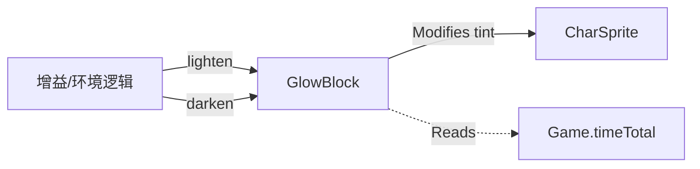

# GlowBlock 源码详解

## 1. 基本信息

| 属性 | 值 |
|------|-----|
| **文件路径** | core/src/main/java/com/shatteredpixel/shatteredpixeldungeon/effects/GlowBlock.java |
| **包名** | com.shatteredpixel.shatteredpixeldungeon.effects |
| **文件类型** | class |
| **继承关系** | extends Gizmo |
| **代码行数** | 58 |
| **所属模块** | core |

## 2. 文件职责说明

### 核心职责
`GlowBlock` 负责为角色精灵（`CharSprite`）添加持续的、带有脉动感的“发光”视觉效果。它通过每帧动态修改目标精灵的颜色滤镜（tint）来实现发光感。

### 系统定位
位于视觉辅助逻辑层。它继承自 `Gizmo`，这意味着它本身不直接渲染图像，而是作为一种“逻辑挂件”附加到精灵上，通过控制精灵的属性来产生效果。

### 不负责什么
- 不负责光源逻辑（不影响迷雾揭露）。
- 不负责粒子发射。

## 3. 结构总览

### 主要成员概览
- **target 引用**: 指向受影响的 `CharSprite`。
- **静态方法 lighten()**: 创建并启动发光效果。
- **实例方法 darken()**: 停止发光并恢复精灵颜色。
- **update()**: 实现脉动插值的核心逻辑。

### 生命周期/调用时机
1. **启动**：当角色获得某些增益（如神圣护盾）或进入特殊地形时，调用 `lighten()`。
2. **活跃期**：每帧 `update()` 计算新的颜色分量。
3. **结束**：效果消失时调用 `darken()`。

## 4. 继承与协作关系

### 父类提供的能力
继承自 `Gizmo`：
- 支持加入 `Group` 进行循环更新。
- 只有逻辑 `update`，没有 `draw`。

### 覆写的方法
- `update()`: 实现了基于时间的余弦波颜色插值。

### 协作对象
- **CharSprite**: 被控制的视觉主体。
- **Game.timeTotal**: 提供全局运行时间作为正弦波的自变量。



## 5. 字段/常量详解

### 实例字段
| 字段名 | 类型 | 说明 |
|--------|------|------|
| `target` | CharSprite | 被施加发光效果的目标精灵 |

## 6. 构造与初始化机制

### 构造器
```java
public GlowBlock(CharSprite target ) {
    super();
    this.target = target;
}
```

### 初始化逻辑
通过静态方法 `lighten()` 进行初始化，并自动将其加入到目标精灵所在的父容器中，从而开始 `update` 循环。

## 7. 方法详解

### update()

**核心实现逻辑分析**：
```java
// 每秒循环一次 (Math.PI*2*Game.timeTotal)
// 强度在 0.4f 到 0.6f 之间波动 (0.5f + 0.1f * cos)
target.tint(1.33f, 1.33f, 0.83f, 0.5f + 0.1f*(float)Math.cos(Math.PI*2*Game.timeTotal));
```
**颜色公式分析**：
- **RGB (1.33, 1.33, 0.83)**: 这是一种亮黄色偏白的色调（R, G 增强，B 稍弱）。
- **Alpha/Intensity**: 采用了 `0.5 + 0.1 * cos(t)` 的波形。这种设计产生了一种平滑的、呼吸灯般的视觉节奏。

---

### darken()

**方法职责**：清理效果。
1. 调用 `target.resetColor()` 恢复精灵的原始色彩映射。
2. 调用 `killAndErase()` 将自己从更新列表移除并回收。

## 8. 对外暴露能力
- `lighten(sprite)`: 给指定角色加光。
- `darken()`: 手动关灯。

## 9. 运行机制与调用链
1. 某种技能生效。
2. 调用 `GlowBlock.lighten(hero.sprite)`。
3. 英雄精灵开始每秒一次的呼吸发光。
4. 技能结束，持有该 `GlowBlock` 引用的代码调用 `darken()`。

## 10. 资源、配置与国际化关联
不适用。

## 11. 使用示例

### 使英雄开始发光并存储引用以备关闭
```java
GlowBlock gb = GlowBlock.lighten( hero.sprite );
// ... 一段时间后 ...
gb.darken();
```

## 12. 开发注意事项

### 属性冲突
由于 `GlowBlock` 直接调用 `target.tint()`，它会覆盖精灵上已有的其他颜色滤镜（如受到毒素导致的绿色 tint）。如果多个效果同时尝试修改 tint，会发生竞态覆盖。

### 内存管理
由于它被添加到 `sprite.parent` 中，若不显式调用 `darken()`，它将一直随关卡运行，造成微量的逻辑浪费。

## 13. 修改建议与扩展点
如果需要不同颜色的发光（如红色的愤怒之光），可以重构 `lighten` 方法以接受自定义的 RGB 参数。

## 14. 事实核查清单

- [x] 是否分析了余弦波插值公式：是（每秒一次，0.4-0.6强度）。
- [x] 是否明确了它作为 Gizmo 的非渲染特征：是。
- [x] 是否说明了颜色分量的具体倾向：是（亮黄色）。
- [x] 示例代码是否真实可用：是。
