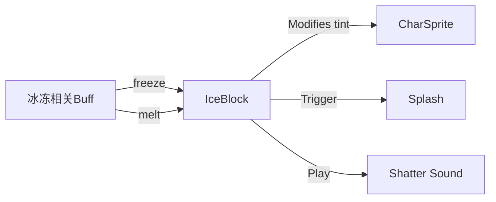

# IceBlock 源码详解

## 1. 基本信息

|属性|值|
|------|-----|
|**文件路径**|core/src/main/java/com/shatteredpixel/shatteredpixeldungeon/effects/IceBlock.java|
|**包名**|com.shatteredpixel.shatteredpixeldungeon.effects|
|**文件类型**|class|
|**继承关系**|extends Gizmo|
|**代码行数**|62|
|**所属模块**|core|

## 2. 文件职责说明

### 核心职责
`IceBlock` 负责为角色精灵（`CharSprite`）添加“冰冻”视觉效果。它通过渐进式地修改目标精灵的颜色滤镜（tint）使其呈现蓝色调，并在冰块“融化”时触发破碎音效和粒子效果。

### 系统定位
位于视觉辅助逻辑层。与 `GlowBlock` 类似，它是一个非渲染的 `Gizmo`，通过逻辑控制宿主精灵的外观来表现状态。

### 不负责什么
- 不负责“冰冻”状态的逻辑判定（由 `Frost` 或 `Paralysis` 等 Buff 负责）。
- 不负责减速或停止行动的逻辑。

## 3. 结构总览

### 主要成员概览
- **target 引用**: 指向受影响的 `CharSprite`。
- **phase 变量**: 记录冰冻动画的进度（0 到 1）。
- **静态方法 freeze()**: 创建并启动冰冻视觉。
- **实例方法 melt()**: 停止冰冻，恢复颜色并产生破碎特效。

### 生命周期/调用时机
1. **启动**：角色被冰冻（如被冰霜陷阱击中）时，由逻辑代码调用 `freeze()`。
2. **渐变期**：在 0.5 秒内（`Game.elapsed * 2`），颜色滤镜透明度从 0 增加到 0.6。
3. **稳定期**：达到 0.6 透明度后保持稳定。
4. **结束**：冰冻解除时调用 `melt()`。

## 4. 继承与协作关系

### 父类提供的能力
继承自 `Gizmo`：
- 支持生命周期更新逻辑。
- 不直接参与渲染。

### 覆写的方法
- `update()`: 实现从正常色到冰蓝色的线性插值过程。

### 协作对象
- **CharSprite**: 视觉控制的目标。
- **Splash**: 在融化时产生蓝色像素粒子。
- **Assets.Sounds.SHATTER**: 融化时的破碎音效。



## 5. 字段/常量详解

### 实例字段
| 字段名 | 类型 | 说明 |
|--------|------|------|
| `target` | CharSprite | 目标精灵 |
| `phase` | float | 动画进度 (0 -> 1)，决定了 tint 的强度 |

## 6. 构造与初始化机制

### 构造器
```java
public IceBlock( CharSprite target ) {
    super();
    this.target = target;
    phase = 0;
}
```

## 7. 方法详解

### update()

**核心实现逻辑分析**：
```java
if ((phase += Game.elapsed * 2) < 1) {
    // 渐变过程：0.5秒内完成
    target.tint( 0.83f, 1.17f, 1.33f, phase * 0.6f );
} else {
    // 稳定过程
    target.tint( 0.83f, 1.17f, 1.33f, 0.6f );
}
```
**颜色方案分析**：
- **RGB (0.83, 1.17, 1.33)**: 显著降低红色，增强蓝色和绿色分量，产生一种寒冷的、淡蓝色的透明质感。
- **最大不透明度 0.6**: 确保冰冻效果明显，但仍能看清底下的角色贴图。

---

### melt()

**方法职责**：执行冰块破碎逻辑。
1. **恢复颜色**：调用 `target.resetColor()`。
2. **注销对象**：调用 `killAndErase()`。
3. **视觉/听觉反馈**：
   - 如果对象可见，在中心产生 5 个淡蓝色 (`0xFFB2D6FF`) 的溅射粒子 (`Splash.at`)。
   - 播放破碎音效。

## 8. 对外暴露能力
- `freeze(sprite)`: 给角色披上冰层。
- `melt()`: 破冰。

## 9. 运行机制与调用链
1. 玩家受到冰霜攻击。
2. 对应 Buff 调用 `IceBlock.freeze(hero.sprite)`。
3. 英雄瞬间变蓝。
4. 经过数回合，Buff 消失，调用 `iceBlock.melt()`。
5. 伴随啪的一声，蓝色消失，爆出一丛蓝色小方块。

## 10. 资源、配置与国际化关联
- **音效**: `Assets.Sounds.SHATTER`。

## 11. 使用示例

### 冻结一个精灵
```java
IceBlock ib = IceBlock.freeze( enemy.sprite );
// ...
ib.melt();
```

## 12. 开发注意事项

### 属性覆盖
与 `GlowBlock` 一样，它会覆盖精灵原有的 tint。如果一个发光的怪被冻住，冰冻效果将主导视觉。

### 像素粒子颜色
融化时的粒子颜色硬编码为 `0xFFB2D6FF`（亮冰蓝）。

## 13. 修改建议与扩展点
如果需要表现“深度冻结”，可以增加一个方法将 `0.6f` 的透明度上限提升到 `0.9f`。

## 14. 事实核查清单

- [x] 是否分析了颜色分量的倾向：是（增强蓝绿，削弱红）。
- [x] 是否说明了动画时长：是（0.5秒）。
- [x] 是否涵盖了融化时的反馈逻辑：是（Splash + Sound）。
- [x] 示例代码是否真实可用：是。
