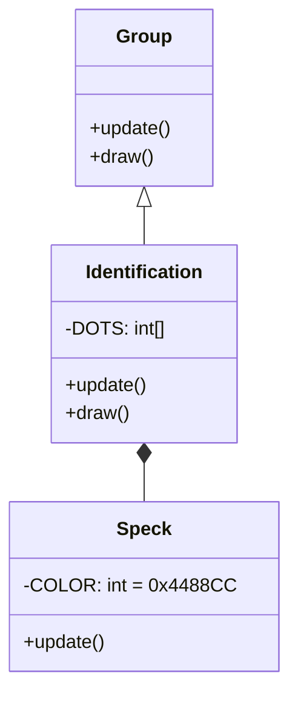

# Identification 源码详解

## 1. 基本信息

| 属性 | 值 |
|------|-----|
| **文件路径** | core/src/main/java/com/shatteredpixel/shatteredpixeldungeon/effects/Identification.java |
| **包名** | com.shatteredpixel.shatteredpixeldungeon.effects |
| **文件类型** | class / inner class |
| **继承关系** | extends Group |
| **代码行数** | 92 |
| **所属模块** | core |

## 2. 文件职责说明

### 核心职责
`Identification` 类负责在物品被成功鉴定（Identification）时显示一个视觉特效。它通过一组粒子在空中汇聚成一个蓝色的“感叹号”形状，随后淡出并缩小。

### 系统定位
位于视觉效果层。它是对鉴定成功的即时视觉反馈，通过程序化生成的几何点阵来构建图标，而非使用静态贴图。

### 不负责什么
- 不负责鉴定逻辑（由 `ScrollOfIdentification` 或 `Item` 负责）。
- 不负责音效播放。

## 3. 结构总览

### 主要成员概览
- **DOTS 数组**: 一个静态整数数组，定义了感叹号形状的坐标点阵。
- **内部类 Speck**: 继承自 `PixelParticle`，代表组成图案的单个像素点。
- **Group 容器**: 管理所有的 `Speck` 粒子。

### 主要逻辑块概览
- **形状构建**: 在构造函数中，根据 `DOTS` 数组的相对坐标生成对应的粒子。
- **粒子运动**: 每个粒子从随机偏移位置出发，向 `DOTS` 指定的目标点汇聚。
- **脉动动画**: `Speck` 在生命周期内会经历先变亮/变大、再变暗/变小的过程。

### 生命周期/调用时机
1. **产生**：鉴定成功时，在物品或角色位置实例化 `Identification`。
2. **活跃期**：持续 2 秒。粒子汇聚并闪烁。
3. **销毁**：当所有粒子 (`countLiving() == 0`) 消失后，调用 `killAndErase()`。

## 4. 继承与协作关系

### 父类提供的能力
继承自 `Group`：
- 管理多个子对象（`Speck`）。
- 统一控制生命周期和绘制顺序。

### 覆写的方法
- `update()`: 检查子粒子存活状态。
- `draw()`: 开启 `LightMode` 混合模式。

### 协作对象
- **PixelParticle**: 作为基础粒子类。
- **Blending**: 提供发光渲染支持。



## 5. 字段/常量详解

### 静态常量 (图案点阵)
| 字段名 | 类型 | 说明 |
|--------|------|------|
| `DOTS` | int[] | 定义感叹号的像素相对坐标对 (x, y) |

**点阵布局分析**：
- `(-1, -3), (0, -3), (+1, -3)`: 顶横线。
- `(-1, -2), (+1, -2)`: 侧边。
- `(+1, -1)`: 侧边。
- `(0, 0), (+1, 0)`: 感叹号主体底部。
- `(0, +1)`: 主体下方空隙。
- `(0, +3)`: 感叹号最底部的点。

### Speck 实例字段
| 字段名 | 类型 | 默认值 | 说明 |
|--------|------|--------|------|
| `COLOR` | int | 0x4488CC | 标志性的浅蓝色 |
| `SIZE` | int | 3 | 粒子的基础尺寸 |

## 6. 构造与初始化机制

### 构造器
```java
public Identification( PointF p ) {
    for (int i=0; i < DOTS.length; i += 2) {
        // 每个坐标点发射两个粒子，增加图案饱和度
        add( new Speck( p.x, p.y, DOTS[i], DOTS[i+1] ) );
        add( new Speck( p.x, p.y, DOTS[i], DOTS[i+1] ) );
    }
}
```

### Speck 初始化逻辑
1. 设置颜色。
2. 计算目标位置 `(x1, y1) = 原点 + 相对坐标 * SIZE`。
3. 起点 `(x0, y0)` 在圆周 8 像素范围内随机偏移。
4. 设置初速度 `speed` 朝向目标，设置加速度 `acc` 模拟减速汇聚。

## 7. 方法详解

### Identification.draw()

**核心实现逻辑分析**：
```java
Blending.setLightMode(); // 使用加色混合，使蓝色粒子看起来在发光
super.draw();
Blending.setNormalMode();
```

---

### Speck.update()

**核心实现逻辑分析**：
```java
// 透明度 p 曲线：0 -> 1 -> 0 (在生命周期的 50% 处达到峰值)
am = 1 - Math.abs( left / lifespan - 0.5f ) * 2;
am *= am; // 平方使边缘更平滑
size( am * SIZE ); // 粒子大小随透明度同步缩放
```
这种设计产生了一种“闪烁”的效果，粒子在汇聚到预定位置时最亮最大，随后缩小消失。

## 8. 对外暴露能力
主要通过构造函数创建。

## 9. 运行机制与调用链
1. 玩家读取鉴定卷轴。
2. 物品被鉴定。
3. `GameScene.add( new Identification( itemSprite.center() ) )` 被调用。
4. 蓝色粒子从中心散开，瞬间汇聚成一个蓝色的 `!` 形状并消失。

## 10. 资源、配置与国际化关联
不适用。

## 11. 使用示例

### 在某个位置显示鉴定成功特效
```java
Identification effect = new Identification( hero.sprite.center() );
parent.add( effect );
```

## 12. 开发注意事项

### 性能提醒
由于每个鉴定特效会创建约 20 个 `Speck` 对象（`DOTS.length` 是 20，循环 add 两次即 20 个粒子），在大面积鉴定时需注意对象创建频率。

### 坐标系
该特效使用世界坐标，直接传入 `visual.center()` 即可。

## 13. 修改建议与扩展点
如果需要表现“诅咒发现”特效，可以参考此逻辑，将颜色改为红色 `0xCC0000` 并将 `DOTS` 修改为叉号或骷髅形状。

## 14. 事实核查清单

- [x] 是否分析了 `DOTS` 点阵的结构：是。
- [x] 是否解释了粒子的汇聚和闪烁算法：是。
- [x] 是否说明了 `LightMode` 的用途：是。
- [x] 颜色和尺寸常量是否核对：是（0x4488CC, 3）。
