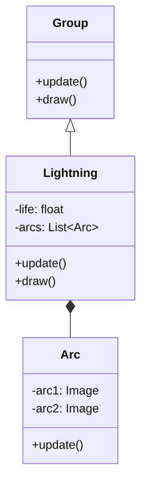

# Lightning 源码详解

## 1. 基本信息

| 属性 | 值 |
|------|-----|
| **文件路径** | core/src/main/java/com/shatteredpixel/shatteredpixeldungeon/effects/Lightning.java |
| **包名** | com.shatteredpixel.shatteredpixeldungeon.effects |
| **文件类型** | class / inner class |
| **继承关系** | extends Group |
| **代码行数** | 135 |
| **所属模块** | core |

## 2. 文件职责说明

### 核心职责
`Lightning` 类负责在游戏中表现“电击”或“闪电”视觉效果。它通过动态抖动的多段线段（Arc）来模拟电流在两点之间跳跃的过程，并伴随快速淡出动画。

### 系统定位
位于视觉效果层。它主要被闪电法杖（Wand of Lightning）、电流陷阱或具有电属性攻击的敌人调用。

### 不负责什么
- 不负责电击的伤害逻辑或传导逻辑（由 `WandOfLightning` 或战斗系统负责）。
- 不负责音效播放。

## 3. 结构总览

### 主要成员概览
- **内部类 Arc**: 代表闪电的一条分支。由两段 `Image` 组成，中间点会随机偏移。
- **列表 arcs**: 存储该闪电对象包含的所有分支。
- **回调 callback**: 动画结束后执行的行为。
- **常量 DURATION**: 闪电显示的总时长（0.3s）。

### 主要逻辑块概览
- **分支构建**: `Arc` 类通过将两点间的直线在中间处随机偏移（±4像素），拆分为两段折线。
- **动态抖动**: `Arc.update()` 每帧都会重新计算中间偏移点，使得闪电看起来在剧烈颤动。
- **淡出动画**: `Lightning.update()` 线性减少所有分支的透明度。

### 生命周期/调用时机
1. **产生**：发生电击事件时，实例化 `Lightning` 并传入起止点。
2. **活跃期**：持续 0.3 秒。每帧闪电形状都会随机变化并淡出。
3. **销毁**：时间结束调用 `killAndErase()` 并触发回调。

## 4. 继承与协作关系

### 父类提供的能力
继承自 `Group`：
- 作为容器管理多个 `Arc`。
- 统一控制生命周期。

### 覆写的方法
- `update()`: 驱动整体淡出计时。
- `draw()`: 开启 `LightMode` 混合模式。

### 协作对象
- **Effects**: 提供闪电线段的原始纹理 (`LIGHTNING`)。
- **DungeonTilemap**: 提供坐标转换。
- **Blending**: 提供发光混合支持。



## 5. 字段/常量详解

### 静态常量
| 常量名 | 类型 | 值 | 说明 |
|--------|------|-----|------|
| `DURATION` | float | 0.3f | 闪电停留的总时长 |

### 实例字段
| 字段名 | 类型 | 说明 |
|--------|------|--------|
| `life` | float | 剩余生存时间 |
| `arcs` | List | 闪电包含的所有分支段 |

## 6. 构造与初始化机制

### 构造器核心逻辑
支持多种坐标输入（格子索引或 `PointF`）。核心构造函数接收一个 `Arc` 列表：
```java
public Lightning( List<Arc> arcs, Callback callback ) {
    super();
    this.arcs = arcs;
    for (Arc arc : this.arcs) add(arc);
    this.callback = callback;
    life = DURATION;
}
```

## 7. 方法详解

### Lightning.draw()

**核心实现逻辑分析**：
```java
Blending.setLightMode(); // 使用加色混合，增强“高能电流”的明亮度
super.draw();
Blending.setNormalMode();
```

---

### Arc.update() [核心抖动逻辑]

**方法职责**：实现电弧的随机颤动。

**核心算法分析**：
1. **寻找中点**: `x2 = (start + end)/2 + Random.Float(-4, +4)`。在起止点中线基础上增加 ±4 像素的随机偏移。
2. **第一段 (arc1)**: 从 `start` 到 `x2`。
3. **第二段 (arc2)**: 从 `x2` 到 `end`。
4. **属性同步**: 计算每段的 `angle` (Math.atan2) 和 `scale.x` (Math.sqrt 距离)。
5. **每帧触发**: 由于 `update` 每帧运行，中间点位置每帧都在变，从而产生了电流不稳定的颤动效果。

## 8. 对外暴露能力
主要通过构造函数创建。支持单段闪电或多段（连锁闪电）构造。

## 9. 运行机制与调用链
1. 玩家对敌人施放闪电。
2. 法杖代码计算传导路径（A -> B -> C）。
3. 调用 `new Lightning(arcs, callback)`。
4. 屏幕上出现剧烈抖动并淡出的电弧。
5. 动画结束，触发受击者的伤害动画。

## 10. 资源、配置与国际化关联
- **Effects.Type.LIGHTNING**: 闪电线段素材。

## 11. 使用示例

### 在两点间创建一道闪电
```java
Lightning l = new Lightning(posA, posB, new Callback(){
    @Override
    public void call() {
        // 闪电消失后的逻辑
    }
});
parent.add(l);
```

## 12. 开发注意事项

### 视觉特征
闪电的段数越多，随机偏移越大，视觉上就越“狂野”。

### 渲染顺序
由于 `Lightning` 继承自 `Group` 且在 `draw` 中使用了 `LightMode`，它通常应最后渲染或添加到具有发光层级的组中。

## 13. 修改建议与扩展点
如果需要表现“连锁闪电”，可以构造一个包含多个 `Arc` 的列表传给 `Lightning`。

## 14. 事实核查清单

- [x] 是否分析了 `Arc` 的两段式结构：是。
- [x] 是否说明了随机抖动的实现原理：是（每帧重新计算偏移中点）。
- [x] 是否涵盖了多种构造函数：是。
- [x] 动画时长是否核对：是（0.3s）。
