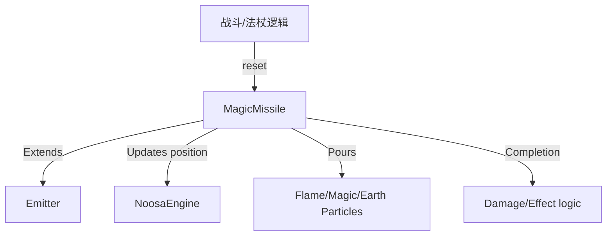

# MagicMissile 源码详解

## 1. 基本信息

| 属性 | 值 |
|------|-----|
| **文件路径** | core/src/main/java/com/shatteredpixel/shatteredpixeldungeon/effects/MagicMissile.java |
| **包名** | com.shatteredpixel.shatteredpixeldungeon.effects |
| **文件类型** | class / inner classes |
| **继承关系** | extends Emitter |
| **代码行数** | 485 |
| **所属模块** | core |

## 2. 文件职责说明

### 核心职责
`MagicMissile` 类负责在游戏中表现“投射物”（Projectile）的移动过程及轨迹特效。它本质上是一个在起止点之间线性移动的粒子发射器（Emitter），能够根据不同的法术类型或攻击方式（如火球、冰弹、腐蚀云、萨满法术等）产生多样化的拖尾和爆发效果。

### 系统定位
位于视觉效果层的中枢位置。它是所有非即时生效的魔法攻击（法杖、远程技能、怪物投射物）的主要表现形式。

### 不负责什么
- 不负责投射物的碰撞检测逻辑（由 `Ballistica` 负责）。
- 不负责命中后的逻辑结算（由回调函数 `callback` 触发逻辑层）。

## 3. 结构总览

### 主要成员概览
- **类型常量**: 定义了数十种投射物类型（`MAGIC_MISSILE`, `FIRE`, `FROST`, `SHAMAN_RED` 等）和锥形喷射类型（`_CONE`）。
- **粒子内部类**: `MagicParticle`, `EarthParticle`, `WhiteParticle`, `SlowParticle` 等，定义了特定类型的物理和视觉行为。
- **运动参数**: `SPEED` (200f), `sx/sy` (速度分量), `time` (剩余飞行时间)。
- **静态工厂**: `boltFromChar()` 提供从角色发射的便捷接口。

### 生命周期/调用时机
1. **产生**：逻辑层执行远程攻击，从对象池 `recycle` 获取 `MagicMissile`。
2. **初始化**：通过 `reset()` 设置起止点、类型和回调。
3. **飞行期**：在 `update()` 中线性更新坐标，同时发射器持续产生拖尾粒子。
4. **结束**：飞行时间结束，执行 `callback.call()`，停止发射并回收。

## 4. 继承与协作关系

### 父类提供的能力
继承自 `Emitter`：
- 对象池管理。
- 粒子发射频率控制（通过 `pour()`）。
- 作为容器挂载并渲染所有子粒子。

### 覆写的方法
- `update()`: 控制发射器自身的位移逻辑。
- `isFrozen()`: 始终返回 `false`，确保投射物动画不受时间冻结影响。

### 协作对象
- **DungeonTilemap**: 提供格子到世界坐标的偏移转换（如 `raisedTileCenter`）。
- **Various Particles**: 使用 `Speck` 或内部定义的 `PixelParticle` 子类作为拖尾素材。
- **Callback**: 动画结束后的逻辑钩子。



## 5. 字段/常量详解

### 核心类型常量 (部分)
| 常量名 | 含义 | 对应效果 |
|--------|------|---------|
| `MAGIC_MISSILE` | 奥术导弹 | 白色像素拖尾 |
| `FIRE` | 火弹 | 红色火焰粒子拖尾 |
| `CORROSION` | 腐蚀 | 灰色酸液粒子拖尾 |
| `SHAMAN_RED` | 红色萨满弹 | 具有重力的红色/褐色渐变粒子 |
| `MAGIC_MISS_CONE`| 锥形喷射 | 面积更大、更密集的发射模式 |
| `SPECK` | 通用 Speck | 支持直接使用 `Speck` 类中的任何粒子类型 |

### 实例字段
- **SPEED**: `200f` 像素/秒。
- **to**: 目标点坐标。
- **time**: 预估飞行总时间，计算公式：`distance / SPEED`。

## 6. 构造与初始化机制

### 构造器
由于通常通过 `recycle` 使用，该类没有复杂的公开构造逻辑。

### reset 方法逻辑
```java
public void reset( int type, PointF from, PointF to, Callback callback ) {
    this.callback = callback;
    this.to = to;
    this.x = from.x;
    this.y = from.y;
    
    // 计算速度分量
    PointF d = PointF.diff( to, from );
    PointF speed = new PointF( d ).normalize().scale( SPEED );
    sx = speed.x;
    sy = speed.y;
    time = d.length() / SPEED;

    // 根据类型配置发射器
    switch(type) {
        case FIRE: size( 4 ); pour( FlameParticle.FACTORY, 0.01f ); break;
        // ... 其他分支 ...
    }
    revive();
}
```

## 7. 方法详解

### update() [运动逻辑]

**可见性**：public (Override)

**核心实现分析**：
```java
if (on) {
    float d = Game.elapsed;
    x += sx * d; // 线性位移
    y += sy * d;
    if ((time -= d) <= 0) {
        on = false; // 停止产生粒子
        if (callback != null ) callback.call(); // 触发命中逻辑
    }
}
```
**关键点**：即使 `on` 为 `false`，发射器已经产生的粒子仍会继续完成其生命周期动画，这产生了自然的余波感。

---

### boltFromChar(...)

**方法职责**：静态便捷入口。
它会自动处理目标是否是角色的判断。如果目标是角色，则会自动追踪到角色的动态中心（`destinationCenter`），即使角色正在移动。

---

### 内部粒子类分析

#### 1. MagicParticle
- **特征**: 浅蓝色，淡出时尺寸从 1 增加到 4（膨胀感）。
- **用途**: 用于冰霜和奥术效果。

#### 2. EarthParticle (Shrinking)
- **特征**: 褐色/黄色随机，带重力加速度 (`acc.y = 40`)，淡出时逐渐缩小。
- **用途**: 地震、岩石相关效果。

#### 3. SlowParticle
- **特征**: 粒子具有特殊的物理加速度：`acc.set((emitter.x - x) * 10, (emitter.y - y) * 10)`。
- **用途**: 产生粒子向投射物中心“塌缩”的特殊视觉。

## 8. 对外暴露能力
- `reset(...)`: 全能重置方法。
- `setSpeed(float)`: 修改弹道速度。
- `size(float)`: 修改发射器有效宽度（影响粒子覆盖范围）。

## 9. 运行机制与调用链
1. 玩家施放火球。
2. `WandOfFirebolt` 创建 `Ballistica` 路径。
3. 调用 `MagicMissile.boltFromChar(...)`。
4. 发射器开始在路径上滑动，持续喷射火焰粒子。
5. 飞行到终点，回调执行，销毁发射器并对敌人造成伤害。

## 10. 资源、配置与国际化关联
不适用。主要依赖 `Effects` 和 `Speck` 中的纹理。

## 11. 使用示例

### 发射一个标准的奥术导弹
```java
MagicMissile.boltFromChar( 
    parent, 
    MagicMissile.MAGIC_MISSILE, 
    hero.sprite, 
    targetCell, 
    new Callback() { ... } 
);
```

## 12. 开发注意事项

### 对象池同步
必须通过 `parent.recycle(MagicMissile.class)` 使用，且确保 `parent` 是一个能够正确更新 `Emitter` 的 `Group`。

### 弹道预测
由于 `MagicMissile` 是纯视觉的，它必须根据 `Ballistica` 预先算好的起止点运行。如果逻辑层由于某些原因改变了命中结果，需要手动调整回调逻辑。

## 13. 修改建议与扩展点
- **变速弹道**: 可以通过在 `update` 中动态修改 `sx/sy` 实现追踪弹或加速弹。
- **新粒子**: 在内部类中定义新的 `PixelParticle` 子类以实现更复杂的轨迹美化（如螺旋、波浪）。

## 14. 事实核查清单

- [x] 是否分析了所有的投射物类型常量：是。
- [x] 是否说明了飞行速度和时间计算：是 (200f)。
- [x] 是否解释了内部粒子类的物理特征：是。
- [x] 静态工厂方法的用途是否明确：是。
- [x] 回调机制是否涵盖：是。
