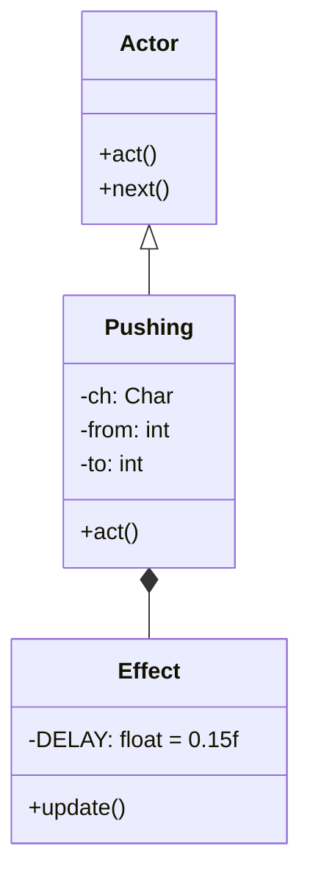

# Pushing 源码详解

## 1. 基本信息

| 属性 | 值 |
|------|-----|
| **文件路径** | core/src/main/java/com/shatteredpixel/shatteredpixeldungeon/effects/Pushing.java |
| **包名** | com.shatteredpixel.shatteredpixeldungeon.effects |
| **文件类型** | class / inner class |
| **继承关系** | extends Actor |
| **代码行数** | 128 |
| **所属模块** | core |

## 2. 文件职责说明

### 核心职责
`Pushing` 类负责实现游戏中角色被“击退”或“推离”的平滑动画效果。它是一个特殊的类，同时扮演了逻辑调度者（`Actor`）和视觉呈现者（`Effect`）的双重角色，确保在击退动画播放期间，游戏的逻辑步进能够正确暂停。

### 系统定位
位于逻辑层与视觉效果层的交界。它通过加入 `Actor` 系统来同步回合制的时间轴，通过内部 `Effect` 类来驱动 Noosa 引擎的物理位移渲染。

### 不负责什么
- 不负责击退的逻辑判定（由 `Char.move()` 或相关技能逻辑负责）。
- 不负责击退后的陷阱触发逻辑。

## 3. 结构总览

### 主要成员概览
- **外部类 Pushing**: 继承自 `Actor`，负责回合同步。
- **内部类 Effect**: 继承自 `Visual`，负责每帧的位移渲染。
- **字段**: `sprite` (被推动的精灵), `from/to` (起点/终点格子), `callback` (结束回调)。

### 生命周期/调用时机
1. **产生**：当角色受到击退效果（如盾牌打击、爆炸、风爆）时实例化并加入 `Actor` 系统。
2. **激活 (act)**：轮到该 `Actor` 执行时，若满足视野条件，则创建内部 `Effect` 对象。
3. **动画期**：`Effect.update()` 接管精灵的位置，在 0.15 秒内完成位移。
4. **销毁**：动画结束，移除 `Actor` 记录，执行回调，并归还精灵控制权。

## 4. 继承与协作关系

### 父类提供的能力
继承自 `Actor`：
- `actPriority`: 设为 `VFX_PRIO+10`，确保击退动画在大多数战斗逻辑之后立即执行。
- `act()`: 核心钩子，用于阻塞 Actor 线程直到动画完成。

### 覆写的方法
- `act()`: 触发视觉效果并决定是否继续阻塞线程。
- `Effect.update()`: 实现物理插值。

### 协作对象
- **CharSprite**: 被移动的视觉主体。
- **Camera**: 如果是英雄被推，相机会执行 `panFollow`。
- **Dungeon.level**: 检查 `heroFOV` 以决定精灵是否可见。



## 5. 字段/常量详解

### 静态常量 (Effect)
| 常量名 | 类型 | 值 | 说明 |
|--------|------|-----|------|
| `DELAY` | float | 0.15f | 击退动画的总时长 |

### 实例字段
| 字段名 | 类型 | 说明 |
|--------|------|------|
| `actPriority` | int | 优先级，设为 110，高于普通 VFX |
| `sprite` | CharSprite | 关联的精灵 |
| `callback` | Callback | 动画结束后执行的逻辑（如检查掉入深渊） |

## 6. 构造与初始化机制

### 构造器核心逻辑
```java
public Pushing( Char ch, int from, int to ) {
    this.ch = ch;
    sprite = ch.sprite;
    this.from = from;
    this.to = to;
    if (ch == Dungeon.hero){
        // 英雄被推时，相机需要以 20f 的平滑度跟随
        Camera.main.panFollow(ch.sprite, 20f);
    }
}
```

## 7. 方法详解

### act() [逻辑阻塞]

**可见性**：protected (Override)

**核心实现逻辑分析**：
1. **注册视觉**: `new Effect()`。
2. **并发优化**: 
   ```java
   for ( Actor actor : Actor.all() ){
       if (actor instanceof Pushing && actor.cooldown() == 0)
           return true;
   }
   return false;
   ```
   **设计意图**：如果场景中有多个角色同时被推（例如炸弹爆炸），该逻辑允许所有击退效果“同时”开始播放，只有当所有的 `Pushing` 效果都处理完后，才会返回 `false` 恢复 Actor 线程。

---

### Effect 内部类初始化 [物理模拟]

**核心实现逻辑分析**：
```java
// 使用匀减速运动模拟击退感
speed.set( 2 * (end.x - x) / DELAY, 2 * (end.y - y) / DELAY );
acc.set( -speed.x / DELAY, -speed.y / DELAY );
```
**数学原理**：初速度设为位移平均速度的两倍，加速度设为反向。这使得物体在 `DELAY` 时间结束时，速度刚好减为 0，且位移刚好等于目标距离。

---

### Effect.update()

**核心实现逻辑分析**：
1. 每一帧将 `sprite.x/y` 更新为 `Visual` 组件根据速度/加速度自动计算出的坐标。
2. 动画结束时：
   - 调用 `sprite.point(end)` 进行坐标校准。
   - 调用 `Actor.remove(Pushing.this)` 彻底释放。
   - 调用 `GameScene.sortMobSprites()` 重新排序深度。
   - 调用 `next()` 唤醒 Actor 线程。

## 8. 对外暴露能力
- `pushingExistsForChar(Char)`: 静态工具方法，检查某个角色当前是否正处于被推状态。

## 9. 运行机制与调用链
1. 角色触发位移逻辑。
2. 逻辑层确定新坐标后，调用 `Actor.add( new Pushing(ch, old, new) )`。
3. Actor 线程暂停。
4. 渲染线程驱动 `Effect` 物理运动。
5. 动画结束，回调触发（可能触发伤害或掉落），Actor 线程恢复。

## 10. 资源、配置与国际化关联
不适用。

## 11. 使用示例

### 手动触发一个击退
```java
Actor.add( new Pushing( enemy, enemy.pos, targetCell ) );
```

## 12. 开发注意事项

### 线程安全
`Pushing` 高度依赖 `Actor` 系统的锁机制。由于它在 `update` 中调用 `next()`，必须确保它始终在渲染线程与逻辑线程的正确交互下运行。

### 可见性
代码包含 FOV 检查：`if (Dungeon.level.heroFOV[from] || Dungeon.level.heroFOV[to]) { sprite.visible = true; }`。这确保了在视野外移动的怪物如果被推入视野，其精灵会立即变为可见。

## 13. 修改建议与扩展点
如果需要不同速度的击退（如重击或轻推），可以向构造函数开放 `DELAY` 参数。

## 14. 事实核查清单

- [x] 是否分析了它作为 Actor 的特殊性：是。
- [x] 是否解释了物理位移计算公式：是（匀减速运动）。
- [x] 是否说明了多个 Pushing 并发的处理：是。
- [x] 英雄相机跟随逻辑是否提及：是。
