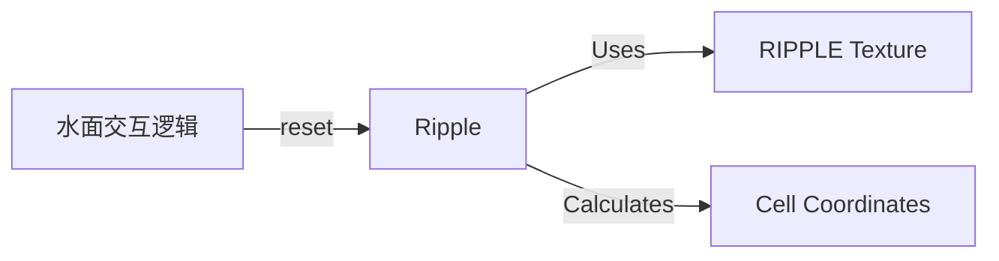

# Ripple 源码详解

## 1. 基本信息

| 属性 | 值 |
|------|-----|
| **文件路径** | core/src/main/java/com/shatteredpixel/shatteredpixeldungeon/effects/Ripple.java |
| **包名** | com.shatteredpixel.shatteredpixeldungeon.effects |
| **文件类型** | class |
| **继承关系** | extends Image |
| **代码行数** | 53 |
| **所属模块** | core |

## 2. 文件职责说明

### 核心职责
`Ripple` 类负责表现水面“波纹”特效。当角色在水中移动或物体掉入水中时，在对应的地图格子上产生一个逐渐扩大并变淡消失的圆形波纹效果。

### 系统定位
位于视觉效果层。它是对 `Effects.Type.RIPPLE` 纹理片段的具体实现，作为环境交互反馈的一部分。

### 不负责什么
- 不负责触发波纹的逻辑判定（由 `Char.move()` 或物品掉落逻辑负责）。
- 不负责复杂的流体模拟。

## 3. 结构总览

### 主要成员概览
- **常量 TIME_TO_FADE**: 波纹显示并消失的总时长（0.5秒）。
- **reset() 方法**: 用于复用对象并初始化波纹位置。
- **update()**: 处理随时间扩大的缩放动画和透明度变化。

### 生命周期/调用时机
1. **触发**：角色在水格、浅滩上移动时。
2. **产生**：通常从 `GameScene` 的对象池中 `recycle` 一个 `Ripple` 实例。
3. **活跃期**：执行 `update()`，缩放比例从 0 增加到 1，透明度从 1 减少到 0。
4. **销毁**：0.5秒后自动 `kill()`。

## 4. 继承与协作关系

### 父类提供的能力
继承自 `Image`：
- 基础纹理渲染。
- 坐标、缩放 (`scale`) 和透明度 (`alpha`) 控制。

### 覆写的方法
- `update()`: 实现了波纹扩散的自定义插值动画。

### 协作对象
- **Effects**: 提供波纹的原始纹理。
- **DungeonTilemap**: 获取格子尺寸 (`SIZE=16`) 以进行坐标计算。
- **Dungeon.level**: 获取关卡宽度以换算行列坐标。



## 5. 字段/常量详解

### 静态常量
| 常量名 | 类型 | 值 | 说明 |
|--------|------|-----|------|
| `TIME_TO_FADE` | float | 0.5f | 波纹从出现到完全消失的时间 |

### 实例字段
| 字段名 | 类型 | 说明 |
|--------|------|------|
| `time` | float | 剩余存活时间 |

## 6. 构造与初始化机制

### 构造器
```java
public Ripple() {
    super( Effects.get( Effects.Type.RIPPLE ) );
}
```

### 初始化 (reset 方法)
```java
public void reset( int p ) {
    revive();
    x = (p % Dungeon.level.width()) * DungeonTilemap.SIZE;
    y = (p / Dungeon.level.width()) * DungeonTilemap.SIZE;
    origin.set( width / 2, height / 2 ); // 核心：中心对齐，确保向四周扩散
    scale.set( 0 ); // 初始大小为 0
    time = TIME_TO_FADE;
}
```

## 7. 方法详解

### update()

**可见性**：public (Override)

**核心实现逻辑分析**：
```java
float p = time / TIME_TO_FADE; // 进度从 1 到 0
scale.set( 1 - p ); // 缩放从 0 到 1
alpha( p ); // 透明度从 1 到 0
```
**动画效果**：这是一个标准的“向外扩散并变淡”的过程。由于 `origin` 设置在中心，缩放效果会表现为波纹从格子中心向边缘均匀扩大。

## 8. 对外暴露能力
主要通过 `reset(pos)` 接口供外部系统在指定格子触发波纹。

## 9. 运行机制与调用链
1. 角色发生位移。
2. 判定 `Dungeon.level.water[pos]` 为真。
3. 调用 `parent.recycle(Ripple.class).reset(pos)`。
4. 渲染线程每帧更新波纹缩放直到 0.5s 后销毁。

## 10. 资源、配置与国际化关联
- 使用 `assets/effects.png` 中的波纹切片。

## 11. 使用示例

### 在指定格子产生一个波纹
```java
Ripple r = (Ripple)parent.recycle( Ripple.class );
r.reset( cellIndex );
parent.add( r );
```

## 12. 开发注意事项

### 对象复用
由于在水中移动会频繁产生波纹，必须确保使用 `recycle` 机制以减轻 GC 压力。

### 视觉特征
波纹是瞬时的视觉装饰，不具有逻辑状态，因此不要在该类中添加任何会影响游戏数值的逻辑。

## 13. 修改建议与扩展点
如果需要表现更重物体的落水（如掉落的巨石），可以增加一个 `scaleFactor` 参数来改变波纹的最大扩散范围。

## 14. 事实核查清单

- [x] 是否分析了缩放与透明度的反向关系：是。
- [x] 是否说明了 `origin` 对扩散中心的影响：是。
- [x] 时间常量是否核对：是（0.5s）。
- [x] 坐标换算是否准确：是。
