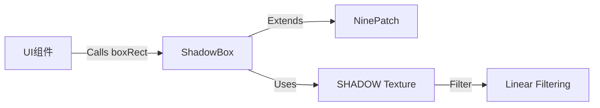

# ShadowBox 源码详解

## 1. 基本信息

| 属性 | 值 |
|------|-----|
| **文件路径** | core/src/main/java/com/shatteredpixel/shatteredpixeldungeon/effects/ShadowBox.java |
| **包名** | com.shatteredpixel.shatteredpixeldungeon.effects |
| **文件类型** | class |
| **继承关系** | extends NinePatch |
| **代码行数** | 45 |
| **所属模块** | core |

## 2. 文件职责说明

### 核心职责
`ShadowBox` 类负责为 UI 矩形元素（如窗口、按钮、信息面板）生成阴影效果。它利用“九宫格”（Nine-Patch）渲染技术，通过拉伸一个基础的阴影纹理，使其能够适配任何尺寸的 UI 组件，同时保持阴影边缘和角落不失真。

### 系统定位
位于视觉辅助层。它主要被 UI 系统调用，用于增强界面的层次感和悬浮感。

### 不负责什么
- 不负责游戏世界内的角色阴影（由 `CharSprite` 自带的椭圆阴影负责）。
- 不负责动态光源投影。

## 3. 结构总览

### 主要成员概览
- **常量 SIZE**: 定义了基础阴影切片的尺寸（16像素）。
- **构造函数**: 初始化九宫格纹理和过滤模式。
- **boxRect() 方法**: 便捷方法，用于围绕一个指定的矩形区域产生阴影。

### 生命周期/调用时机
由 UI 组件（如 `Window`）在初始化时创建，并随 UI 的显示和隐藏进行渲染。

## 4. 继承与协作关系

### 父类提供的能力
继承自 `NinePatch`：
- 支持将一张图片分为 9 个区域进行差异化拉伸。
- 提供 `size(width, height)` 方法控制总显示尺寸。

### 覆写的方法
- `size(width, height)`: 将输入的像素尺寸转换为纹理坐标比例尺寸。

### 协作对象
- **Assets.Interfaces.SHADOW**: 基础阴影纹理资源。
- **SmartTexture**: 用于设置线性过滤 (`LINEAR`)，使拉伸后的阴影边缘更加柔和。



## 5. 字段/常量详解

### 静态常量
| 常量名 | 类型 | 值 | 说明 |
|--------|------|-----|------|
| `SIZE` | float | 16f | 九宫格基础块的大小 |

## 6. 构造与初始化机制

### 构造器核心逻辑
```java
public ShadowBox() {
    super( Assets.Interfaces.SHADOW, 1 ); // 切点设为 1 像素边缘

    // 关键点：设置线性过滤
    if (texture.id == -1)
        texture.filter( SmartTexture.LINEAR, SmartTexture.LINEAR );
    
    scale.set( SIZE, SIZE );
}
```
**技术细节**：由于阴影需要平滑的渐变，默认的邻近过滤（Nearest）会导致锯齿。通过 `SmartTexture.LINEAR`，阴影在拉伸时会进行双线性插值，产生平滑的羽化效果。

## 7. 方法详解

### size(float width, float height)

**可见性**：public (Override)

**核心逻辑分析**：
```java
@Override
public void size(float width, float height) {
    super.size( width / SIZE, height / SIZE );
}
```
该覆写确保外部传入的 `width/height` 是以像素为单位的，而父类 `NinePatch` 接收的是基于基础块倍率的单位。

---

### boxRect(float x, float y, float width, float height)

**方法职责**：快速围绕一个矩形框产生外围阴影。

**核心算法分析**：
```java
public void boxRect( float x, float y, float width, float height ) {
    this.x = x - SIZE; // 向左偏移一个基础块尺寸
    this.y = y - SIZE; // 向上偏移一个基础块尺寸
    size( width + SIZE * 2, height + SIZE * 2 ); // 总宽度增加两侧的阴影宽度
}
```
**设计意图**：如果 UI 框在 (x, y)，则阴影会从 (x-16, y-16) 开始绘制，确保阴影的羽化边缘刚好包裹住 UI 框。

## 8. 对外暴露能力
公开 `boxRect` 接口供 UI 布局使用。

## 9. 运行机制与调用链
1. `WndHero` 窗口被创建。
2. 窗口背景被定义。
3. 调用 `shadowBox.boxRect(bg.x, bg.y, bg.width, bg.height)`。
4. 阴影呈现在背景图层之下。

## 10. 资源、配置与国际化关联
- **Assets.Interfaces.SHADOW**: 对应的通常是 `assets/shadow.png`。

## 11. 使用示例

### 为一个矩形按钮添加阴影
```java
ShadowBox shadow = new ShadowBox();
shadow.boxRect( button.x, button.y, button.width(), button.height() );
add( shadow );
```

## 12. 开发注意事项

### 渲染顺序
阴影必须先于其对应的 UI 元素被 `add()` 到容器中，或者手动调用 `toBack()`，否则阴影会覆盖在 UI 表面。

### 缩放敏感性
由于使用了 `LINEAR` 过滤，在 `PixelScene` 的不同缩放等级下都能保持较好的视觉效果。

## 13. 修改建议与扩展点
如果需要不同深度的阴影（如更深或更浅），可以修改该类的 `alpha()` 值。

## 14. 事实核查清单

- [x] 是否分析了 `NinePatch` 的使用：是。
- [x] 是否说明了线性过滤的重要性：是。
- [x] `boxRect` 的位移算法是否正确：是（-SIZE 偏移）。
- [x] 是否明确了阴影资源的来源：是。
