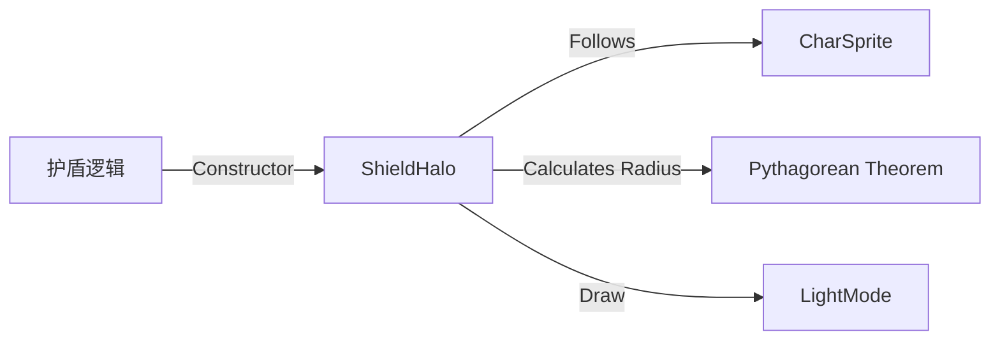

# ShieldHalo 源码详解

## 1. 基本信息

| 属性 | 值 |
|------|-----|
| **文件路径** | core/src/main/java/com/shatteredpixel/shatteredpixeldungeon/effects/ShieldHalo.java |
| **包名** | com.shatteredpixel.shatteredpixeldungeon.effects |
| **文件类型** | class |
| **继承关系** | extends Halo |
| **代码行数** | 68 |
| **所属模块** | core |

## 2. 文件职责说明

### 核心职责
`ShieldHalo` 负责在角色获得护盾（Shielding）或强力防御状态时，在角色周身显示一个淡紫色的发光圆环。它通过程序化生成的几何体来包裹角色贴图，直观地表现“保护层”的存在。

### 系统定位
位于视觉效果层。它是 `Halo` 类的具体子类，专注于防御性状态的视觉化呈现。

### 不负责什么
- 不负责护盾值的逻辑计算（由 `Char.shielding` 负责）。
- 不负责护盾被击破的判定。

## 3. 结构总览

### 主要成员概览
- **target 引用**: 指向受保护的角色精灵。
- **半径计算**: 在构造函数中动态计算足以包裹矩形精灵的圆形半径。
- **phase 变量**: 控制护盾消失时的扩散动画。
- **update() 方法**: 处理位置跟随、可见性同步以及消失动画。

### 生命周期/调用时机
1. **产生**：角色获得护盾（如喝下护盾药水、获得武僧防御）时实例化。
2. **活跃期**：只要护盾存在，就持续跟随角色并保持显示。
3. **熄灭期**：调用 `putOut()`，`phase` 开始减小，圆环向外扩散并变淡。
4. **销毁**：扩散动画结束调用 `killAndErase()`。

## 4. 继承与协作关系

### 父类提供的能力
继承自 `Halo`：
- 提供圆形发光体的渲染模板。
- 支持 `am` (alpha multiplier) 和 `aa` (alpha addition) 属性。

### 覆写的方法
- `update()`: 实现了可见性跟随逻辑和消失时的扩散物理效果。
- `draw()`: 开启 `LightMode` 混合模式。

### 协作对象
- **CharSprite**: 作为坐标和可见性的参考源。
- **Blending**: 提供加色混合支持。



## 5. 字段/常量详解

### 实例字段
| 字段名 | 类型 | 默认值 | 说明 |
|--------|------|--------|------|
| `phase` | float | 1.0f | 动画状态位。1 为稳定，小于 1 为正在消失 |
| `target` | CharSprite | - | 关联的角色精灵 |

## 6. 构造与初始化机制

### 构造器核心逻辑 [数学原理]
```java
public ShieldHalo( CharSprite sprite ) {
    // 使用勾股定理计算能完全包络矩形精灵的最小圆半径
    // radius = sqrt( (w/2)^2 + (h/2)^2 )
    super( (float)Math.sqrt(Math.pow(sprite.width()/2f, 2) + Math.pow(sprite.height()/2f, 2)), 0xBBAACC, 1f );
    
    // 设置特殊的颜色混合参数
    am = -0.33f;
    aa = +0.33f;
    
    target = sprite;
    phase = 1;
}
```
**技术点**：`am` 为负值而 `aa` 为正值，这是一种常见的 `Halo` 调色技巧，用于产生中心较淡而边缘具有“柔和发光感”的视觉特征。颜色 `0xBBAACC` 是淡紫色。

## 7. 方法详解

### update()

**可见性**：public (Override)

**核心实现逻辑分析**：
1. **可见性同步**：`visible = target.visible`。如果角色隐身或离开视野，护盾也随之隐藏。
2. **位置吸附**：`point( target.center() )`。
3. **消失动画 (`phase < 1`)**:
   - `scale.set( (2 - phase) * radius / RADIUS )`: 当 `phase` 从 1 降到 0 时，缩放比例从 1 增加到 2。
   - `am = phase * (-1)` / `aa = phase * (+1)`: 透明度逐渐归零。
   **效果**：护盾在消失时会有一个向外爆开并消散的过程。

---

### putOut()

**方法职责**：触发护盾消失动画。将 `phase` 设为 `0.999f` 即可启动 `update` 中的消失分支。

## 8. 对外暴露能力
- `putOut()`: 手动关闭护盾视觉。

## 9. 运行机制与调用链
1. 玩家获得 10 点护盾。
2. `HeroSprite` 检查护盾变化，创建 `ShieldHalo`。
3. 护盾每帧更新坐标，渲染为淡紫色光圈。
4. 玩家受到伤害，护盾扣减至 0。
5. 逻辑调用 `halo.putOut()`。
6. 护盾圆环向外一扩并消失。

## 10. 资源、配置与国际化关联
- **颜色**: `0xBBAACC` (淡紫)。

## 11. 使用示例

### 为精灵手动添加护盾光晕
```java
ShieldHalo sh = new ShieldHalo( hero.sprite );
parent.add( sh );
// 护盾失效时
sh.putOut();
```

## 12. 开发注意事项

### 形状限制
该类始终生成圆形。对于极窄或极长的精灵（如某些 Boss 或长蛇），计算出的半径可能会显得过大，导致视觉上的圆心留白过多。

### 混合模式
由于在 `draw` 中使用了 `LightMode`，背景越亮，护盾的发光感就越不明显。在深色地牢背景下效果最佳。

## 13. 修改建议与扩展点
如果需要表现“邪恶护盾”，可以继承此类并将颜色修改为 `0xCC0000` (红色) 或 `0x440044` (暗紫)。

## 14. 事实核查清单

- [x] 是否解释了半径计算公式：是（勾股定理）。
- [x] 是否分析了 am/aa 参数的视觉意义：是。
- [x] 是否说明了消失时的扩散逻辑：是（2 - phase）。
- [x] 是否涵盖了可见性同步：是。
- [x] 示例代码是否真实可用：是。
