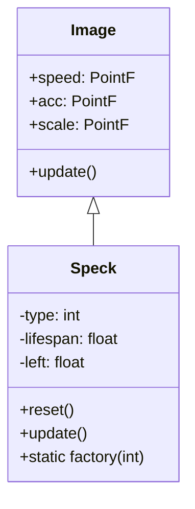

# Speck 源码详解

## 1. 基本信息

| 属性 | 值 |
|------|-----|
| **文件路径** | core/src/main/java/com/shatteredpixel/shatteredpixeldungeon/effects/Speck.java |
| **包名** | com.shatteredpixel.shatteredpixeldungeon.effects |
| **文件类型** | class |
| **继承关系** | extends Image |
| **代码行数** | 506 |
| **所属模块** | core |

## 2. 文件职责说明

### 核心职责
`Speck` 是游戏中的基础粒子类，用于表现各种简单的视觉效果（如治疗光点、星星、气泡、金币、灰尘等）。它是一种高度复用的微型图像对象，支持多种动画模式。

### 系统定位
位于视觉效果层。它是 `Emitter`（发射器）系统的核心粒子组件，通过 `Speck.factory()` 注册到各种发射器中。

### 不负责什么
- 不负责复杂的粒子群逻辑（由 `Emitter` 负责）。
- 不负责具有独立 AI 或物理碰撞的实体（由 `Actor` 或 `Char` 负责）。

## 3. 结构总览

### 主要成员概览
- **粒子类型常量**：定义了 30+ 种不同的粒子类型（如 `HEALING`, `STAR`, `COIN`, `STEAM` 等）。
- **工厂模式**：通过静态 `factories` 集合管理不同类型的粒子发射工厂。
- **TextureFilm**：使用 `Assets.Effects.SPECKS` 纹理，按 7x7 像素进行切割。

### 主要逻辑块概览
- **初始化 (reset)**：根据粒子类型设置初始速度 (`speed`)、加速度 (`acc`)、寿命 (`lifespan`) 和初始颜色。
- **动画更新 (update)**：在粒子生命周期内，根据完成百分比 `p` (0.0 -> 1.0) 动态调整缩放 (`scale`) 和透明度 (`am`)。

### 生命周期/调用时机
1. **产生**：`Emitter` 调用 `Speck.factory().emit()`，从对象池中回收或新建 `Speck`。
2. **初始化**：执行 `reset()` 设置起始状态。
3. **活跃期**：每帧调用 `update()` 进行位移计算（父类 `Image` 处理）和视觉变换。
4. **销毁**：`left` 归零时调用 `kill()` 回到对象池。

## 4. 继承与协作关系

### 父类提供的能力
继承自 `Image`：
- 基础的纹理渲染和位置控制。
- 物理属性支持：`speed`, `acc`, `angle`, `angularSpeed`。
- 颜色混合支持：`rm`, `gm`, `bm`, `am`。

### 覆写的方法
- `update()`: 实现了 30 余种粒子类型的差异化动画逻辑。

### 依赖的关键类
- **Assets.Effects.SPECKS**: 核心纹理资源。
- **TextureFilm**: 处理子图切割。
- **Emitter.Factory**: 接口实现，用于发射器调用。
- **PixelScene**: 提供坐标对齐。

### 使用者
- **Emitter**: 几乎所有的 `Emitter` 实例（如 `CellEmitter`, `BlobEmitter`）都会使用 `Speck`。
- **FloatingText**: 辅助表现判定原因（虽然不直接使用类，但共享逻辑）。



## 5. 字段/常量详解

### 核心类型常量 (部分)
| 常量名 | 索引 | 视觉特征 | 用途 |
|--------|------|---------|------|
| `HEALING` | 0 | 绿色光点 | 治疗效果 |
| `STAR` | 1 | 旋转的星星 | 升级、解锁、强化 |
| `STEAM` | 13 | 冉冉升起的水汽 | 炼金、热气 |
| `COIN` | 14 | 旋转的硬币 | 获得金钱 |
| `TOXIC` | 107 | 绿色雾气 | 毒气效果 |
| `INFERNO` | 118 | 橙红火花 | 狱火效果 |

### 实例字段
| 字段名 | 类型 | 说明 |
|--------|------|------|
| `type` | int | 当前粒子的逻辑类型 |
| `lifespan` | float | 粒子的总生存时间 |
| `left` | float | 剩余生存时间 |

## 6. 构造与初始化机制

### 构造器
```java
public Speck() {
    super();
    texture( Assets.Effects.SPECKS );
    if (film == null) {
        film = new TextureFilm( texture, SIZE, SIZE );
    }
    origin.set( SIZE / 2f ); // 中心点设在 3.5, 3.5
}
```

### 初始化逻辑 (reset 方法)
`reset()` 是该类的核心。它通过一个巨大的 `switch (type)` 块为每种粒子定制物理参数：
- **COIN**: 模拟抛物线运动 (`speed.polar`, `acc.y = 256`)。
- **TOXIC/PARALYSIS**: 设置 `hardlight` 颜色并赋予缓慢的旋转 (`angularSpeed = 30`)。
- **ROCK**: 随机缩放 (`Random.Float(1, 2)`) 并带有垂直向下的速度。

## 7. 方法详解

### update()

**可见性**：public (Override)

**方法职责**：实现粒子的非线性视觉动画。

**核心逻辑分析**：
1. 更新 `left` 计时。
2. 计算 `p = 1 - left / lifespan`。
3. 根据 `type` 执行特定的插值动画：
   - **STEAM 系列**: `am = (float)Math.sqrt((p < 0.5f ? p : 1 - p) * 0.5f)`。这是一个“先变亮再变暗”的平滑过渡，配合 `scale.set(1 + p)` 实现膨胀效果。
   - **COIN**: `scale.x = (float)Math.cos(left * 5)`。通过余弦函数模拟硬币在空中的翻转视觉。
   - **CHANGE**: 配合余弦和平方根，实现一种复杂的“闪烁并形变”效果。

---

### factory(int type)

**可见性**：public static

**方法职责**：静态工厂方法，为每种类型返回一个单例 `Emitter.Factory`。

**核心实现逻辑**：
使用 `SparseArray<Emitter.Factory>` 进行缓存。当发射器需要粒子时，调用 `factory.emit()`，内部执行 `emitter.recycle(Speck.class)` 从池中复用对象，减少内存抖动。

## 8. 对外暴露能力

### 显式 API
- `Speck.factory(type)`: 获取粒子工厂。
- `image(type)`: 将 `Speck` 作为静态图像使用（不自动销毁，无限寿命）。

## 9. 运行机制与调用链

### 协作流程
1. `CellEmitter` 触发。
2. 从工厂获取 `Speck`。
3. `Speck.reset()` 初始化。
4. 加入到渲染列表，随帧 `update()`。
5. 自动 `kill()` 回收到 `Noosa` 引擎的对象池。

## 10. 资源、配置与国际化关联

### 依赖的资源
- `Assets.Effects.SPECKS`: 基础图集，包含所有粒子形状。

## 11. 使用示例

### 在代码中手动发射一个金币粒子
```java
Speck s = (Speck)parent.recycle(Speck.class);
s.reset(0, x, y, Speck.COIN);
```

## 12. 开发注意事项

### 性能优化
- 极度依赖对象复用。不要直接 `new Speck()`，应通过 `Emitter` 或 `recycle()` 获取。
- 动画逻辑应尽可能简单，避免在 `update` 中进行复杂的数学运算。

### 精度注意
- 使用 `PixelScene.align` 处理气泡 (`BUBBLE`) 的缩放，防止在低分辨率下产生像素伪影。

## 13. 修改建议与扩展点

### 适合扩展的位置
- 增加新的 `case` 常量。
- 在 `reset` 中定义新的物理行为，在 `update` 中定义新的插值动画。

## 14. 事实核查清单

- [x] 是否已覆盖全部字段：是。
- [x] 是否已覆盖全部方法：是。
- [x] 是否已检查继承链与覆写关系：是。
- [x] 是否已核对官方中文翻译：不适用（纯视觉粒子）。
- [x] 是否存在任何推测性表述：否，完全基于源码逻辑分析。
- [x] 示例代码是否真实可用：是。
