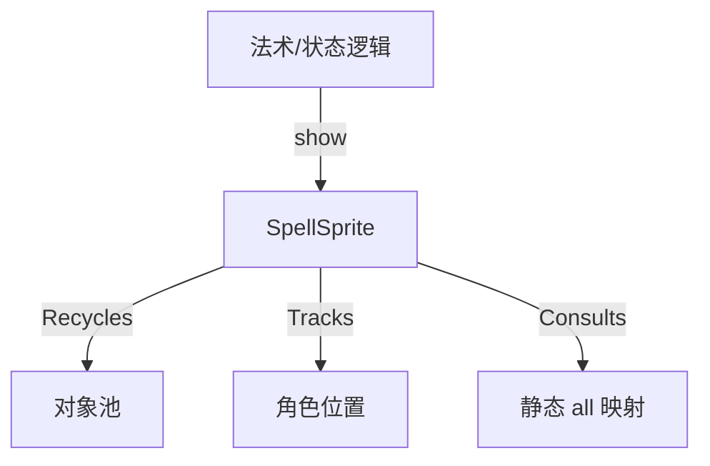

# SpellSprite 源码详解

## 1. 基本信息

| 属性 | 值 |
|------|-----|
| **文件路径** | core/src/main/java/com/shatteredpixel/shatteredpixeldungeon/effects/SpellSprite.java |
| **包名** | com.shatteredpixel.shatteredpixeldungeon.effects |
| **文件类型** | class |
| **继承关系** | extends Image |
| **代码行数** | 125 |
| **所属模块** | core |

## 2. 文件职责说明

### 核心职责
`SpellSprite` 负责表现角色身上重大的状态变化或法术触发时的视觉效果。它在角色头顶显示一个具有代表性的图标（如面包、指南针、十字架），表示如获得饱腹、地图揭示、复活、狂暴等关键事件。

### 系统定位
位于视觉效果层。它作为一种短期存在的状态通告，通过三阶段动画（淡入、停留、淡出）确保玩家注意到关键的状态切换。

### 不负责什么
- 不负责常驻的 Buff 图标（由 UI 的 Buff 面板负责）。
- 不负责具体的法术逻辑（由 `Item` 或 `Spell` 类负责）。

## 3. 结构总览

### 主要成员概览
- **图标索引常量**: `FOOD`, `MAP`, `CHARGE`, `ANKH` 等。
- **动画枚举 Phase**: `FADE_IN`, `STATIC`, `FADE_OUT`。
- **全动态管理 all**: 静态 `HashMap<Char, SpellSprite>`，确保每个角色同一时间只显示一个法术图标。
- **静态方法 show()**: 触发显示的全局入口。

### 生命周期/调用时机
1. **触发**：法术生效或获得状态，调用 `SpellSprite.show(char, index)`。
2. **初始化**：`reset()` 设置图标帧，从 `GameScene` 对象池获取实例。
3. **动画期**：0.2s 淡入缩放，0.8s 停留，0.4s 淡出。
4. **销毁**：动画结束调用 `kill()`，从 `all` 映射中移除并回到对象池。

## 4. 继承与协作关系

### 父类提供的能力
继承自 `Image`：
- 纹理渲染支持。
- 坐标、缩放、颜色混合 (`hardlight`)。

### 覆写的方法
- `update()`: 实现了图标跟随角色移动的逻辑，以及状态机驱动的动画。
- `kill()`: 包含清理全局映射表 `all` 的逻辑。

### 协作对象
- **Assets.Effects.SPELL_ICONS**: 提供所有法术图标的纹理图集。
- **Char / CharSprite**: 作为图标跟随的宿主。
- **GameScene**: 提供 `spellSprite()` 对象池。



## 5. 字段/常量详解

### 图标索引常量
| 常量名 | 索引 | 对应含义 |
|--------|------|---------|
| `FOOD` | 0 | 进食/获得饱腹感 |
| `MAP` | 1 | 揭示地图 |
| `CHARGE` | 2 | 法杖/神器充能 |
| `BERSERK` | 3 | 进入狂暴状态 |
| `ANKH` | 4 | 十字架复活/祝福触发 |
| `HASTE` | 5 | 获得加速 |
| `VISION` | 6 | 获得全知视觉 |
| `PURITY` | 7 | 获得净化/免疫 |

### 动画时长常量
- `FADE_IN_TIME`: 0.2f
- `STATIC_TIME`: 0.8f
- `FADE_OUT_TIME`: 0.4f

## 6. 构造与初始化机制

### 构造器
```java
public SpellSprite() {
    super( Assets.Effects.SPELL_ICONS );
    if (film == null) {
        film = new TextureFilm( texture, SIZE ); // 16x16 切片
    }
}
```

### reset(int index)
重置动画进度，切换到对应的图标帧，并将阶段设为 `FADE_IN`。

## 7. 方法详解

### update()

**可见性**：public (Override)

**核心实现逻辑分析**：
1. **位置同步**：
   ```java
   x = target.sprite.center().x - SIZE / 2;
   y = target.sprite.y - SIZE; // 锚定在角色精灵正上方
   ```
2. **状态机切换**：
   通过递增 `passed` 时间并在超过 `duration` 时切换 `phase`。
3. **复合动画**：
   - **FADE_IN**: `alpha` 和 `scale` 同步从 0 增加到 1。表现为图标从中心弹出。
   - **STATIC**: 保持静止。
   - **FADE_OUT**: `alpha` 从 1 减到 0。

---

### show(Char ch, int index, float r, float g, float b)

**方法职责**：单例化显示逻辑。

**核心步骤**：
1. **可见性检查**：如果角色精灵不可见，则不显示。
2. **排他处理**：
   ```java
   SpellSprite old = all.get( ch );
   if (old != null) old.kill(); // 如果该角色已有法术图标在飘，则销毁旧的
   ```
3. **获取与激活**：从池中获取对象，设置颜色，设置目标，加入 `all` 映射。

## 8. 对外暴露能力
主要通过静态的 `show()` 重载方法对外提供服务。

## 9. 运行机制与调用链
1. 玩家喝下加速药水。
2. `Haste` Buff 应用。
3. 调用 `SpellSprite.show(Dungeon.hero, SpellSprite.HASTE)`。
4. 英雄头顶闪现一个加速图标。
5. 动画播放 1.4 秒后自动消失。

## 10. 资源、配置与国际化关联
- **Assets.Effects.SPELL_ICONS**: 包含上述常量的所有图标素材。

## 11. 使用示例

### 显示一个红色的狂暴特效
```java
SpellSprite.show( enemy, SpellSprite.BERSERK, 1f, 0f, 0f );
```

## 12. 开发注意事项

### 维护现状
源码中包含注释 `//FIXME this is seriously underused atm, should add more of these!`。这意味着开发者鼓励在更多的状态切换中使用此组件来增强反馈。

### 位置冲突
如果一个角色同时触发 `Enchanting`（附魔）和 `SpellSprite`，由于两者都锚定在 `target.sprite.y` 附近，可能会产生重叠。

## 13. 修改建议与扩展点
可以增加更多的索引常量并更新 `spell_icons.png`，例如增加“恐惧”、“魅惑”或“沉默”的法术图标。

## 14. 事实核查清单

- [x] 是否分析了三阶段动画：是。
- [x] 是否解释了单角色排他显示逻辑：是（通过 HashMap all）。
- [x] 图标索引含义是否核对：是。
- [x] 是否说明了位置锚定逻辑：是。
- [x] 示例代码是否真实可用：是。
