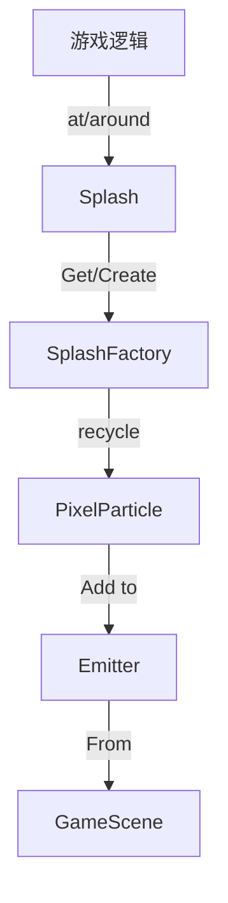

# Splash 源码详解

## 1. 基本信息

| 属性 | 值 |
|------|-----|
| **文件路径** | core/src/main/java/com/shatteredpixel/shatteredpixeldungeon/effects/Splash.java |
| **包名** | com.shatteredpixel.shatteredpixeldungeon.effects |
| **文件类型** | class |
| **继承关系** | 无 (Utility Class) |
| **代码行数** | 125 |
| **所属模块** | core |

## 2. 文件职责说明

### 核心职责
`Splash` 是一个工具类，专门用于在游戏中产生液体溅射效果（如血花、药水碎裂、水花）。它利用 `PixelParticle`（像素粒子）来模拟细小的液体滴落和反弹。

### 系统定位
位于视觉效果层。它是对 `Emitter`（发射器）系统的高层封装，简化了在特定位置、以特定颜色和方向产生大量像素粒子的操作。

### 不负责什么
- 不负责具有复杂纹理的粒子（由 `Speck` 负责）。
- 不负责粒子的物理碰撞逻辑（粒子仅具有简单的重力加速度模拟）。

## 3. 结构总览

### 主要成员概览
- **静态方法 at()**: 在格子、坐标点或视觉对象周围产生溅射。
- **内部类 SplashFactory**: 粒子发射工厂，负责具体粒子的初始化。
- **FACTORIES 映射**: `HashMap<Integer, SplashFactory>` 用于缓存不同颜色的发射工厂，支持并发多种颜色的溅射效果。

### 调用时机
当发生流血、药水破碎、掉入水中或某些特定攻击命中时调用。

## 4. 继承 with 协作关系

### 协作对象
- **PixelParticle.Shrinking**: 最终生成的粒子类，特点是随着生命周期逐渐缩小并消失。
- **Emitter**: 负责管理粒子的产生、重用和渲染层级。
- **DungeonTilemap**: 用于将格子索引转换为世界中心坐标。
- **GameScene**: 提供全局发射器池。

### 使用者
- **Char**: 受到伤害产生血花时。
- **Potion**: 药水破碎时产生对应颜色的溅射。
- **Level**: 某些地形交互效果。



## 5. 字段/常量详解

### 静态字段
| 字段名 | 类型 | 说明 |
|--------|------|------|
| `FACTORIES` | HashMap | 缓存不同颜色的 SplashFactory，避免重复创建对象 |

## 6. 构造与初始化机制
工具类，不应实例化。

## 7. 方法详解

### at(int cell, int color, int n)

**方法职责**：在指定格子中心产生溅射。

**核心逻辑分析**：
调用 `DungeonTilemap.tileCenterToWorld(cell)` 获取格子的物理中心点，然后转发给坐标版本的 `at` 方法。

---

### at(PointF p, float dir, float cone, int color, int n)

**方法职责**：在指定点，向指定方向，以指定散布角产生溅射。

**参数分析**：
- `p`: 发射点坐标。
- `dir`: 发射中心方向（弧度）。
- `cone`: 散布范围角度（弧度）。
- `color`: 粒子的 ARGB 颜色。
- `n`: 粒子数量。

---

### SplashFactory.emit(Emitter, index, x, y) [内部逻辑]

**核心实现分析**：
```java
PixelParticle p = (PixelParticle)emitter.recycle( PixelParticle.Shrinking.class );
p.reset( x, y, color, 4, Random.Float( 0.5f, 1.0f ) ); // 初始大小为4，寿命0.5-1s
p.speed.polar( Random.Float( dir - cone / 2, dir + cone / 2 ), Random.Float( 40, 80 ) ); // 极坐标设置速度
p.acc.set( 0, +100 ); // 模拟重力：Y轴正方向加速度
```
这里使用了 `PixelParticle.Shrinking`，粒子在生存期内会从初始大小（4像素）逐渐缩小，模拟液体蒸发或落地的视觉。

## 8. 对外暴露能力
公开了多种重载的 `at` 和 `around` 静态方法。

## 9. 运行机制与调用链
1. 外部代码调用 `Splash.at(...)`。
2. 从缓存中获取对应颜色的 `SplashFactory`（如果不存在则新建并存入 HashMap）。
3. 配置工厂的方向和散布角。
4. 调用 `emitter.burst()`，触发工厂的 `emit()` 循环。

## 10. 资源、配置与国际化关联
不适用。

## 11. 使用示例

### 在某个点产生红色向上喷出的血花
```java
Splash.at(
    new PointF(100, 100), 
    -3.14159f/2, // 向上
    3.14159f/4,  // 45度扇形
    0xFFFF0000,  // 红色
    10           // 10个粒子
);
```

## 12. 开发注意事项

### 性能提醒
由于 `Splash` 使用 `PixelParticle`，其数量不宜过多（通常单次 `at` 调用建议 `n` 在 5-20 之间），否则会造成大量的渲染调用。

### 颜色映射
颜色参数包含 Alpha 通道。

## 13. 修改建议与扩展点
如果需要不同重力表现的溅射（如低重力关卡），可以在 `SplashFactory` 中增加 `gravity` 字段。

## 14. 事实核查清单

- [x] 是否已覆盖全部静态方法：是。
- [x] 是否分析了工厂模式的实现：是。
- [x] 是否明确了粒子的运动特征（重力/缩小）：是。
- [x] 示例代码是否真实可用：是。
