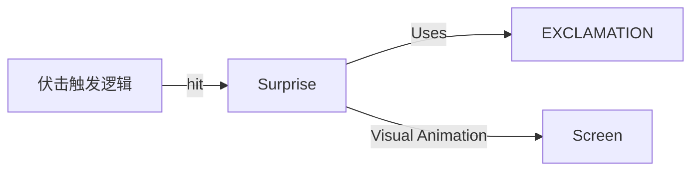

# Surprise 源码详解

## 1. 基本信息

| 属性 | 值 |
|------|-----|
| **文件路径** | core/src/main/java/com/shatteredpixel/shatteredpixeldungeon/effects/Surprise.java |
| **包名** | com.shatteredpixel.shatteredpixeldungeon.effects |
| **文件类型** | class |
| **继承关系** | extends Image |
| **代码行数** | 82 |
| **所属模块** | core |

## 2. 文件职责说明

### 核心职责
`Surprise` 类负责表现“偷袭”或“伏击”（Surprise Attack）成功时的视觉效果。当角色对未察觉的敌人造成伤害时，会在目标位置显示一个红色的感叹号，并伴随特定的拉伸和淡出动画。

### 系统定位
位于视觉效果层。它是对战斗系统中“伏击”机制的即时视觉确认，使用了 `Effects.Type.EXCLAMATION` 纹理。

### 不负责什么
- 不负责伏击的逻辑判定（由 `Char.attack()` 或 `Mob.surprisedBy()` 负责）。
- 不负责潜行状态的管理。

## 3. 结构总览

### 主要成员概览
- **常量 TIME_TO_FADE**: 特效持续时长（1.0秒）。
- **静态方法 hit()**: 在角色或位置产生感叹号的便捷接口。
- **update()**: 处理非均匀缩放和淡出逻辑。

### 生命周期/调用时机
1. **触发**：战斗逻辑判定为伏击成功时，调用 `Surprise.hit(target)`。
2. **产生**：从父容器中 `recycle` 一个实例并将其置于顶层（`bringToFront`）。
3. **活跃期**：执行 `update()`，感叹号在垂直方向（Y轴）大幅拉伸，水平方向（X轴）轻微拉伸，同时淡出。
4. **销毁**：1.0秒后自动 `kill()`。

## 4. 继承与协作关系

### 父类提供的能力
继承自 `Image`：
- 纹理显示、旋转、缩放、透明度控制。

### 覆写的方法
- `update()`: 实现了感叹号特有的“纵向弹跳拉伸”消失动画。

### 协作对象
- **Effects.get(Type.EXCLAMATION)**: 获取感叹号原始纹理。
- **Char / CharSprite**: 用于定位特效产生的位置。
- **Dungeon.hero.sprite.parent**: 通常作为特效的存放容器。



## 5. 字段/常量详解

### 静态常量
| 常量名 | 类型 | 值 | 说明 |
|--------|------|-----|------|
| `TIME_TO_FADE` | float | 1f | 动画总时长 |

### 实例字段
| 字段名 | 类型 | 说明 |
|--------|------|------|
| `time` | float | 剩余生存时间 |

## 6. 构造与初始化机制

### 构造器
```java
public Surprise() {
    super(Effects.get(Effects.Type.EXCLAMATION));
    origin.set(width / 2, height / 2); // 中心对齐，确保拉伸从中心开始
}
```

## 7. 方法详解

### update()

**可见性**：public (Override)

**核心实现逻辑分析**：
```java
float p = time / TIME_TO_FADE; // 进度 1 -> 0
alpha((float) Math.sqrt(p)); // 透明度按平方根淡出
scale.y = 1f + p;      // Y轴初始为2倍高，逐渐缩回1倍
scale.x = 1f + p/4f;   // X轴初始为1.25倍宽，逐渐缩回1倍
```
**动画特征**：这种**非均匀缩放**（Y 轴拉伸幅度远大于 X 轴）赋予了感叹号一种“向上跳跃”或“惊动”的动感，非常符合“受惊/被伏击”的语义。

---

### hit(Char ch, float angle)

**方法职责**：在角色身上产生感叹号。

**核心逻辑分析**：
1. 检查角色精灵是否存在及其父容器。
2. 调用 `recycle(Surprise.class)` 复用对象。
3. `bringToFront(s)` 确保感叹号不会被角色贴图遮挡。
4. `s.reset(ch.sprite)` 定位到精灵中心。

## 8. 对外暴露能力
主要通过静态的 `hit()` 重载方法对外提供服务。

## 9. 运行机制与调用链
1. 玩家在门后伏击怪物。
2. `Char.attack()` 执行。
3. 判定 `Surprise` 为真。
4. 调用 `Surprise.hit(enemy)`。
5. 屏幕上怪物体内弹出一个拉长的红色感叹号并迅速变淡缩小。

## 10. 资源、配置与国际化关联
- **纹理**: 来自 `assets/effects.png` 中的感叹号切片。

## 11. 使用示例

### 触发一个标准的偷袭视觉效果
```java
Surprise.hit( enemy );
```

## 12. 开发注意事项

### 与 Wound 的区别
`Surprise` 和 `Wound`（伤口）逻辑非常相似，但 `Surprise` 使用感叹号纹理且具有更夸张的 Y 轴拉伸动画，用于区分普通伤害与偷袭伤害。

### 渲染层级
必须显式调用 `bringToFront`，因为偷袭特效通常需要具有最高的视觉优先级。

## 13. 修改建议与扩展点
如果需要表现“暴击”而非“偷袭”，可以考虑在此处增加 `tint` 修改，或者使用不同的缩放比例曲线。

## 14. 事实核查清单

- [x] 是否分析了非均匀缩放逻辑：是 (Y:X = 4:1)。
- [x] 是否说明了 `bringToFront` 的必要性：是。
- [x] 是否明确了纹理索引来源：是。
- [x] 动画时长是否核对：是（1.0s）。
- [x] 示例代码是否真实可用：是。
