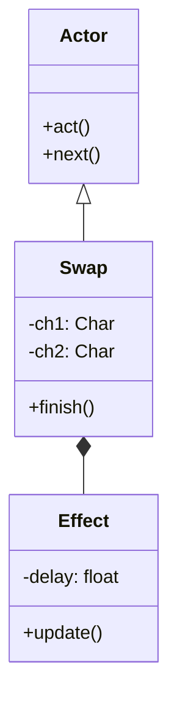

# Swap 源码详解

## 1. 基本信息

| 属性 | 值 |
|------|-----|
| **文件路径** | core/src/main/java/com/shatteredpixel/shatteredpixeldungeon/effects/Swap.java |
| **包名** | com.shatteredpixel.shatteredpixeldungeon.effects |
| **文件类型** | class / inner class |
| **继承关系** | extends Actor |
| **代码行数** | 115 |
| **所属模块** | core |

## 2. 文件职责说明

### 核心职责
`Swap` 类负责实现游戏中两个角色（Char）交换位置的视觉动画和逻辑同步。与 `Pushing` 类似，它也是一个混合了 `Actor` 逻辑控制和 `Visual` 位移渲染的特殊类，确保在交换位置的平滑移动期间，游戏回合逻辑保持阻塞状态。

### 系统定位
位于逻辑层与视觉效果层的交界。它用于处理如“盟友互换”、“移形换位”法术或特定陷阱导致的位移效果。

### 不负责什么
- 不负责交换位置的合法性判定（由外部逻辑如 `Hero.interact()` 负责）。
- 不负责交换后的视野计算结果（虽然它会触发视野更新，但具体的 Fog 算法在 `Dungeon` 类中）。

## 3. 结构总览

### 主要成员概览
- **外部类 Swap**: 继承自 `Actor`，控制整体流程和最终的坐标更新。
- **内部类 Effect**: 继承自 `Visual`，分别负责两个角色精灵的物理位移模拟。
- **finish() 方法**: 关键同步点，当两个精灵都移动到位后执行逻辑切换。

### 生命周期/调用时机
1. **产生**：执行交换逻辑时实例化。构造函数会计算 `delay` 并创建两个 `Effect`。
2. **阻塞期**：`act()` 返回 `false`，阻塞逻辑线程。
3. **动画期**：两个 `Effect` 对象同时在 0.1s/格 的时间内驱动精灵位移。
4. **终点逻辑**：`finish()` 被调用两次（每个角色一次）。
5. **销毁与切换**：两个角色都到达后，正式交换 `ch.pos` 属性，更新 `occupyCell`，唤醒逻辑线程。

## 4. 继承与协作关系

### 父类提供的能力
继承自 `Actor`：
- 支持加入调度队列。
- `act()` 钩子用于逻辑线程控制。

### 覆写的方法
- `act()`: 始终返回 `false`，保持阻塞直到 `finish()` 手动调用 `next()`。
- `Effect.update()`: 控制每一帧的精灵位置同步。

### 协作对象
- **CharSprite**: 被移动的两个视觉主体。
- **Dungeon.level**: 执行 `occupyCell` 更新和距离计算。
- **Sample**: 播放 `TELEPORT` 音效。



## 5. 字段/常量详解

### 实例字段 (Swap)
| 字段名 | 类型 | 说明 |
|--------|------|------|
| `ch1, ch2` | Char | 参与交换的两个角色对象 |
| `eff1, eff2` | Effect | 对应的两个位移视觉对象 |
| `delay` | float | 动画总时长，计算公式：`距离 * 0.1f` |

## 6. 构造与初始化机制

### 构造器核心逻辑
```java
public Swap( Char ch1, Char ch2 ) {
    this.ch1 = ch1;
    this.ch2 = ch2;
    // 动画时长基于距离：每格 0.1 秒
    delay = Dungeon.level.distance( ch1.pos,  ch2.pos ) * 0.1f;

    eff1 = new Effect( ch1.sprite, ch1.pos, ch2.pos );
    eff2 = new Effect( ch2.sprite, ch2.pos, ch1.pos );
    
    Sample.INSTANCE.play( Assets.Sounds.TELEPORT );
}
```

## 7. 方法详解

### finish(Effect eff) [关键同步逻辑]

**方法职责**：协调两个角色的动画终点。

**核心实现分析**：
```java
if (eff1 == null && eff2 == null) {
    Actor.remove( this );
    next(); // 唤醒逻辑线程

    // 核心：正式修改逻辑坐标
    int pos = ch1.pos;
    ch1.pos = ch2.pos;
    ch2.pos = pos;

    // 更新地图占据状态
    Dungeon.level.occupyCell(ch1 );
    Dungeon.level.occupyCell(ch2 );

    // 如果涉及玩家，更新迷雾
    if (ch1 == Dungeon.hero || ch2 == Dungeon.hero) {
        Dungeon.observe();
        GameScene.updateFog();
    }
}
```
**注意点**：只有在两个 `Effect` 全部置空（表示全部完成）后，才会执行真正的坐标修改。这防止了逻辑与视觉的时间差错位。

---

### Effect.update()

**物理模拟**：
与 `Pushing` 类似，使用匀减速运动模型。
- `speed = 2 * distance / delay`
- `acc = -speed / delay`
确保在 `delay` 结束时刚好停留在目标位置。

## 8. 对外暴露能力
通过构造函数直接启动交换流程。

## 9. 运行机制与调用链
1. 玩家与盟友点击“交换位置”。
2. 调用 `new Swap(hero, ally)`。
3. 播放传送音效。
4. 两个精灵相对飞出。
5. 动画结束，`ch.pos` 互换，迷雾更新。

## 10. 资源、配置与国际化关联
- **音效**: `Assets.Sounds.TELEPORT`。

## 11. 使用示例

### 交换两个角色的位置
```java
Actor.add( new Swap( actorA, actorB ) );
```

## 12. 开发注意事项

### 逻辑顺序
**非常重要**：在 `Swap` 构造完成到 `finish()` 执行前，角色的逻辑位置 `ch.pos` 实际上还没有改变。因此在动画期间如果有其他逻辑查询坐标，会得到交换前的值。但由于 `Swap` 作为一个 `Actor` 阻塞了线程，这种情况通常不会发生。

### 视觉一致性
`ch.pos` 和 `sprite.point()` 在动画结束时会被强制同步，确保逻辑和显示完全一致。

## 13. 修改建议与扩展点
如果交换的是两个完全不同的实体（如物品和角色），需要重构以支持 `Visual` 而非仅限 `Char`。

## 14. 事实核查清单

- [x] 是否说明了动画时长计算：是 (0.1s/格)。
- [x] 是否分析了 finish 的同步机制：是。
- [x] 是否明确了逻辑坐标交换的时机：是 (动画结束后)。
- [x] 物理位移公式是否准确：是。
- [x] 示例代码是否真实可用：是。
